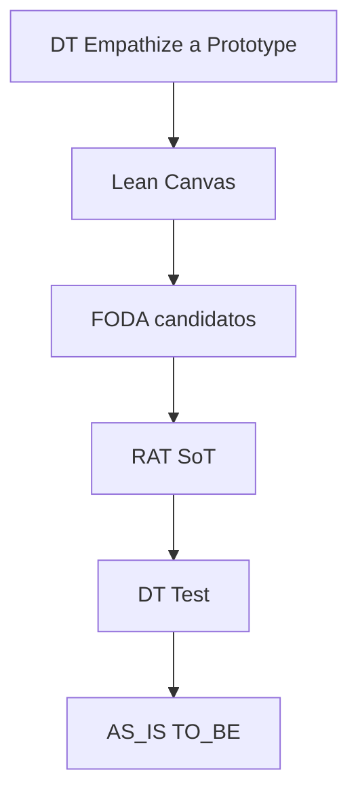

# init-project-mvp

Cuarto paso de la familia **init-***: deja **listo** un MVP del proyecto académico (no reabre el tema).

Los **cómo** viven en `config.playbooks` → `common/<tool>/…`. La **salida** es informe **aplicado** bajo `mvp/`; los paths se registran en `config.tools["mvp-N"]`.

## Pedagogía vs salida

| Capa | Dónde | Contenido |
|------|--------|-----------|
| Playbook | `config.playbooks` → `common/…` + esta skill | Método, diagramas de proceso, reglas R#, ciclo DT |
| Salida | `mvp/mvp-<N>-<slug>/*.md` + `config.tools["mvp-N"]` | Artefactos aplicados al caso |

**Prohibido en generados:** mini-clases, “qué es Empathizar”, diagramas de ciclo metodológico, sección **Notas** pedagógica, anexos de orden de llenado Lean.

## Layout

```text
docs/content/<FOLDER>/
  config.json          # playbooks = common; tools = mapa mvp-N → generados
  profile.md
  mvp/
    mvp-1-titulo-corto-del-mvp/
      design-thinking.md
      lean-canvas.md
      foda.md
      rat.md
      as-is-to-be.md
```

### Nombre de la carpeta de salida

```text
mvp/mvp-<N>-<slug>/
```

- `<N>`: número del MVP (config / arg).
- `<slug>`: título/objetivo del MVP en minúsculas, sin acentos, espacios → `-`, solo `[a-z0-9-]`, compactar `--`.
- Fuente del slug (en orden): fila **Objetivo** de la secuencia del profile → si no, texto tras “MVP N —” en arranque → si no, `mvp-<N>`.
- Archivos = claves de `config.playbooks` presentes (p. ej. `design-thinking.md`).
- Ejemplo: `mvp/mvp-1-confiabilidad-inventario-pt-por-variante/design-thinking.md`

## Invoke

```text
/init-project-mvp PASS mvp-1
```

Sin profile + MVP entregables → pedir **init-project** primero.

## Lookup Graphify (obligatorio si existe grafo)

```bash
graphify query "<q>" --graph docs/content/<FOLDER>/graphify-out/graph.json
```

Antes de releer `profile`/`mvp` enteros o bib: consultar el grafo del proyecto. Si no hay grafo, usar `profile.md` + playbooks y al cerrar sugerir **graphify-project**.

## Resolución de N

1. Arg `mvp-N` / `MVP: N`
2. Else `config.mvp`
3. Else `1` → persistir `config.mvp` = N

## Pipeline (SoT del orden = diagrama)

**Fuente de verdad del orden:** el diagrama siguiente. Si el texto de esta skill o de un playbook discrepa del diagrama, **gana el diagrama**.



**Una pasada:** el diagrama es lineal. La iteración DT (Evaluar→Empathize) es intención pedagógica en el playbook; si Test pide reabrir Empathize, se anota `pendiente_campo` / pregunta al equipo para otra iteración — **no** se re-ejecuta el pipeline en el mismo run.

Todas las herramientas son **opcionales** vía `config.playbooks`. El diagrama define el orden **entre las presentes**; las ausentes se omiten (degradación abajo). Numeración `##` **dentro de cada archivo**.

### Degradación si falta un playbook

| Ausente | Efecto en pasos posteriores |
|---------|----------------------------|
| **design-thinking** | Lean/FODA/RAT/AS-IS anclan a **profile**. No hay `design-thinking.md` ni Test DT. |
| **lean-canvas** | Sin `lean-canvas.md`. Trazas DT o profile. |
| **foda** | RAT desde DT + Lean + profile. Sin `foda.md` ni amarre. |
| **rat** | DT Test (si hay DT): criterio_exito profile + umbral; IDs `T1…`. Brecha: `valida: criterio_exito profile`. |
| **as-is-to-be** | Sin `as-is-to-be.md`. |
| **DT y Lean** | Todo lo posterior origina en **profile** (`ref: profile`). |
| Varias ausentes | Cascada; nunca inventar IDs/secciones omitidas. |

Post-RAT (si FODA **y** RAT corrieron): **pasada de amarre** — reescribe en `foda.md` los `→ candidato RAT` de cuadrantes **y** de la tabla TOWS a `→ R#`.

### Presupuesto WebSearch (3 total) — prioridad con válvula

Cupo global = **3**.

1. **Reserva RAT** (si `rat` en playbooks): hasta **1** para contraste/falsación. Empathize **no** gasta esta reserva.
2. **DT Empathize / contexto**: hasta el cupo no reservado (máx. 2 con reserva RAT; máx. 3 sin RAT). Si pediría más → `pendiente_campo`.
3. **Válvula Lean / FODA / AS-IS:** si **sobra** cupo tras Empathize y tras usar/liberar la reserva RAT, pueden usarlo. Si cupo = 0 → `pendiente_campo`.

### Single source of truth (datos)

| Dato | SoT | Otros |
|------|-----|-------|
| Roles, POV, HMW, Prototype | DT else profile | Lean / AS-IS referencian |
| Problema / Segmentos / Solución canvas | Lean ← DT o profile | no reinventar |
| Supuestos + umbral | **RAT** | FODA: candidato luego amarre `R#` (incl. TOWS) |
| Plan de prueba | DT Test ← RAT; else profile / fichas RAT | — |
| TO-BE | AS-IS/TO-BE ← Prototype o profile | — |

**Contradicción:** `evidencia` > `pendiente_campo` > `hipótesis`; anotar `conflicto:`.

## Resolución de playbooks

- Sin `playbooks` → si `tools` viejo apunta a `common/…`, migrar mentalmente a playbooks y avisar; else default completo (todos model1).
- Path inexistente → listar `common/<tool>/*.md` / fallback `model1` avisando.
- Solo archivos de playbooks presentes; cada md autónomo.

Default `playbooks`:

```json
"playbooks": {
  "design-thinking": "common/design-thinking/model1.md",
  "lean-canvas": "common/lean-canvas/model1.md",
  "foda": "common/foda/model1.md",
  "rat": "common/rat/model1.md",
  "as-is-to-be": "common/as-is-to-be/model1.md"
}
```

## Registro en `config.tools`

Tras escribir la carpeta, actualizar **solo** la clave `mvp-N` (no borrar otras):

```json
"tools": {
  "mvp-1": {
    "design-thinking": "./mvp/mvp-1-<slug>/design-thinking.md",
    "lean-canvas": "./mvp/mvp-1-<slug>/lean-canvas.md",
    "foda": "./mvp/mvp-1-<slug>/foda.md",
    "rat": "./mvp/mvp-1-<slug>/rat.md",
    "as-is-to-be": "./mvp/mvp-1-<slug>/as-is-to-be.md"
  }
}
```

Paths relativos a `docs/content/<FOLDER>/`. Solo incluir tools realmente escritas.

## Procedure

1. Resolver FOLDER; profile + config; bloque MVP N.
2. Resolver **playbooks**; leer esos md.
3. Derivar carpeta `mvp/mvp-<N>-<slug>/`. Si existe → preguntar antes de sobrescribir.
4. Lanzar agente **`design-thinking`** con CONTEXTO + playbooks + diagrama + degradación + WebSearch + amarre FODA/TOWS.
5. Escribir **un archivo por playbook presente** (contenido **aplicado** al caso):
   - `design-thinking.md` — Empathize…Prototype (+ Test post-RAT); preguntas al equipo al final si hay DT.
   - `lean-canvas.md` — lienzo + flujo del feature si aplica.
   - `foda.md` — 2×2 + TOWS + amarre tras RAT.
   - `rat.md` — fichas R# + cola.
   - `as-is-to-be.md` — AS-IS / TO-BE según playbook.
   - Diagramas solo del **dominio**; sin sección **Notas**.
6. Si no hay DT, poner **Preguntas al equipo** al final del último archivo escrito.
7. `config.mvp` = N; **`config.tools["mvp-N"]`** = mapa de paths generados (merge; no borrar otras claves `mvp-*`).
8. Chat: carpeta + archivos + playbooks + `tools["mvp-N"]` + degradaciones + cupo + preguntas.

## Forbidden

- Leer `config.tools` como playbooks (salvo migración legacy common/).
- Paralelo / fuera del diagrama.
- Re-ejecutar el pipeline en el mismo run por “ciclo DT”.
- Inventar `R#` / archivos de playbooks ausentes.
- `R#` en FODA/TOWS antes del amarre post-RAT.
- Amarre que ignore enlaces dentro de TOWS.
- Pedagogía / Notas / diagramas de método en generados.
- Gastar reserva RAT en Empathize.
- Reabrir tema / inventar hechos / Graphify / RSL / autoevaluación RAT.
- Borrar `tools["mvp-M"]` de otros MVPs al registrar N.
