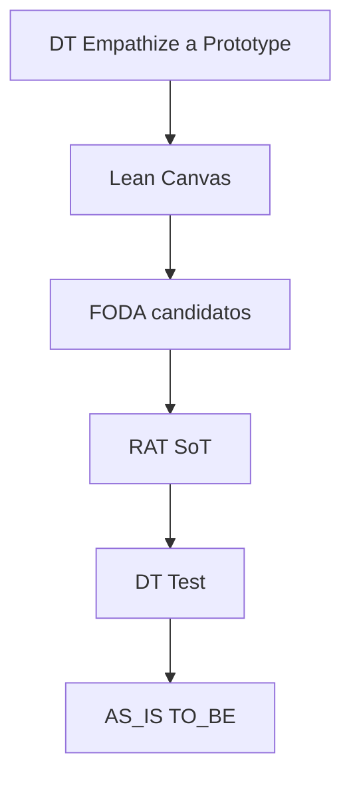

# init-project-mvp

Cuarto paso de la familia **init-***: deja **listo** un MVP del proyecto académico (no reabre el tema).

Los **cómo** viven en `common/<tool>/model1.md` (vía `config.tools`).

## Layout

```text
docs/content/<FOLDER>/
  config.json
  profile.md
  mvp/
    mvp-1-titulo-corto-del-mvp.md   # paquete DT+Lean+FODA+RAT+AS-IS/TO-BE

common/
  design-thinking/model1.md # playbook tool DT
  lean-canvas/model1.md
  foda/model1.md
  rat/model1.md
  as-is-to-be/model1.md
```

### Nombre del archivo de salida

```text
mvp/mvp-<N>-<slug>.md
```

- `<N>`: número del MVP (config / arg).
- `<slug>`: título/objetivo del MVP en minúsculas, sin acentos, espacios → `-`, solo `[a-z0-9-]`, compactar `--`.
- Fuente del slug (en orden): fila **Objetivo** de la secuencia del profile → si no, texto tras “MVP N —” en arranque → si no, `mvp-<N>`.
- Ejemplo: `mvp/mvp-1-confiabilidad-inventario-pt-por-variante.md`

## Invoke

```text
/init-project-mvp PASS mvp-1
```

Sin profile + MVP entregables → pedir **init-project** primero.

## Resolución de N

1. Arg `mvp-N` / `MVP: N`
2. Else `config.mvp`
3. Else `1` → persistir `config.mvp` = N

## Pipeline (SoT del orden = diagrama)

**Fuente de verdad del orden:** el diagrama siguiente. Si el texto de esta skill o de un playbook discrepa del diagrama, **gana el diagrama**.



Todas las tools son **opcionales** vía `config.tools`. El diagrama define el orden **entre las presentes**; las ausentes se omiten (degradación abajo). Los playbooks usan **títulos semánticos**; el orquestador asigna `## 1…k` solo a secciones presentes.

### Degradación si falta una tool

| Ausente | Efecto en pasos posteriores |
|---------|----------------------------|
| **design-thinking** | Lean/FODA/RAT/AS-IS anclan a **profile** (o a Lean si existe). No hay § DT ni Test DT. |
| **lean-canvas** | Sin § Lean. Trazas DT o profile. `valida: R#` sigue válido si RAT corrió. |
| **foda** | RAT desde DT + Lean + profile. Sin § FODA ni amarre. |
| **rat** | DT Test (si hay DT): criterio_exito profile + umbral; IDs `T1…`. Brecha: `valida: criterio_exito profile`. |
| **as-is-to-be** | Sin diagramas. |
| **DT y Lean** | Todo lo posterior origina en **profile** (`ref: profile`). |
| Varias ausentes | Cascada; nunca inventar IDs/secciones omitidas. |

Post-RAT (si FODA **y** RAT corrieron): **pasada de amarre** — candidatos FODA → `R#`.

### Presupuesto WebSearch (3 total) — prioridad con válvula

Cupo global = **3**.

1. **Reserva RAT** (si `rat` habilitado): hasta **1** para contraste/falsación. Empathize **no** gasta esta reserva.
2. **DT Empathize / contexto**: hasta el cupo no reservado (máx. 2 con reserva RAT; máx. 3 sin RAT). Si pediría más → `pendiente_campo`.
3. **Válvula Lean / FODA / AS-IS:** si **sobra** cupo tras Empathize y tras usar/liberar la reserva RAT, pueden usarlo para un dato externo concreto. Si cupo = 0 → `pendiente_campo` (no es ban categórico: es última prioridad).

### Single source of truth (datos)

| Dato | SoT | Otros |
|------|-----|-------|
| Roles, POV, HMW, Prototype | DT else profile | Lean / AS-IS referencian |
| Problema / Segmentos / Solución canvas | Lean ← DT o profile | no reinventar |
| Supuestos + umbral | **RAT** | FODA: candidato luego amarre `R#` |
| Plan de prueba | DT Test ← RAT; else profile / fichas RAT | — |
| TO-BE | AS-IS/TO-BE ← Prototype o profile | — |

**Contradicción:** `evidencia` > `pendiente_campo` > `hipótesis`; anotar `conflicto:`.

## Resolución de tools

- Sin `tools` → default completo (todos model1).
- Path inexistente → listar `common/<tool>/*.md` / fallback `model1` avisando.
- Solo secciones presentes; numerar `## 1…k` en orden del diagrama.

Default:

```json
"tools": {
  "design-thinking": "common/design-thinking/model1.md",
  "lean-canvas": "common/lean-canvas/model1.md",
  "foda": "common/foda/model1.md",
  "rat": "common/rat/model1.md",
  "as-is-to-be": "common/as-is-to-be/model1.md"
}
```

## Procedure

1. Resolver FOLDER; profile + config; bloque MVP N.
2. Resolver tools; leer playbooks.
3. Derivar path `mvp/mvp-<N>-<slug>.md` (reglas de nombre arriba). Si existe → preguntar antes de sobrescribir.
4. Lanzar agente **`design-thinking`** con CONTEXTO + playbooks + diagrama + degradación + WebSearch + amarre FODA.
5. Escribir el archivo (títulos semánticos numerados 1…k).
6. `config.mvp` = N.
7. Chat: path completo + tools + degradaciones + cupo búsquedas + preguntas al equipo.

## Forbidden

- Paralelo / fuera del diagrama.
- Inventar `R#` / secciones ausentes.
- `R#` en FODA antes del amarre post-RAT.
- Hardcodear `## N` desde playbooks.
- Gastar reserva RAT en Empathize.
- Reabrir tema / inventar hechos / Graphify / RSL / autoevaluación RAT.
