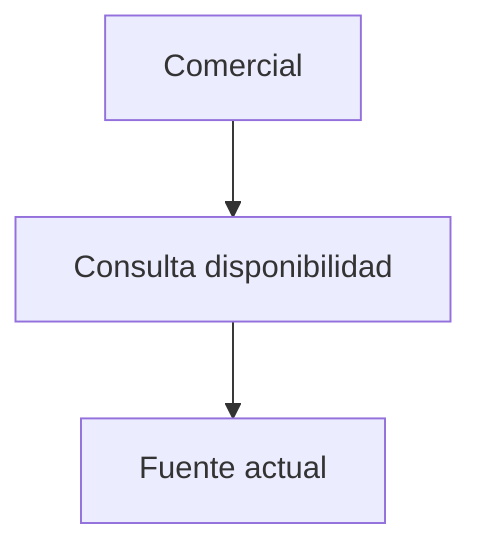

# Flujos AS-IS / TO-BE — model1

Diagramas Mermaid del **proceso del MVP N** (no de la transformación digital completa).

## Posición en el pipeline

Se escribe **al final** del diagrama de la skill (SoT del orden), después de los nodos presentes entre Prototype/profile y RAT/Test.

- **TO-BE** = materialización visual del **DT Prototype** si hubo DT; si no, de los **entregables del profile** (`ref: profile`).
- **Brecha** cita `valida: R#` si hubo RAT; si no, `valida: criterio_exito profile`. **Nunca** inventar `R#` si RAT no corrió.

## Propósito

Contrastar cómo fluye hoy la información/decisión vs cómo debe fluir con el entregable del MVP.

## AS-IS

1. Identificar el flujo crítico del MVP (p. ej. consulta de disponibilidad → respuesta al cliente).
2. Nodos: roles + sistemas/artefactos actuales (cuaderno, WhatsApp, memoria, Excel…).
3. Mostrar fricciones (espera, ida al almacén, dato desfasado).
4. Etiqueta global: `hipótesis` | `evidencia` | `pendiente_campo`.
5. Si **no** se puede observar en campo (tiempo/acceso): marcar `pendiente_campo` o `hipótesis` y declarar **supuesto de trabajo**. Entonces:
   - TO-BE lleva `confiabilidad: baja hasta Fase 0`
   - La brecha **debe** citar el `R#` (o gate Fase 0) que valida el AS-IS antes de confiar en el TO-BE

## TO-BE (solo MVP N)

1. Mismos roles relevantes + artefacto del **Prototype** (`ref: DT Prototype`).
2. Solo pasos que el MVP entrega (ubicaciones permitidas, latencia de turno, sin POS si está fuera).
3. **Prohibido:** ERP, e-commerce, omnicanal, talleres ATP, dashboards de ventas si no son del MVP N.

## Brecha AS-IS → TO-BE

2–4 bullets:

- Qué cambia (dato único, rol registrador, cierre de turno…).
- Qué se deja igual.
- Qué valida el salto: `valida: R#` o `valida: criterio_exito profile` (si no hay tool RAT).

## Sintaxis Mermaid (obligatoria)

- IDs en camelCase; sin espacios en IDs.
- No usar `end` como id de nodo.
- Etiquetas con caracteres especiales entre comillas dobles.
- Preferir `flowchart TD` (o `LR` si es más legible).

## Salida mínima

Sección semántica **Flujos AS-IS / TO-BE** con dos fences mermaid + brecha. El **número** (`## N`) lo asigna el orquestador.