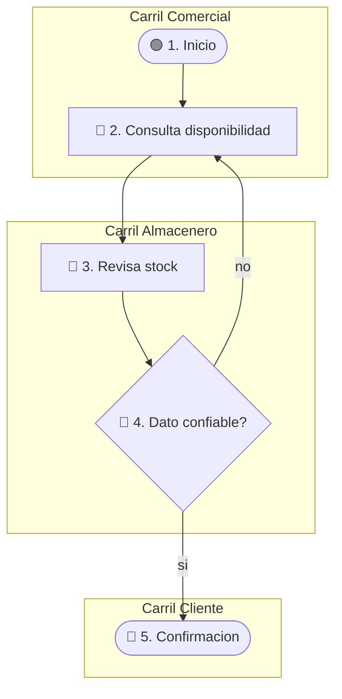

# Flujos AS-IS / TO-BE — model1

Diagramas Mermaid del **proceso del MVP N** en estilo **carriles (swimlanes)** por rol — no un flowchart plano sin roles.

**Pedagogía vs salida:** este playbook guía al orquestador. La salida `as-is-to-be.md` son flujos **del caso** + lectura **nodo a nodo** (sin “cómo funciona Mermaid” como clase).

## Posición en el pipeline

Se escribe **al final** del diagrama de la skill (SoT del orden), después de Prototype/profile y RAT/Test.

- **TO-BE** = materialización visual del **DT Prototype** si hubo DT; si no, `ref: profile`.
- **Brecha** cita `valida: R#` si hubo RAT; si no, `valida: criterio_exito profile`.

## Propósito

Contrastar cómo fluye hoy la información/decisión **entre roles** vs cómo debe fluir con el entregable del MVP.

## Carriles (obligatorio)

Inspirado en diagramas cross-functional (tipo “Approvals” con columnas por actor):

1. Un **carril = un rol** del MVP (p. ej. Comercial, Almacenero, Cliente/pedido). Máx. 4–5 carriles.
2. Cada actividad vive **dentro** del `subgraph` de su rol.
3. Las flechas **cruzan carriles** cuando hay handoff (consulta, respuesta, registro).
4. AS-IS y TO-BE usan **los mismos carriles de rol** cuando sea posible (para comparar).

### Mermaid — plantilla de carriles

Preferir `flowchart TB` o `LR` con `subgraph` por rol. IDs camelCase; labels con caracteres especiales **entre comillas dobles**. **Numerar cada nodo en el label** (`🟢 1. …`, `🔵 2. …`) para que el paso a paso coincida 1:1 con el dibujo.



### Leyenda de formas / emojis (obligatoria en la salida)

Mermaid a veces no renderiza bien rombos/óvalos. Usar **forma Mermaid + emoji en el label**, y en la lectura explicar el significado:

| Emoji | Significado | Forma Mermaid sugerida |
|-------|-------------|------------------------|
| 🟢 | Inicio | `(["🟢 …"])` |
| 🔵 | Actividad / proceso | `["🔵 …"]` |
| 🔶 | Decisión (rombo) | `{"🔶 …?"}` — si falla el parser, usar `["🔶 …?"]` y decir en la lectura que es decisión |
| 🔴 | Fin / terminación | `(["🔴 …"])` |
| ⚠️ | Fricción / problema | nodo o arista con label `"⚠️ …"` |

**Prohibido:** paréntesis sin comillas, `&` entre nodos, id `end`, `/` sueltos que rompan el parser.

## AS-IS

1. Flujo crítico del MVP (consulta disponibilidad → respuesta).
2. Nodos en el carril correcto + artefactos actuales (cuaderno, WhatsApp, memoria…).
3. Mostrar fricciones con ⚠️.
4. Etiqueta global: `hipótesis` | `evidencia` | `pendiente_campo`.
5. Sin observación de campo → `hipótesis` / supuesto de trabajo; TO-BE con `confiabilidad: baja hasta Fase 0`.

## TO-BE (solo MVP N)

1. Mismos carriles de rol + artefacto del Prototype (`ref: DT Prototype`).
2. Solo pasos del MVP (≤2 ubicaciones, latencia de turno, sin POS si está fuera).
3. **Prohibido:** ERP, e-commerce, ATP talleres, dashboards de venta si no son del MVP N.
4. Si hay **dos tiempos** (p. ej. primero se cierra el turno, después se consulta), dibujar **una sola cadena numerada** o dos pistas con números continuos y decir en el paso a paso **dónde se juntan**. No dejar nodos 🟢/🔶 huérfanos sin flecha de entrada.

## Lectura del flujo (obligatoria — nodo a nodo)

Tras **cada** diagrama: glosario corto (si hay X/Y u otras letras) + **Paso a paso**. La leyenda de emojis puede ir en una tabla breve; **no sustituye** al paso a paso.

### Plantilla de cada ítem (copiar el tono)

```text
N. **[emoji] [label exacto del nodo]** — Carril [Nombre].
   Qué ocurre aquí (una o dos frases).
   Si el label trae X, Y, SKU, etc.: definirlos en ESTE paso (qué es X, qué es Y, ejemplo).
   Siguiente: la flecha va a [emoji N+1 / rama sí|no]. Si cruza de carril: **Cambio de carril → [Nombre]** porque [quién pasa qué a quién].
```

**Ejemplo (no copiar el dominio; copiar el nivel de detalle):**

1. **🟢 1. Consulta de talla** — Carril Comercial. Aquí arranca el flujo: llega un cliente o un pedido que necesita un par concreto.
2. **🔵 2. Pregunta: hay talla X en ubicación Y?** — Sigue en Comercial. **X** = número de talla de esa variante (modelo × color), p. ej. 38. **Y** = ubicación propia donde se busca el producto terminado, p. ej. almacén de planta. Comercial no mira el estante: formula la pregunta.
3. **Cambio de carril → Almacenero / planta.** La flecha sale de Comercial y entra a planta: le pasa esa pregunta (hoy, de palabra).
4. **🔵 3. Recibe la pregunta** — Carril Almacenero / planta. Planta ya tiene el encargo; todavía no responde al cliente.
5. … (un ítem por nodo; en un 🔶 desglosar rama «sí» y rama «no» antes de seguir)

### Reglas (no negociables)

1. **1 nodo del Mermaid = 1 ítem numerado.** Un cruce de carril es un ítem extra («Cambio de carril → …») **antes** del nodo de destino.
2. **Prohibido** resumir tres nodos en un bullet («planta busca, decide y responde»).
3. **Prohibido** saltar del nodo «pregunta» al nodo «dice sí o no al cliente» sin recorrer lo que hay en medio.
4. Cada 🟢🔵🔶🔴⚠️ del diagrama aparece **al menos una vez** en el paso a paso, con el **mismo número** que en el label.
5. En 🔶: nombrar las dos (o más) salidas y a qué número va cada una; recorrer una rama hasta que se reúne, luego la otra si aplica.
6. Si hay pistas en paralelo, titularlas (**Pista A — …**, **Pista B — …**) y decir el nodo donde se juntan.
7. Cerrar con **cómo termina** (el 🔴): quién queda con qué dato.

No explicar “qué es un swimlane” en abstracto; explicar **este** flujo del caso.

## Brecha AS-IS → TO-BE

2–4 bullets: qué cambia / qué se deja igual / `valida: R#` o `valida: criterio_exito profile`.

## Salida mínima

Archivo `as-is-to-be.md`:

1. Mermaid AS-IS con carriles + nodos numerados + glosario X/Y si aplica + **paso a paso nodo a nodo**
2. Mermaid TO-BE igual de detallado
3. Brecha

Numeración `##` = orquestador.
