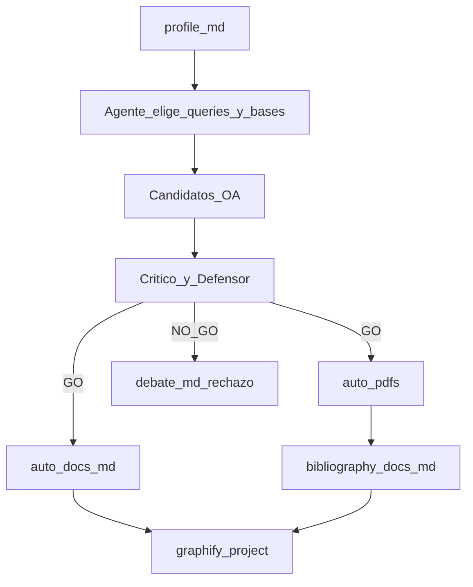

# Bibliography auto — model1

Playbook para la skill **`bibliography-auto`**. Busca fuentes **open access** a partir del `profile`, valida utilidad con **2 agentes** antes de descargar, escribe catálogo + PDF + MD y refresca Graphify del proyecto.

**Independiente de PICOCT:** no leer ni usar `bibliography/PICOCT|PICOC|PICO/`. El orquestador decide queries y bases.

## Propósito

Obtener hasta **5** papers públicos útiles al tema del proyecto, con:

- catálogo citable (`docs.md`)
- PDF en `auto/pdfs/`
- MD ligero en `bibliography/docs/` (consulta / Graphify, sin meter PDF en el contexto)

## Layout

```text
docs/content/<FOLDER>/
  bibliography/
    auto/
      docs.md           # catálogo SoT (aceptadas + pendiente_oa)
      debate.md         # acta utilidad por candidato
      pdfs/<slug>.pdf   # solo GO con OA
    docs/
      <slug>.md         # PDF → MD (solo GO)
  index-manifest.json
  graphify-out/
```

## Pipeline



### Paso 1 — Resolver proyecto

1. `FOLDER` + leer `profile.md` (tema, problema, alcance, MVP).
2. Leer `config.json`: `citation_style` (p. ej. `common/citation-style/APA7.md` o IEEE).
3. Si falta `profile.md` → pedir **init-project**.
4. Si ya existen archivos en `bibliography/auto/` o `bibliography/docs/` → **preguntar** antes de sobrescribir / complementar.

### Paso 2 — Buscar candidatos (sin descargar)

El agente elige bases y queries (Semantic Scholar, OpenAlex, Unpaywall, arXiv, SciELO, publishers OA, etc.).

Por cada candidato anotar (lista corta; puede ser >5 para filtrar):

- título, autores, año
- abstract o snippet
- keywords (si hay)
- DOI / URL landing
- URL PDF OA candidata (si existe) — **aún no descargar**

**Forbidden:** Sci-Hub, paywall bypass, inventar DOI/PDF, descargar en este paso.

### Paso 3 — Debate de utilidad (obligatorio)

Modo: `bibliography_auto_utilidad`.

Agentes:

- **critico-estricto** — irrelevancia al profile, buzzword-only, fuera de alcance, genérico sin ancla al dominio del proyecto. WebSearch ≤3.
- **defensor-fundamento** — defiende con abstract/DOI/keywords; concede `punto_debil` si no aporta. WebSearch ≤3.

CONTEXTO mínimo:

```text
modo: bibliography_auto_utilidad
FOLDER
profile_resumen: tema + problema + alcance (breve)
candidatos: [{titulo, autores, año, abstract, doi_url, pdf_oa_url?}, ...]
objetivo: decidir GO|NO_GO por utilidad al profile; no descargar aún
```

**Regla de descarga (orquestador consolida):**

| Veredicto | Acción |
|-----------|--------|
| `GO` / `GO_con_cambios` | Elegible a descarga (si hay PDF OA) |
| `NO_GO` / empate débil | **No** descargar ni transformar; rechazo breve en `debate.md` |
| GO sin PDF OA | Ficha `pendiente_oa` en `docs.md`; **no** cuenta como slot PDF |

Desempate: ante duda razonable → **no descargar**.

Escribir acta en `bibliography/auto/debate.md` (ataques, defensas, veredicto por candidato).

Tope: como máximo **5** aceptadas con PDF. Si hay más GO, priorizar las más alineadas al profile.

### Paso 4 — Descargar y convertir (solo GO)

1. Crear `bibliography/auto/pdfs/` y `bibliography/docs/`.
2. Para cada GO con URL PDF pública: HTTP 200 / content-type PDF (o enlace OA explícito). Guardar `pdfs/<slug>.pdf`.
3. Convertir con `pdftotext -layout` → `bibliography/docs/<slug>.md`:
   - Front matter breve: título, DOI/URL, path del PDF, fecha captura.
   - Cuerpo con **≥3** headings `##` / `###` (páginas o secciones) — requerido por Graphify (`MIN_HEADINGS_NOTE`).
4. Si la descarga falla → marcar en `docs.md` / `debate.md`; no inventar contenido.

Slug: 3–8 palabras, lowercase, hyphenated, estable (mismo nombre pdf y md).

### Paso 5 — Escribir `docs.md`

Catálogo SoT. Una sección `##` por fuente **aceptada** o `pendiente_oa`.

Campos obligatorios por fuente:

| Campo | Descripción |
|-------|-------------|
| Título | Título del trabajo |
| Autores | Lista de autores |
| Keywords | Keywords del paper |
| Razón | Por qué se eligió (alineación profile + veredicto debate) |
| Cita | Formato según playbook de `config.citation_style` |
| Paths | `auto/pdfs/…`, `docs/…` (si aplica), DOI/URL, estado (`ok` \| `pendiente_oa`) |

Plantilla mínima:

```markdown
# Bibliografía auto — <FOLDER>

## <Título corto o slug>

- **Título:** …
- **Autores:** …
- **Keywords:** …
- **Razón:** …
- **Cita:** …
- **DOI / URL:** …
- **PDF:** `bibliography/auto/pdfs/<slug>.pdf` | `pendiente_oa`
- **MD:** `bibliography/docs/<slug>.md` | —
- **Estado:** `ok` | `pendiente_oa`
```

### Paso 6 — Graphify del proyecto (obligatorio)

Esta skill **sí** invoca Graphify del proyecto (excepción al “no refresh solos”):

```bash
pnpm graphify:project -- <FOLDER>
```

El prepare debe indexar:

- `bibliography/auto/docs.md` → `kind: bib_auto_index`
- `bibliography/docs/<slug>.md` → `kind: bib_auto` (+ `source_pdf`)

Skip por `sha256` si ya `md_ready` / `graphify_indexed`. Sin `--force` salvo que el usuario lo pida.

Si un MD queda `needs_agent` (<3 headings): enriquecer headings y stamp antes de build.

### Paso 7 — Registrar en `config.tools`

```json
"bibliography-auto": {
  "catalog": "./bibliography/auto/docs.md",
  "debate": "./bibliography/auto/debate.md",
  "pdfs": "./bibliography/auto/pdfs/",
  "docs": "./bibliography/docs/"
}
```

### Paso 8 — Chat

Informar: aceptadas / rechazadas, pendientes OA, paths, Graphify skipped vs nuevos, `needs_agent` restantes.

## Forbidden

- Usar PICOCT / keywords del marco como input obligatorio.
- Descargar PDF **antes** del debate de utilidad.
- Paywall bypass / Sci-Hub.
- Inventar DOI, PDF o texto del paper.
- Más de 5 PDFs descargados.
- Guardar PDF fuera de `bibliography/auto/pdfs/`.
- Indexar binarios PDF en Graphify (solo MD + `docs.md`).
- Refresh graphify-root o graphify-theme desde esta skill.
- Sobrescribir en silencio.

## Agentes

- `.cursor/agents/critico-estricto.md`
- `.cursor/agents/defensor-fundamento.md`
