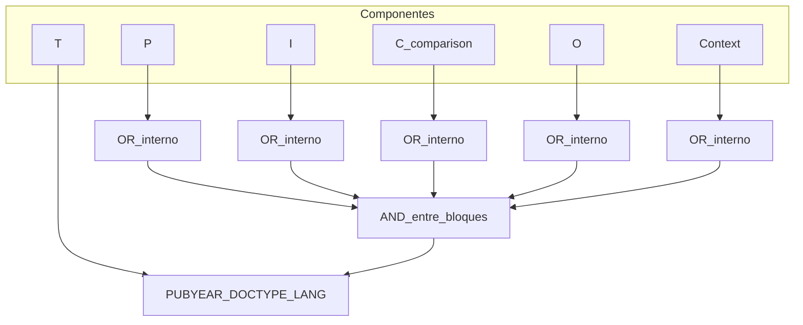

# Bibliography PICOCT — model1

Playbook para la skill **`bibliography-picoct`**. Define conceptos, variantes del marco, cómo llenar cada componente, cómo derivar **keywords controladas** (EN/ES) y cómo armar **ecuaciones de búsqueda** tipo Scopus.

**Pedagogía vs salida:** este archivo enseña al orquestador. La salida aplicada vive en `docs/content/<FOLDER>/bibliography/<MARCO>/` (`picoct.md`, `keywords.md`, `debate.md`) — sin mini-clases.

## Posición en el pipeline


Va **antes** de poblar CSV / búsqueda automática y **antes** de `make-informe`. No reabre el tema del proyecto.

## Propósito

Traducir el problema académico del `profile` a un marco de revisión (PICO / PICOC / PICOCT), con vocabulario de búsqueda **estándar en la literatura**, y ecuaciones pegables en bases (Scopus, IEEE Xplore, WoS).

## Variantes del marco (elegir una)

| Marco | Componentes | Cuándo usarlo |
|-------|-------------|----------------|
| **PICO** | P, I, C, O | Intervención vs comparación clásica; sin énfasis en entorno ni ventana temporal |
| **PICOC** | P, I, C, O, **C**ontext | El entorno (país, sector, tipo de organización) es filtro de inclusión |
| **PICOCT** (default) | P, I, C, O, Context, **T**ime/Type | Hay rango de años y/o tipo de documento/diseño metodológico |

Si el usuario no indica marco → **PICOCT**.

La carpeta de salida se nombra con el marco en mayúsculas: `bibliography/PICOCT/`, `bibliography/PICOC/`, `bibliography/PICO/`.

## Conceptos — tabla de componentes

Usar exactamente estos significados al llenar `picoct.md`:

| Componente | Definición | Criterios de inclusión / descripción |
| :---: | :--- | :--- |
| **P** | **Population / Problem** (Población o Problema) | Sujetos de estudio **o** problemática central (p. ej. PYME de calzado; descuadre de inventario PT por variante) |
| **I** | **Intervention** (Intervención o Exposición) | Técnica, herramienta, tratamiento o método a evaluar (p. ej. bitácora digital / piloto Sheets / inventory accuracy protocol) |
| **C** | **Comparison** (Comparación) | Grupo de control o método tradicional (cuaderno, WhatsApp, memoria, Excel suelto, POS/ERP). Puede ser débil o “usual care”; no omitir sin justificar |
| **O** | **Outcome** (Resultados o Desenlaces) | Variables/métricas a medir (exactitud de stock, tiempo de confirmación, adopción de registro, % descuadre) |
| **C** (solo PICOC/PICOCT) | **Context** (Contexto) | Entorno geográfico, institucional o sectorial (Perú / Trujillo / manufacturing SMEs / footwear) |
| **T** (solo PICOCT) | **Time / Type of study** (Tiempo / Tipo) | Rango de años de publicación **y/o** diseño metodológico / tipo documental buscado (artículos, SLR, case study) |

### Reglas al llenar el marco

1. **Fuente prioritaria:** si `profile.md` (o el polish de origen) ya trae **`## Marco PICOCT`**, **partir de esa tabla** — copiar/adaptar a `picoct.md` según el marco elegido (PICO/PICOC/PICOCT). Solo completar huecos; no reescribir desde cero salvo que falte la sección.
2. Si no hay Marco PICOCT en profile: construir desde tema/problema/alcance/MVP. No inventar hechos de empresa.
3. Cada celda: 1–3 frases + etiqueta `evidencia` | `hipótesis` | `pendiente_campo`.
4. **P** debe ser problema *observable*, no slogan de transformación digital.
5. **I** = intervención del estudio/MVP, no “digitalización” genérica.
6. **C** (comparison): si no hay brazo control explícito, documentar *prácticas actuales* como comparación.
7. **O** debe ser medible (nombres de métricas usables en keywords).
8. **Context**: país/sector; evitar solo el nombre comercial de la empresa como único término de búsqueda (la empresa es caso; el Context de la query es el *tipo* de entorno).
9. **T — años:** si el usuario/profile **no** fija rango → solo el **año corriente** del sistema (p. ej. `PUBYEAR > 2025 AND PUBYEAR < 2027` para acotar 2026, o documentar `año = 2026`) + tipo default `article` si aplica. Si hay rango explícito → usarlo.
10. **Profile incompleto:** si un componente (sobre todo **O** o **Context**) sigue vacío tras el Marco PICOCT: mejor hipótesis razonable + `pendiente_campo`, listar en chat (Paso 6). **No** detener el pipeline ni inventar datos de empresa.

## Keywords — conceptos

Una **keyword** es un término (o frase entre comillas) que **aparece en la literatura** del dominio: títulos, abstracts, author keywords, tesauros (IEEE, Scopus subject areas, MeSH si aplica salud, UNESCO, etc.).

### Qué sí / qué no

| Sí | No |
|----|-----|
| Términos usados en papers/tesis/SLR del dominio | Jerga inventada del equipo (“Sheets-piloto Romantex”) |
| Sinónimos y variantes ortográficas documentadas | Nombres propios de empresa como único eje de P/I |
| Wildcards Scopus razonables (`inventor*`, `SME*`) | Operadores metidos dentro de la celda de la tabla |
| Equivalentes EN y ES reales | Traducción literal absurda |

### Cantidad

- Por componente: **4–12** keywords EN y **4–12** ES (pueden solaparse conceptualmente).
- Priorizar precisión: menos términos buenos > lista interminable de ruido.
- Comparison (**C**): incluir términos del *status quo* y, si aplica, palabras de contraste (`comparison`, `versus`, `compared with`) **solo** si no diluyen demasiado; preferir nombres del método tradicional.

### Verificación (obligatoria en espíritu)

Antes de fijar una keyword:

1. ¿Aparece en papers/tesis del área? (WebSearch / abstracts conocidos)
2. ¿Es demasiado local (solo el caso) → bajar a Context o descartar de la query global?
3. El crítico atacará inventos; el defensor debe citar uso o sustituir.

## Pipeline operativo (cómo hacerlo)

### Paso 1 — Resolver marco y proyecto

1. `FOLDER` + leer `profile.md`.
2. Marco: arg usuario o default `PICOCT`.
3. Crear (si no existe) `bibliography/<MARCO>/`.

### Paso 2 — Escribir `picoct.md`

Estructura mínima:

```markdown
# Marco <MARCO> — <FOLDER>

## Componentes

| Componente | Definición breve | Criterios / descripción del caso | Etiqueta |
|------------|------------------|----------------------------------|----------|
| P | … | … | evidencia \| hipótesis |
| … | | | |

## Notas de inclusión / exclusión (breves)
- Incluir: …
- Excluir: …
```

Solo filas de componentes del marco elegido.

### Paso 3 — Keywords candidatas

Para cada componente presente, listar EN y ES. Marcar dudosas como `candidato` hasta el debate.

### Paso 4 — Debate (crítico + defensor)

Modo skill: `keywords_picoct` (no GO/NO_GO de tema).

- **critico-estricto:** ataca keywords inventadas, buzzwords, demasiado locales, o tan amplias que traen ruido (`digitalization` solo). Cupo WebSearch **3**.
- **defensor-fundamento:** responde con evidencia de uso o propone sustituto documentado; admite `punto_debil`. Cupo **3**.

El orquestador **consolida** (no promedio político): elimina inventadas; conserva las defendidas con rastro de uso.

**Desempate (sin empate):** si el defensor cita un uso **débil** (una sola mención, fuente de bajo impacto, o uso tangencial no central al concepto) y el crítico **mantiene** la objeción → degradar el término a `candidato_débil`, **dejarlo fuera** de la ecuación final y de la columna activa de `keywords.md`, y documentarlo en `debate.md` con la razón. Ante duda razonable, el término **no entra** a la query.

Escribir acta breve en `debate.md` (ataques, sustituciones, `candidato_débil` excluidos, lista final aceptada).

### Paso 5 — Escribir `keywords.md`

#### 5.1 Tabla

| Componente | Keywords (EN) | Keywords (ES) |
|------------|---------------|---------------|
| P | `a`, `b`, `"multi word"` | `…` |
| I | … | … |
| … | | … |

Una fila por componente del marco. Keywords separadas por coma; frases multi-palabra entre comillas en la celda.

#### 5.2 Ecuaciones de búsqueda avanzada

Dos subsecciones: **Scopus (English)** y **Scopus (Español)**.

**Regla de composición:**

```text
(COMP_P) AND (COMP_I) AND (COMP_C) AND (COMP_O) [AND (COMP_Context)] [AND (filtros_T)]
```

Dentro de cada `COMP_*`:

```text
TITLE-ABS-KEY ( k1 OR k2 OR "frase compuesta" OR stem* )
```

- Un bloque `TITLE-ABS-KEY` por componente presente.
- Componentes unidos solo con `AND`.
- Internamente solo `OR`.
- Filtros de **T** (y opcionales) **después** de los bloques de contenido:

```text
AND PUBYEAR > YYYY AND PUBYEAR < YYYY
AND ( LIMIT-TO ( DOCTYPE , "ar" ) )
AND ( LIMIT-TO ( LANGUAGE , "English" ) )   # o Spanish en la versión ES
```

`LIMIT-TO ( OA , "all" )` **solo** si el usuario lo pide o T lo exige; no es default (reduce recall).

**Ejemplo de forma** (ilustrativo; no copiar al caso):

```text
TITLE-ABS-KEY ( blind* OR "visually impair*" OR "low vision" )
AND
TITLE-ABS-KEY ( "artificial intelligence" OR "machine learning" OR CNN )
AND
TITLE-ABS-KEY ( "traditional braille" OR comparison OR versus )
AND
TITLE-ABS-KEY ( accuracy OR usability OR accessibility )
AND
PUBYEAR > 2020 AND PUBYEAR < 2026
AND ( LIMIT-TO ( DOCTYPE , "ar" ) )
AND ( LIMIT-TO ( LANGUAGE , "English" ) )
```

La versión ES usa keywords ES + `LANGUAGE , "Spanish"` (o sin LIMIT de idioma si se busca bilingüe — documentar la elección en una línea bajo la ecuación).

**Checklist de sintaxis (obligatoria antes de pegar la ecuación definitiva)** — fallar cualquiera = corregir y re-chequear:

1. **Paréntesis balanceados:** contar `(` = `)` en toda la ecuación.
2. **Un bloque por componente:** exactamente un `TITLE-ABS-KEY(...)` por cada componente presente en el marco (PICO → 4; PICOC → 5; PICOCT → 5 de contenido + filtros T aparte; Context sí lleva bloque; **T no** se expresa como `TITLE-ABS-KEY`, solo como filtros).
3. **Operadores:** entre bloques de componente solo `AND`; dentro de cada `TITLE-ABS-KEY` solo `OR` (más wildcards/`""` en términos).
4. **Orden de filtros:** `PUBYEAR`, `LIMIT-TO` (DOCTYPE, LANGUAGE, OA…) van **después** de todos los bloques de contenido; nunca intercalados entre componentes.

Sin este checklist, una ecuación “parecida” al ejemplo puede romper Scopus por anidación incorrecta.

### Paso 6 — Chat al usuario

Informar: paths, marco, años, keywords descartadas / `candidato_débil`, componentes en `pendiente_campo` a confirmar, si hace falta ampliar Context/T.

## Diagrama mental keywords ↔ query



## Salida mínima

| Archivo | Contenido |
|---------|-----------|
| `picoct.md` | Marco lleno del caso |
| `keywords.md` | Tabla EN/ES + ecuaciones Scopus EN y ES |
| `debate.md` | Acta crítico ↔ defensor |

## Forbidden

- Inventar keywords sin intento de verificación / sin pasar el debate.
- Meter el nombre de la empresa como único término de Intervention.
- Usar solo `OR` entre P e I (rompe la lógica del marco).
- Copiar ecuaciones de ejemplo genéricas sin adaptar al profile.
- Escribir pedagogía larga dentro de `keywords.md`.
