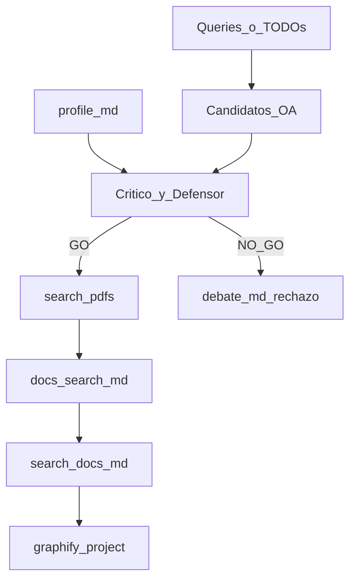

# Bibliography search — model1

Playbook para la skill **`bibliography-search`**. Busca fuentes **open access** para cerrar huecos de citación (p. ej. `TODO: citar` de **make-report**), valida utilidad con **2 agentes** antes de descargar, escribe catálogo + PDF + MD bajo **`bibliography/search/`** + **`bibliography/docs/search/`**, y refresca Graphify del proyecto.

**Independiente de PICOCT.** Misma raíz `bibliography/` que **bibliography-auto**; **no mezclar catálogos** (`auto/` vs `search/`).

## Propósito

Obtener hasta **5** papers públicos útiles a consultas/TODOs de citación, con:

- catálogo citable (`bibliography/search/docs.md`)
- PDF en `bibliography/search/pdfs/`
- MD ligero en `bibliography/docs/search/` (consulta / Graphify)

## Layout

```text
docs/content/<FOLDER>/
  bibliography/
    auto/…                    # bibliography-auto (no tocar aquí)
    search/
      docs.md                 # catálogo SoT FINAL: 1:1 con pdfs/
      debate.md
      pdfs/<slug>.pdf
    docs/
      <slug>.md               # MD de auto
      search/<slug>.md        # MD de search
  index-manifest.json
  graphify-out/
```

## Pipeline



### Paso 1 — Resolver proyecto y consultas

1. `FOLDER` + leer `profile.md` (tema, problema, alcance).
2. Leer `config.json`: `citation_style`.
3. Si falta `profile.md` → pedir **init-project**.
4. Recoger **queries** del invocador:
   - TODOs `TODO: citar — …` del draft, o
   - lista explícita del usuario / make-report.
5. Si ya hay archivos en `bibliography/search/` o `bibliography/docs/search/` → **preguntar** antes de sobrescribir / complementar.
6. Si el draft tiene entrada en `docs/reports-trace.json`, al cerrar TODOs marcar `todos[].status: "done"` en esa versión.

### Paso 2 — Buscar candidatos (sin descargar)

**Obligatorio:** seguir `common/bibliography-oa-sources/model1.md` (OpenAlex, Semantic Scholar, arXiv, PubMed, …; ≥2 fuentes; dedupe; priorizar OA con `pdf_oa_url`).

- **search:** queries = TODOs / lista (`modo_consumidor: bibliography_search`).
- Anclar cada candidato a `query_origen` (TODO o query).

Por cada candidato anotar (lista corta; puede ser >5 para filtrar):

- título, autores, año
- abstract o snippet
- keywords (si hay)
- DOI / URL landing
- URL PDF OA candidata (si existe) — **aún no descargar**
- query/TODO que motiva el candidato
- fuente + is_oa

**Forbidden:** Sci-Hub, paywall bypass, inventar DOI/PDF, descargar en este paso, saltarse oa-sources.

### Paso 3 — Debate de utilidad (obligatorio)

Modo: `bibliography_search_utilidad`.

Agentes:

- **critico-estricto** — irrelevancia a query/profile, buzzword-only, fuera de alcance. WebSearch ≤3.
- **defensor-fundamento** — defiende con abstract/DOI/keywords; concede `punto_debil` si no aporta. WebSearch ≤3.

CONTEXTO mínimo:

```text
modo: bibliography_search_utilidad
FOLDER
profile_resumen: tema + problema + alcance (breve)
queries_o_todos: […]
candidatos: [{titulo, autores, año, abstract, doi_url, pdf_oa_url?, query_origen}, ...]
objetivo: decidir GO|NO_GO por utilidad a query + profile; no descargar aún
```

**Regla de descarga (orquestador consolida):**

| Veredicto | Acción |
|-----------|--------|
| `GO` / `GO_con_cambios` | Elegible a descarga (si hay PDF OA) |
| `NO_GO` / empate débil | **No** descargar ni transformar; rechazo breve en `debate.md` |
| GO sin PDF OA / descarga fallida | Solo en `debate.md` + chat como `pendiente_oa`; **no** inventar ficha en `docs.md` |

Desempate: ante duda razonable → **no descargar**.

Escribir acta en `bibliography/search/debate.md`.

Tope: como máximo **5** PDFs. Si hay más GO, priorizar las más alineadas a los TODOs/queries.

### Paso 4 — Descargar y convertir (solo GO)

1. Crear `bibliography/search/pdfs/` y `bibliography/docs/search/`.
2. Para cada GO con URL PDF pública: HTTP 200 / content-type PDF (o enlace OA explícito). Guardar `pdfs/<slug>.pdf`.
3. Convertir con `pdftotext -layout` → `bibliography/docs/search/<slug>.md`, luego enriquecer:
   ```bash
   python scripts/graphify_bib_enrich.py docs/content/<FOLDER>/bibliography/docs/search/<slug>.md \
     --pdf docs/content/<FOLDER>/bibliography/search/pdfs/<slug>.pdf
   ```
4. Si la descarga falla → anotar en `debate.md` y chat; **no** inventar PDF, MD ni entrada en `docs.md`.

Slug: 3–8 palabras, lowercase, hyphenated, estable (mismo nombre pdf y md).

### Paso 5 — Escribir `docs.md` (al final del material, antes de Graphify)

**Orden obligatorio:** debate → descargas + MD → **verificar en disco** → recién entonces `search/docs.md` → config → Graphify → chat.

Catálogo SoT. **Solo** fuentes con PDF real en `search/pdfs/<slug>.pdf` **y** MD en `bibliography/docs/search/<slug>.md`. Si se descargaron 2, el catálogo tiene 2 secciones — ni más ni menos. **Prohibido** inventar fichas, `pendiente_oa` o paths que no existan.

Campos obligatorios por fuente:

| Campo | Descripción |
|-------|-------------|
| Título | Título del trabajo |
| Autores | Lista de autores |
| Keywords | Keywords del paper |
| Query / TODO | Qué hueco de citación cubre |
| Razón | Por qué se eligió (alineación + veredicto debate) |
| Cita | Formato según playbook de `config.citation_style` |
| Paths | `search/pdfs/…`, `docs/search/…`, DOI/URL, estado `ok` |

Plantilla mínima:

```markdown
# Búsqueda bibliográfica — <FOLDER>

## <slug>

- **Título:** …
- **Autores:** …
- **Keywords:** …
- **Query / TODO:** …
- **Razón:** …
- **Cita:** …
- **DOI / URL:** …
- **PDF:** `bibliography/search/pdfs/<slug>.pdf`
- **MD:** `bibliography/docs/search/<slug>.md`
- **Estado:** `ok`
```

### Paso 6 — Graphify del proyecto (obligatorio)

```bash
pnpm graphify:project -- <FOLDER>
```

El prepare debe indexar:

- `bibliography/search/docs.md` → `kind: bib_search_index`
- `bibliography/docs/search/<slug>.md` → `kind: bib_search` (+ `source_pdf`)

Skip por `sha256` si ya `md_ready` / `graphify_indexed`. Sin `--force` salvo que el usuario lo pida.

### Paso 7 — Registrar en `config.tools`

```json
"bibliography-search": {
  "catalog": "./bibliography/search/docs.md",
  "debate": "./bibliography/search/debate.md",
  "pdfs": "./bibliography/search/pdfs/",
  "docs": "./bibliography/docs/search/"
}
```

### Paso 8 — Chat

Informar: aceptadas con PDF+MD / rechazadas / `pendiente_oa` (solo chat+debate), paths reales, Graphify skipped vs nuevos. Si lo invocó **make-report**, devolver slugs + citas listas para reemplazar TODOs.

## Forbidden

- Mezclar catálogos `auto/` y `search/` (mismo root `bibliography/` está bien; catálogos separados).
- Saltar `common/bibliography-oa-sources/model1.md` en el Paso 2.
- Usar PICOCT como dependencia.
- Descargar PDF **antes** del debate.
- Escribir `docs.md` **antes** de terminar descargas/conversiones, o con más entradas que PDFs+MD reales.
- Inventar fichas, `pendiente_oa` o paths en `docs.md`.
- Paywall bypass / Sci-Hub.
- Más de 5 PDFs descargados.
- Indexar binarios PDF en Graphify (solo MD + catálogo).
- Refresh graphify-root desde esta skill.
- Sobrescribir en silencio.

## Relación

| Recurso | Rol |
|---------|-----|
| **bibliography-oa-sources** | Paso 2 — candidatos OA multi-fuente |
| **make-report** | Puede invocar esta skill por TODOs |
| **graphify-project** | Refresh al cerrar |

## Agentes

- `.cursor/agents/critico-estricto.md`
- `.cursor/agents/defensor-fundamento.md`
