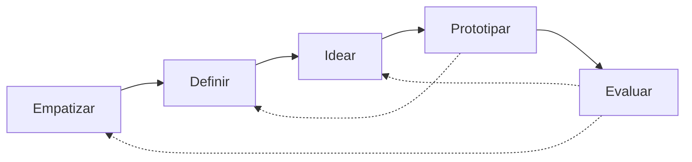

# Design Thinking — model1

Playbook para `init-project-mvp`. Solo el **MVP N**. No reabre el tema. Incorpora práctica de curso ITD (observar antes de preguntar, HMW accionable, Crazy 8’s, prototipo barato, test sin explicar).

**Pedagogía vs salida:** este archivo enseña al orquestador. Los `.md` en `mvp/mvp-<N>-<slug>/` son **informe aplicado** al caso (sin mini-clases ni sección Notas).

## Posición en el pipeline

Tool opcional. Orden del diagrama de la skill = SoT. Empathize→Prototype primero; **Test después del RAT**. TO-BE referencia este Prototype.

## Propósito

Entender el problema desde quien lo vive **antes** de fijar la solución. Ciclos, no carretera: Empatizar ↔ Definir ↔ Idear ↔ Prototipar ↔ Evaluar.

**Ejecución en este paquete:** el ciclo de arriba es **intención pedagógica**. `init-project-mvp` corre **una sola pasada** lineal (Empathize→Prototype → … → Test → flujos). Si Test revela que hay que reabrir Empathize o Idear, se declara como `pendiente_campo` / pregunta al equipo para una **iteración futura** — **no** se reabre el pipeline en el mismo run.

## Etiquetas

`evidencia` | `hipótesis` | `pendiente_campo`

## Cómo hacerlo (con lógica de ejemplo de curso)

### Empatizar — observar comportamiento, no opiniones educadas

1. Roles del MVP (máx. 5).
2. **Observar** rutina real (o plan Fase 0 para observarla). Preguntas abiertas: *“cuéntame la última vez que…”*, no *“¿te gusta X?”*.
3. Mapa empatía Dice/Piensa/Hace/Siente — marcar hipótesis.
4. Prohibido inventar citas o métricas de la empresa.

**Mini-patrón (curso Ana/cafetería):** no preguntar “¿qué opinas de la app?”; mirar dónde se traban y preguntar *en el momento* qué pasó.

### Definir — un reto, no “mejorar el sistema”

Fórmula HMW (curso): *“¿Cómo podríamos [acción] para que [usuario específico] pueda [resultado]?”*

1. POV en una frase.
2. 2–4 HMW; **1 primario** alineado a entregables del profile.
3. Evitar HMW genéricos (“¿cómo digitalizamos la empresa?”).

### Idear — cantidad antes que calidad

1. 3–5 ideas (o Crazy 8’s si hay sesión de equipo: 8 ideas / 8 min).
2. Disparadores: ¿sin presupuesto? ¿100% manual? ¿sin POS?
3. Descartar lo fuera de alcance; priorizar 1 idea (valor criterio_éxito + esfuerzo + datos).

### Prototipar — tangible y barato (≤1 día de diseño)

Artefacto concreto (Sheets, papel, flujo dibujado). Roles, frecuencia, maestro mínimo. No MVP+1. **SoT** del artefacto para Lean Solución y TO-BE.

### Test — después del RAT; usuario usa, tú callas

Mapa `R# → actividad` + umbral numérico/binario. Si tienes que explicar el prototipo para que funcione, eso ya es hallazgo. Sin RAT: umbral desde criterio_exito profile.

## Salida mínima

Archivo `design-thinking.md`: Empathize → Define → Ideate → Prototype → Test (si hubo RAT), **aplicado al caso**. Sin diagrama de ciclo metodológico ni Notas pedagógicas. Número `##` = orquestador por archivo.
