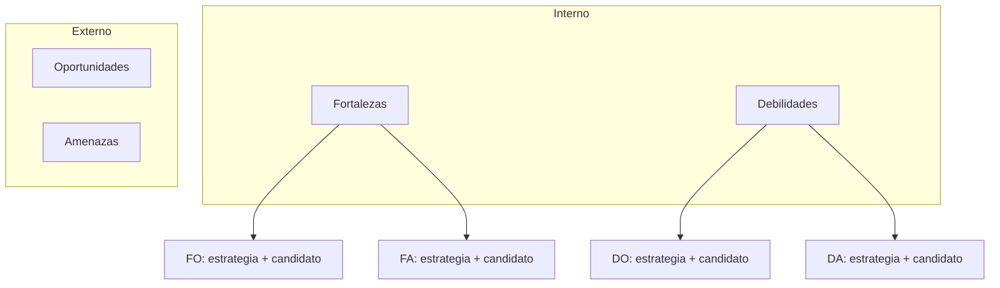

# FODA del MVP — model1

FODA del **movimiento del MVP N** + **matriz cruzada (TOWS)** para pasar de lista a acción. Alineado a curso ITD S03.

**Pedagogía vs salida:** este archivo enseña al orquestador. La salida `foda.md` es matriz + TOWS **del caso**, no tutorial FODA.

## Posición en el pipeline

Después de Lean; antes de RAT. Pase FODA: solo `→ candidato RAT`. Post-RAT: orquestador amarra `→ R#` (cuadrantes **y** celdas TOWS).

## Propósito

Foto del presente (interno/externo × ayuda/perjudica) y **cuatro tipos de estrategia** al cruzar.

Pre-RAT las casillas TOWS producen **candidatos** (o enlaces a Prototype / DT Test) — **nunca** `R#` en este pase. El diagrama no implica amarre a RAT todavía.

## Matriz base

| | Ayuda | Perjudica |
|--|-------|-----------|
| Interno | F | D |
| Externo | O | A |

## Reglas

1. Máx. 3–4 bullets/cuadrante; etiquetas evidencia.
2. Prohibido FODA corporativo genérico no ligado al MVP.
3. Pase pre-RAT: Amenazas/Debilidades de alto impacto → `→ candidato RAT` (nunca `R#` aún).
4. **Cruce TOWS (obligatorio)** — al menos **1 estrategia por casilla** FO / FA / DO / DA, accionable en el piloto/curso:
   - **FO:** usar fortaleza para aprovechar oportunidad
   - **FA:** usar fortaleza para defenderse de amenaza
   - **DO:** corregir debilidad apoyándose en oportunidad
   - **DA:** reducir exposición a amenaza mientras se corrige debilidad
5. Cada estrategia TOWS enlaza a `→ candidato RAT` / `→ Prototype` / `→ DT Test` en el pase FODA.
6. **Amarre post-RAT (orquestador):** reescribe `→ candidato RAT` en cuadrantes F/D/O/A **y** en las celdas FO/FA/DO/DA de la tabla TOWS a `→ R#`. No basta con una lista suelta de candidatos.
7. Implicación final (1 frase) = la estrategia TOWS prioritaria de la semana.

## Salida mínima

Archivo `foda.md`: matriz 2×2 + tabla TOWS + tabla de amarre post-RAT (si hubo RAT). Número = orquestador.
