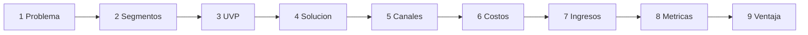

# Lean Canvas — model1

Playbook Ash Maurya (9 bloques) para el **MVP N**. Una hoja de hipótesis vivas, no plan de 40 páginas. Alineado a curso ITD S03 (orden de riesgo, UVP con fórmula, 3 problemas ↔ 3 features).

**Pedagogía vs salida:** este archivo enseña al orquestador. La salida `lean-canvas.md` es el **canvas aplicado** al caso (tabla + flujo del feature si aplica), no una explicación del método.

## Posición en el pipeline

Después de DT Prototype (si hay DT); antes de FODA/RAT. Si no hay DT → `ref: profile`.

## Propósito

Mapear hipótesis del modelo alrededor del MVP. Llenar en el **orden que reduce más riesgo** (no de arriba a abajo del lienzo).

### Orden de llenado (obligatorio) — diagrama funcional

1. Problema → 2. Segmentos → 3. UVP → 4. Solución → 5. Canales → 6. Costos → 7. Ingresos → 8. Métricas → 9. Ventaja especial

### Anexo — estructura del lienzo (no es el orden de llenado)

```mermaid
flowchart TB
  subgraph mercado [Realidad del mercado]
    problema[Problema]
    solucion[Solucion]
    metricas[Metricas clave]
    costos[Estructura de costos]
  end
  subgraph idea [Idea]
    uvp[Propuesta de valor unica]
  end
  subgraph propio [Productos propios]
    segmentos[Segmentos]
    ventaja[Ventaja especial]
    canales[Canales]
    ingresos[Flujo de ingresos]
  end
  problema --> uvp
  segmentos --> uvp
  uvp --> solucion
```

## Reglas

- Cada celda: contenido + `evidencia` | `hipótesis` | `pendiente_campo`.
- Máx. **2 frases o 3 bullets** por celda.
- Trazas: Problema/Segmentos/Solución ← DT o profile.
- **Problema:** hasta **3** dolores ordenados + **alternativas existentes** (qué hacen hoy). Idealmente derivados de conversación/observación, no solo imaginación.
- **Segmentos:** específicos + **early adopters** (quién lo sufriría primero).
- **UVP** — fórmula: *“Para [segmento] que [problema], [producto] es [categoría] que [beneficio], a diferencia de [alternativa].”*
- **Solución:** hasta **3 features** que atacan los **3 problemas** (1:1). Diagrama de flujo del feature central si ayuda.
- **Métricas:** evitar vanidad (descargas, “usuarios”); preferir comportamiento sostenido / criterio_éxito del profile.
- **Ventaja:** algo costoso de copiar; “buen servicio” no cuenta → `ninguna aún` si aplica.
- N/A solo en Canales (interno), Ingresos (operativo sin cobro), Ventaja (`ninguna aún`). Prohibido N/A en Problema/Segmentos/UVP/Solución/Costos/Métricas.

## Salida mínima

Archivo `lean-canvas.md`: tabla 9 bloques (orden 1–9) + mermaid del feature central si la solución es multi-paso. **No** incluir el diagrama de zonas ni el de orden de llenado (viven solo en este playbook). Número = orquestador.
