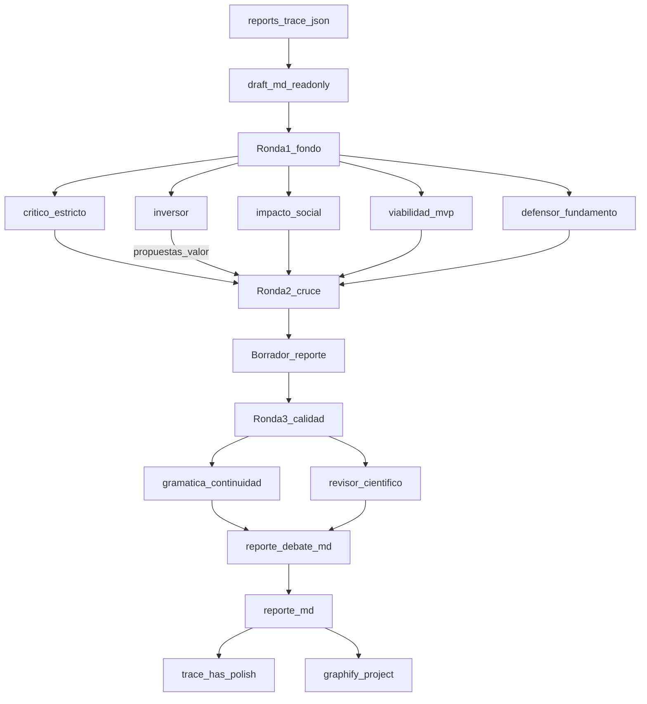

# Make report polish — model1

Playbook para la skill **`make-report-polish`**. Parte de `draft.md` (solo lectura) y produce un informe limpio profesional + acta de debate en la misma carpeta de versión.

**No modifica `draft.md`.** No es `rsl-polish-report`.

## Propósito

```text
docs/content/<FOLDER>/docs/vN-tag/
  draft.md              # base — NO TOCAR
  reporte.md            # informe limpio, continuo, listo para revisión profesional
  reporte-debate.md     # acta 7 agentes
```

Misma estructura de secciones que el draft; prosa más corta, precisa y continua. Sin labels de pipeline.

## Entrada (trazabilidad)

1. Leer `docs/reports-trace.json` (o `config.tools["make-report"].trace`).
2. Tomar la **última** entrada con `has_draft: true` (o la apuntada por `config.tools["make-report"].last`).
3. Si no hay draft / trace → pedir **make-report** primero.

## Pipeline



### Paso 1 — CONTEXTO

```text
## CONTEXTO
- dominio / pais_region / fase_entregable / restricciones (desde profile)
- modo: make_report_polish
- draft_path: …
- company: resumen o N/A

## DRAFT (extractos o path; no reescribir)
```

### Paso 2 — Round 1 (paralelo, 5)

`critico-estricto`, `defensor-fundamento`, `impacto-social`, `viabilidad-mvp`, `inversor` — todos con `modo: make_report_polish` (o `una_alternativa` si el agente no define ese modo: anclar al informe único).

### Paso 3 — Round 2 (cruce)

1. Ataques del crítico → defensor.
2. Alcance → viabilidad (no re-inflar).
3. **Propuestas de valor del inversor** → impacto + defensor + viabilidad (¿cabe sin romper MVP?).
4. Soft-veto inversor: documentar; no tumbar solo por falta de revenue si hay beneficio social/adopción creíble.

### Paso 4 — Borrador de reporte (orquestador)

Redactar borrador interno de `reporte.md` desde el draft + consensos R1/R2:

- Misma estructura de headings del draft.
- Prosa masticada, párrafos que mantienen la misma idea.
- Sin `pendiente_campo` / meta-pipeline.
- Conservar citas y `TODO: citar` residuales (no inventar fuentes).

### Paso 5 — Round 3 (calidad)

1. `gramatica-continuidad` sobre el borrador.
2. `revisor-cientifico` sobre borrador + draft + referencias.
3. Integrar reescrituras y hallazgos accionables en el texto final.

### Paso 6 — Escribir artefactos

1. `reporte-debate.md` — scores (7 roles), Q&A, mermaid, tesis de valor, hallazgos R3.
2. `reporte.md` — informe final.
3. Actualizar `reports-trace.json` en la entrada del draft:

```json
"has_polish": true,
"reporte": "./docs/vN-tag/reporte.md",
"reporte_debate": "./docs/vN-tag/reporte-debate.md"
```

4. `config.tools["make-report-polish"].last` → path del `reporte.md`.

### Paso 7 — Graphify

```bash
pnpm graphify:project -- <FOLDER>
```

### Paso 8 — Chat

Paths, veredicto de fondo, tesis de valor, TODOs de cita residuales, Graphify ok.

## Plantilla `reporte-debate.md`

```markdown
# Debate de informe — [FOLDER] — vN-tag

## Puntuación
| Eje | Critico | Defensa | Impacto | Viabilidad | Inversor | Gramática | Revisor | Notas |
|-----|---------|---------|---------|------------|----------|-----------|---------|-------|
| … | | | | | | | | |

## Tesis de valor (inversor)
…

## Preguntas y respuestas (cronológico)
…

## Cruce R2 / propuestas de valor
…

## Calidad R3
- [gramatica-continuidad] …
- [revisor-cientifico] …

## Diagrama
(mermaid personalizado)

## Fuentes consultadas
- …
```

## Forbidden

- Modificar o sobrescribir `draft.md`.
- Pulir una versión que no sea la última del trace.
- Inventar fuentes / cerrar TODO con DOI ficticio.
- Soft consensus sin presión del crítico.
- graphify-root / graphify-theme.
- Confundir con `rsl-polish-report`.

## Agentes

- `.cursor/agents/critico-estricto.md`
- `.cursor/agents/defensor-fundamento.md`
- `.cursor/agents/impacto-social.md`
- `.cursor/agents/viabilidad-mvp.md`
- `.cursor/agents/inversor.md`
- `.cursor/agents/gramatica-continuidad.md`
- `.cursor/agents/revisor-cientifico.md`
