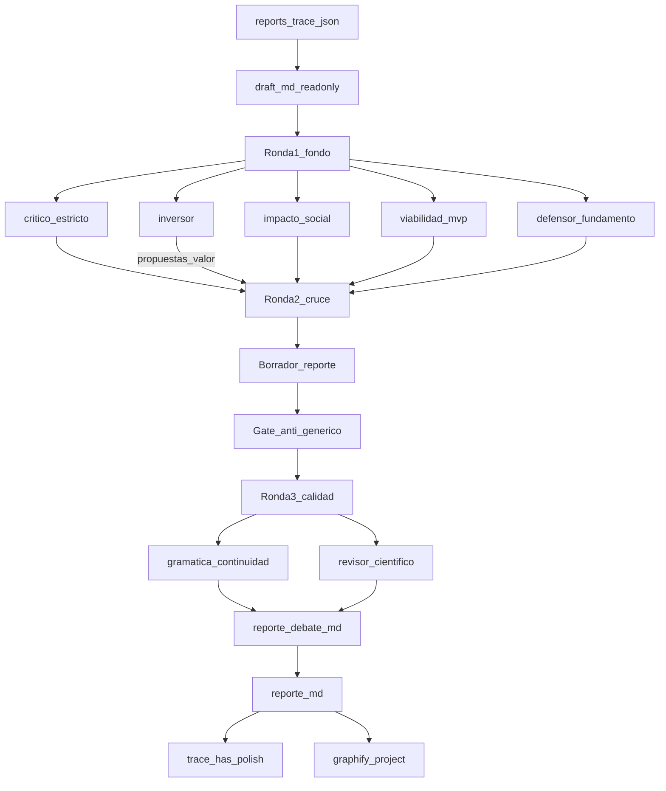

# Make report polish — model1

Playbook para la skill **`make-report-polish`**. Parte de `draft.md` (solo lectura) y produce un informe limpio profesional + acta de debate en la misma carpeta de versión.

**No modifica `draft.md`.**

## Propósito

```text
docs/content/<FOLDER>/docs/vN-tag/
  draft.md              # base — NO TOCAR
  reporte.md            # informe limpio, continuo, listo para revisión profesional
  reporte-debate.md     # acta 7 agentes
```

Misma estructura de secciones que el draft; prosa **más corta, precisa y continua** — **sin vaciar sustancia**. Sin labels de pipeline.

**Polish ≠ genérico.** Brevedad limpia está bien; borrar nombres, cifras, vendors, matices o convertir FODA/Lean en plantilla vacía **no**.

## Entrada (trazabilidad)

1. Leer `docs/reports-trace.json` (o `config.tools["make-report"].trace`) si existe.
2. Tomar la **última** entrada con `has_draft: true`, **o** el path de `config.tools["make-report"].last` si el `draft.md` existe.
3. Si no hay draft usable → pedir **make-report** primero.
4. Si se usó solo `last` sin trace → al cerrar, crear/append la entrada correspondiente en `docs/reports-trace.json` y registrar `config.tools["make-report"].trace`.

## Pipeline



### Paso 1 — CONTEXTO

```text
## CONTEXTO
- dominio / pais_region / fase_entregable / restricciones (desde profile)
- modo: make_report_polish
- draft_path: …
- company: resumen o N/A
- checklist_anti_generico: activo

## DRAFT (extractos o path; no reescribir)
## NOMBRES_PROPIOS_DRAFT (lista obligatoria: empresas, vendors, sedes, fechas, RUC…)
```

Antes de Round 1, el orquestador extrae del draft una lista de **anclas concretas** (nombres propios, cifras, fechas, RUC, vendors). Esa lista es invariante del polish salvo corrección factual documentada.

### Paso 2 — Round 1 (paralelo, 5)

`critico-estricto`, `defensor-fundamento`, `impacto-social`, `viabilidad-mvp`, `inversor` — todos con `modo: make_report_polish`.

El crítico **debe** atacar (si aplica): FODA con sujeto PoC/curso, Lean solo-PoC bajo modelo de negocio empresa, reseña delgada, M/V/V plantilla, pérdida de nombres vs draft, fuentes de una sola familia.

### Paso 3 — Round 2 (cruce)

1. Ataques del crítico → defensor.
2. Alcance → viabilidad (no re-inflar).
3. **Propuestas de valor del inversor** → impacto + defensor + viabilidad (¿cabe sin romper MVP?).
4. Soft-veto inversor: documentar; no tumbar solo por falta de revenue si hay beneficio social/adopción creíble.
5. Si el crítico marca FODA/Lean mal sujetos → el borrador **corrige** (no solo anota).

### Paso 4 — Borrador de reporte (orquestador)

Redactar borrador interno de `reporte.md` desde el draft + consensos R1/R2:

- Misma estructura de headings del draft.
- Prosa masticada: **misma idea, menos ruido** — no menos hechos.
- Sin labels de pipeline.
- Conservar citas y `TODO: citar` residuales (no inventar fuentes).
- Si el draft falló en Reglas Cap. 1 (FODA/Lean) y R1 lo señaló: **reescribir esas secciones bien** en el reporte (el draft sigue intacto; el reporte es la versión correcta).

### Paso 4b — Gate anti-genérico (obligatorio)

Antes de Round 3, verificar. Si falla → corregir el borrador:

| Check | Fallo si… |
|-------|-----------|
| Anclas | Falta un nombre propio / vendor / fecha clave que estaba en el draft sin justificación |
| Genéricos | Aparece “existen soluciones / hay tools / el mercado ofrece” **sin** ejemplos nombrados cuando el draft o el audit los tenían |
| FODA | Debilidades/amenazas son solo límites de curso/PoC |
| Lean | Tabla principal solo describe el demo académico |
| Reseña | Quedó en ≤2 párrafos pobres o peor que el draft |
| M/V/V | Tres bloques idénticos de plantilla |
| Debate | (más abajo) acta scorecard sin ataques reales |

**Regla de oro:** si al quitar nombres propios el párrafo sigue igual de “válido”, es demasiado genérico — reescribir.

### Paso 5 — Round 3 (calidad)

1. `gramatica-continuidad` (`modo: make_report_polish`): **prohibido** proponer reescrituras que sustituyan concreto por genérico.
2. `revisor-cientifico`: comparar draft vs borrador (¿hubo pérdida de sustancia?); coherencia de sujeto FODA/Lean; citas.
3. Si `veredicto: no_apto_aún` o pérdida de anclas → corregir y **re-pasar** gate 4b (máx. 1 ciclo extra).

### Paso 6 — Escribir artefactos

1. `reporte-debate.md` — **acta real** (no stub): scores de 7 roles, ≥3 Q&A con sustancia, cruce R2, hallazgos R3 accionables, mermaid del **argumento** (no del pipeline de skills), tesis de valor. Prohibido: diagrama solo de `make-report → polish` como contenido principal; scorecard vacío con “apto”.
2. `reporte.md` — informe final (pasó gate).
3. Actualizar `reports-trace.json` en la entrada del draft:

```json
"has_polish": true,
"reporte": "./docs/vN-tag/reporte.md",
"reporte_debate": "./docs/vN-tag/reporte-debate.md"
```

4. `config.tools["make-report-polish"].last` → path del `reporte.md`.

### Paso 7 — Graphify

```bash
pnpm graphify:project -- <FOLDER>
```

### Paso 8 — Chat

Paths, veredicto de fondo **honesto** (no inflar), tesis de valor, qué anclas se conservaron, TODOs de cita residuales, Graphify ok.

## Plantilla `reporte-debate.md`

```markdown
# Debate de informe — [FOLDER] — vN-tag

## Puntuación
| Eje | Critico | Defensa | Impacto | Viabilidad | Inversor | Gramática | Revisor | Notas |
|-----|---------|---------|---------|------------|----------|-----------|---------|-------|
| … | | | | | | | | |

## Ataques fuertes del crítico (resumen)
1. …

## Tesis de valor (inversor)
…

## Preguntas y respuestas (cronológico; ≥3)
1. Q: … / A: …

## Cruce R2 / propuestas de valor
…

## Gate anti-genérico
- anclas_conservadas: sí | no — …
- foda_sujeto_empresa: sí | no
- lean_sujeto_empresa: sí | no

## Calidad R3
- [gramatica-continuidad] …
- [revisor-cientifico] …

## Diagrama
(mermaid del argumento / tensiones del informe — no del pipeline de skills)

## Fuentes consultadas
- …
```

## Forbidden

- Modificar o sobrescribir `draft.md`.
- Pulir una versión que no sea la última del trace.
- Inventar fuentes / cerrar TODO con DOI ficticio.
- Soft consensus sin presión del crítico.
- **Vaciar sustancia** (quitar nombres/fechas/vendors “para limpio”).
- Acta de debate scorecard-only / mermaid solo de pipeline.
- graphify-root.

## Agentes

- `.cursor/agents/critico-estricto.md`
- `.cursor/agents/defensor-fundamento.md`
- `.cursor/agents/impacto-social.md`
- `.cursor/agents/viabilidad-mvp.md`
- `.cursor/agents/inversor.md`
- `.cursor/agents/gramatica-continuidad.md`
- `.cursor/agents/revisor-cientifico.md`
