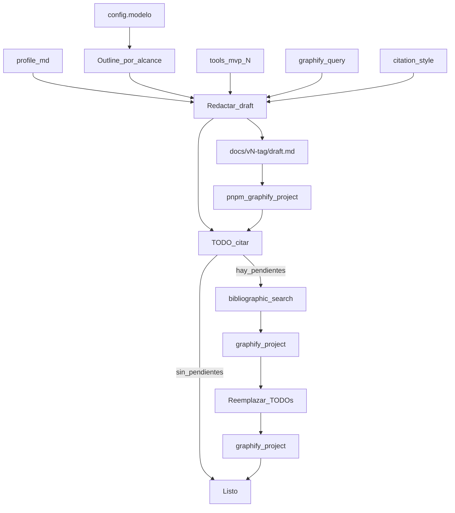

# Make report — model1

Playbook para la skill **`make-report`** (alias **`make-informe`**). Redacta un **draft versionado** del informe académico del proyecto según `config.modelo` + `config.alcance`, usa Graphify durante la redacción, y opcionalmente cierra huecos de citación con **bibliographic-search**.

**No es `rsl-make-report`** (RSL legado bajo `docs/[titulo-breve]/`). Aquí: `docs/content/<FOLDER>/`.

## Propósito

Producir:

```text
docs/content/<FOLDER>/docs/v<N>-<tag>/draft.md
```

con secciones del modelo filtradas por alcance, citas según `citation_style`, integración de tools MVP **solo si la estructura lo pide**, y **Referencias** siempre al final.

## Layout

```text
docs/content/<FOLDER>/
  profile.md
  config.json          # modelo, alcance, citation_style, mvp, tools
  structure.md         # opcional: override local del índice
  docs/
    v1-completo/
      draft.md
    v2-capitulo-1/
      draft.md
  mvp/…                # vía tools["mvp-N"] si el índice lo requiere
  bibliographic/…      # tras bibliographic-search (si hay TODOs)
  graphify-out/
```

## Schema `config.alcance`

| Valor | Significado |
|-------|-------------|
| `[]`, `"*"`, `["*"]` | Toda la estructura del modelo |
| `[{ "capitulo": 1, "secciones": ["*"] }]` | Solo ese capítulo |
| `[{ "capitulo": 1, "secciones": ["1.1", "1.2"] }]` | Prefijo inclusivo |
| Varios objetos | Unión |

**Referencias bibliográficas:** siempre al final del `draft.md` (aunque el alcance no las liste).

**Anexos:** sin regla especial vs alcance; incluir material de anexos solo si el alcance / modelo lo pide y hay contenido útil (MVP, instrumentos, etc.).

## Tag de versión

| Alcance efectivo | `<tag>` |
|------------------|---------|
| Todo el modelo | `completo` |
| Solo capítulo 1 | `capitulo-1` |
| Capítulos 1 y 2 | `capitulo-1-2` |
| Otro recorte | `capitulo-<lista>` legible (p. ej. `capitulo-3`) |

`<N>` = siguiente entero libre bajo `docs/v*-*/` (nunca sobrescribir un draft existente).

## Pipeline



### Paso 1 — Resolver proyecto

1. `FOLDER` + leer `profile.md` y `config.json`.
2. Resolver **índice / modelo** (misma regla Graphify del repo):
   - Si existe `docs/content/<FOLDER>/structure.md` con contenido útil → **override**.
   - Si no → path en `config.modelo` (p. ej. `common/structure/model1.md` o `./structure.md`).
3. Leer playbook de `citation_style`.
4. Sin `profile.md` → pedir **init-project**.

### Paso 2 — Outline por alcance

1. Parsear el índice del modelo (capítulos / secciones numeradas).
2. Filtrar según `config.alcance` (tabla arriba). `[]` = completo.
3. Construir outline de headings del draft (`##`, `###` alineados al índice).
4. Decidir `<tag>` y `<N>` (listar `docs/v*-*/` existentes).

### Paso 3 — Lookup Graphify (durante redacción)

**Antes** de Grep/Read masivo de bib, MVP o apuntes:

```bash
graphify query "<q>" --graph docs/content/<FOLDER>/graphify-out/graph.json
```

Usar nodos (finding, hallazgo, `src`, página/`loc`) para anclar afirmaciones. Si no hay grafo → pedir **graphify-project** o crearlo si el usuario ya autorizó esta skill (esta skill **sí** puede refrescar al final).

Consultas típicas: tema/empresa del profile, conceptos del capítulo, papers de `bibliography/` o `bibliographic/`.

### Paso 4 — Tools MVP (condicional)

Solo si el outline incluye secciones que el índice asocia a entregables MVP (p. ej. Lean Canvas, AS-IS/TO-BE, requeriments del MVP):

1. Leer paths de `config.tools["mvp-N"]` donde `N = config.mvp`.
2. **Integrar** (sintetizar, citar el artefacto); **no** volcar el MD completo al draft.

Si el alcance no toca esas secciones → no leer MVP.

### Paso 5 — Redactar `draft.md`

1. Crear `docs/v<N>-<tag>/draft.md`.
2. Portada breve: FOLDER, tema del profile, fecha, versión `vN-tag`.
3. Redactar secciones del outline con prosa académica coherente al profile.
4. Citas: estilo de `citation_style`. Si falta fuente verificable en grafo/catálogo → placeholder:
   ```text
   TODO: citar — <qué afirmación necesita soporte>
   ```
5. **Referencias** al final: entradas reales ya usadas + dejar TODOs sin inventar bibliografía.
6. Anexos solo si aplican (paso alcance).

**Forbidden en redacción:** inventar DOI/papers; Sci-Hub; copiar verbatim largos de PDFs; sobrescribir `vN` existente.

### Paso 6 — Registrar y Graphify tras draft

```json
"make-report": {
  "last": "./docs/v<N>-<tag>/draft.md"
}
```

```bash
pnpm graphify:project -- <FOLDER>
```

(El draft bajo `docs/` entra al corpus de apuntes.)

### Paso 7 — Cerrar TODOs de citación (si hay)

1. Listar todos los `TODO: citar — …` del draft.
2. Si hay ≥1 → invocar **bibliographic-search** con esas queries (playbook `common/bibliographic-search/model1.md`).
3. Tras search + Graphify: reemplazar cada TODO por cita real + añadir entrada en Referencias (solo fuentes con PDF/MD en catálogo).
4. Si un TODO queda sin OA → dejar el TODO o nota `pendiente_oa` en el draft; no inventar.
5. `pnpm graphify:project -- <FOLDER>` de nuevo tras el reemplazo.

### Paso 8 — Chat

Informar: path del draft, tag/N, secciones cubiertas, TODOs restantes, si corrió bibliographic-search, Graphify ok.

## Forbidden

- Confundir con **rsl-make-report** / escribir en `docs/[titulo-breve]/informe.md`.
- Salida fuera de `docs/v<N>-<tag>/draft.md`.
- Sobrescribir una versión existente.
- Omitir bloque de Referencias.
- Volcar tools MVP enteros; inventar fuentes.
- Meter resultados de search en `bibliography/auto`.
- Refresh graphify-root / graphify-theme.

## Relación con otras skills

| Skill | Rol |
|-------|-----|
| **graphify-project** | Lookup + refresh tras draft/search |
| **bibliographic-search** | Cerrar `TODO: citar` |
| **bibliography-auto** | Corpus base previo (opcional); no lo sustituye make-report |
| **rsl-make-report** | Otro dominio (RSL legado) |
