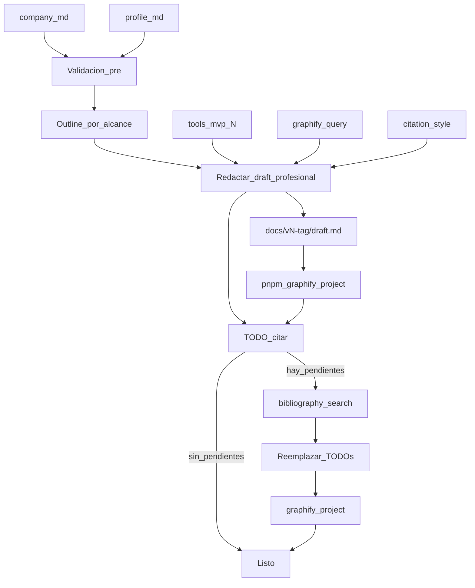

# Make report — model1

Playbook para la skill **`make-report`** (alias **`make-informe`**). Redacta un **draft versionado, profesional y sustancial** del informe académico según `config.modelo` + `config.alcance`, usa **`company.md`** cuando hay organización ancla, Graphify durante la redacción, y cierra huecos de citación con **bibliography-search**.

Dominio: `docs/content/<FOLDER>/`.

## Propósito

Producir:

```text
docs/content/<FOLDER>/docs/v<N>-<tag>/draft.md
docs/content/<FOLDER>/docs/reports-trace.json
```

Esta skill deja la **base completa** del informe. **`make-report-polish`** escribe `reporte.md` sin tocar el draft.

## Layout

```text
docs/content/<FOLDER>/
  profile.md
  company.md           # si tipo_sujeto = empresa|entidad (requerido para cap. 1.1)
  config.json
  structure.md         # opcional
  docs/vN-tag/draft.md
  docs/reports-trace.json
  mvp/…
  bibliography/…
  graphify-out/
```

## Schema `config.alcance`

| Valor | Significado |
|-------|-------------|
| `[]`, `"*"`, `["*"]` | Toda la estructura del modelo |
| `[{ "capitulo": 1, "secciones": ["*"] }]` | Solo ese capítulo |
| `[{ "capitulo": 1, "secciones": ["1.1", "1.2"] }]` | Prefijo inclusivo |
| Varios objetos | Unión |

**Referencias:** siempre al final del `draft.md`.

## Tag de versión

| Alcance efectivo | `<tag>` |
|------------------|---------|
| Todo el modelo | `completo` |
| Solo capítulo 1 | `capitulo-1` |
| Capítulos 1 y 2 | `capitulo-1-2` |
| Otro recorte | `capitulo-<lista>` |

`<N>` = siguiente entero libre bajo `docs/v*-*/` (nunca sobrescribir).

## Estándar de calidad (obligatorio)

### Qué sí

- Prosa **académico-profesional**, párrafos desarrollados, secciones con **hechos nombrables** (fechas, sedes, líneas de negocio, competidores/proxies con nombre cuando existan en `company.md` / theme-audit / benchmark).
- Cap. presentación de empresa: ver **Reglas Capítulo 1** abajo.
- Separar en frases distintas lo **documentado con fuente** de lo que es **diseño del proyecto** — en prosa natural, sin etiquetas internas de pipeline.
- Citas donde aportan; no spam de la misma cita en cada frase.
- Portada/metadato **alineados** con lo que el draft realmente cubre.
- Preferir **concreto breve** a **genérico largo**: un párrafo con hitos > tres frases vacías.

### Qué no (prohibido en el cuerpo del draft)

| Prohibido | Por qué |
|-----------|---------|
| Labels de pipeline (`pendiente_campo`, encabezados `hipótesis:`, `evidencia:`) | Meta del proceso init/MVP |
| “valídalo con sponsor”, “casi reporte”, “propuesta de trabajo no hallazgos” | Descarga la responsabilidad al lector |
| Reseña de 1–2 líneas o solo paráfrasis de un párrafo web | Confunde falta de AS-IS con falta de historia pública |
| FODA cuyas debilidades/amenazas son **solo** riesgos del curso/PoC | El 1.2 es diagnóstico de la **empresa/entorno**, no del sílabo |
| Lean Canvas **solo** del PoC académico bajo “Modelo de negocio” de la empresa | Sustituye el negocio real por el demo del curso |
| Frases genéricas sin ancla (“existen soluciones”, “el mercado ofrece tools”) cuando el corpus ya tiene nombres | Produce informe vacío |
| Inventar hechos internos de la empresa | Solo fuentes públicas / `company.md` |

**Permitido (una vez, prosa natural):** acotar alcance (“con base en fuentes públicas…”) o decir que no hay misión formal publicada. **No** repetir el disclaimer en cada subsección.

**Único placeholder permitido:** `TODO: citar — <afirmación>` cuando falta fuente verificable.

### Reglas Capítulo 1 (si el alcance lo incluye)

Aplica cuando el outline trae 1.1 / 1.2 / 1.3 (nombres equivalentes del `modelo`).

#### 1.1 Presentación / reseña / M-V-V

1. **Reseña histórica (1.1.1):** ≥ **3 párrafos** útiles con hitos fechados cuando existan (fundación, consolidación, expansión de sedes/líneas). Ampliar `company.md` con investigación pública **antes** de redactar si la ficha es corta. No basta un resumen de marketing.
2. **Misión / visión / valores:** si no hay enunciado formal, **decirlo una vez** y desarrollar la narrativa institucional publicada (promesa de servicio, posicionamiento, rigor técnico) con citas. **Prohibido** tres bloques idénticos tipo plantilla (“No se publica… El PoC toma…”). Variar estructura; el PoC no sustituye M/V/V.
3. Intro 1.1: empresa primero; el proyecto como **encuadre breve**, no como protagonista de la presentación.

#### 1.2 Diagnóstico situacional (micro / macro)

**Sujeto del FODA = la organización y su entorno**, no el sílabo.

| Bloque | Debe contener | No debe ser |
|--------|---------------|-------------|
| Fortalezas | Hechos públicos de la empresa (con cita) | Lista de features del MVP |
| Debilidades | Fricciones **organizacionales/operativas** ancladas a lo publicado o a práctica del sector (p. ej. tensión entre promesa de stock inmediato y complejidad de variantes) | Solo “el PoC necesita modelo rollo” / “falta AS-IS de campo” |
| Oportunidades | Entorno de la empresa (digitalización del vertical, demanda contract, etc.) con **nombres** de referentes cuando el audit/benchmark/company los tenga | “Hay software en el mercado” sin ejemplos |
| Amenazas | Entorno competitivo/regulatorio/operativo de la **empresa** (suites locales/verticales nombradas, importaciones, saturación de vendors) | Lista de límites del semestre (RFID, multi-sede, EDI) como únicas amenazas |

**Puente al proyecto (obligatorio, corto):** tras micro y/o macro, un párrafo o viñeta **“Implicación para el proyecto / MVP”** con decisiones de diseño. Ahí sí caben límites de curso. **No** mover ese contenido a Debilidades/Amenazas.

Si `theme-audit.md` / benchmark listó vendors (p. ej. Cuenti, Kaypi, PolyPM): **conservar nombres + cita o `TODO: citar`** en oportunidades/amenazas. No bajar a genérico.

#### 1.3 Modelo de negocio / Lean Canvas

1. El lienzo principal describe el **modelo de negocio de la organización** (segmentos reales, propuesta comercial, canales, ingresos/costos públicos o inferibles con cautela).
2. Si existe Lean del MVP en `tools["mvp-N"]`: usarlo como **contraste breve** después (“Encaje del proyecto”) — métricas/alcance del PoC — **sin reemplazar** el lienzo empresa.
3. Prohibido: tabla Lean solo del demo académico bajo el título de modelo de negocio de la empresa.

## Pipeline



### Paso 1 — Resolver proyecto

1. `FOLDER` + leer `profile.md` y `config.json`.
2. Si `tipo_sujeto` / tema implica empresa o entidad:
   - Exigir `company.md` (o `config.tools.company`). Si falta o está vacío → **detener** y pedir `init-project` / completar ficha.
   - Si existe pero es pobre (p. ej. <1 página útil) → **ampliar con investigación pública** antes de redactar 1.1; actualizar `company.md`.
3. Si `dominio_sin_empresa` → no exigir `company.md`; omitir o adaptar secciones de empresa del modelo con justificación **sustantiva** en el draft (contexto del dominio), sin disclaimers de pipeline.
4. Resolver índice: `structure.md` local útil → override; si no → `config.modelo`.
5. Leer playbook de `citation_style`.
6. Sin `profile.md` → pedir **init-project**.

### Paso 2 — Outline por alcance

1. Parsear el índice del modelo.
2. Filtrar según `config.alcance`. `[]` = completo.
3. Construir outline de headings (`##`, `###`).
4. Decidir `<tag>` y `<N>`.

### Paso 3 — Validación pre-redacción

Antes de escribir el draft:

1. Contrastar profile ↔ company ↔ MVP ↔ bib (Graphify + lectura dirigida).
2. Si hay contradicciones, huecos graves o riesgo de meta-prosa → lanzar subagente **`critico-estricto`** en modo `validacion_informe` con el outline y hallazgos.
3. Resolver: completar `company.md`, acotar afirmaciones a fuentes, o ampliar investigación. **No** copiar objeciones del crítico al draft como disclaimers.

### Paso 4 — Lookup Graphify (durante redacción)

```bash
graphify query "<q>" --graph docs/content/<FOLDER>/graphify-out/graph.json
```

Consultas típicas: empresa (`company.md`), tema, papers, conceptos del capítulo, MVP.

### Paso 5 — Tools MVP (condicional)

Solo si el outline pide entregables MVP (Lean Canvas, FODA, AS-IS/TO-BE, etc.):

1. Leer `config.tools["mvp-N"]` (`N = config.mvp`).
2. **Integrar** según **Reglas Capítulo 1**: FODA/Lean del MVP **alimentan** el puente al proyecto y el contraste; **no** sustituyen el diagnóstico ni el modelo de negocio de la empresa.
3. No volcar el MD ni labels de pipeline.

También leer, si existen: `docs/topics/<FOLDER|tema>/theme-audit.md` (o polish) y benchmark — para **nombres** de referentes/competidores a conservar en 1.2.

### Paso 6 — Redactar `draft.md`

1. Crear `docs/v<N>-<tag>/draft.md`.
2. Portada breve: FOLDER, tema, fecha, versión — sin contradecir el contenido.
3. Si el alcance incluye cap. 1 → aplicar **Reglas Capítulo 1** al pie (reseña, M/V/V, FODA sujeto empresa, Lean empresa + contraste PoC).
4. Resto del outline: densidad alta, hechos nombrables, coherencia narrativa.
5. Citas según `citation_style`. Falta de fuente → solo `TODO: citar — …`.
6. **Referencias** al final (entradas reales usadas), incluidas las de vendors nombrados.
7. Anexos solo si el alcance/modelo lo pide.
8. **Autochequeo pre-cierre (cap. 1):** ¿debilidades/amenazas son de la empresa/entorno? ¿Lean principal es de la empresa? ¿Quedaron nombres propios del audit? ¿Reseña ≥ 3 párrafos útiles?

**Forbidden en redacción:** inventar DOI/papers; Sci-Hub; verbatim largos; sobrescribir `vN`; labels de pipeline; FODA/Lean solo-PoC; genéricos sin ancla.

### Paso 7 — Registrar trace y Graphify

Escanear `TODO: citar — …` del draft. Append (o actualizar si mismo `dir`) en `docs/reports-trace.json`:

```json
{
  "dir": "docs/v<N>-<tag>",
  "version": N,
  "tag": "<tag>",
  "draft": "./docs/v<N>-<tag>/draft.md",
  "has_draft": true,
  "todos": [{ "text": "…", "status": "open" }],
  "has_polish": false,
  "reporte": null,
  "reporte_debate": null,
  "created_at": "ISO-8601"
}
```

Nunca mutar `dir` de versiones previas. Registrar:

```json
"make-report": {
  "last": "./docs/v<N>-<tag>/draft.md",
  "trace": "./docs/reports-trace.json"
}
```

```bash
pnpm graphify:project -- <FOLDER>
```

### Paso 8 — Cerrar TODOs de citación

1. Listar `TODO: citar — …`.
2. Si hay ≥1 → **bibliography-search** (misma skill del pipeline; puede re-correrse suelta después si OA falló).
3. Reemplazar TODOs + Referencias; marcar `todos[].status: "done"` en la entrada del trace de esa versión; Graphify de nuevo.
4. Si un TODO queda sin OA → dejar el `TODO: citar` (único residual aceptable); no inventar.

### Paso 9 — Chat

Path, tag/N, trace, secciones, uso de `company.md` sí/no, TODOs restantes, search sí/no, Graphify ok.

## Forbidden

- Salida fuera de `docs/v<N>-<tag>/draft.md`.
- Sobrescribir versión existente.
- Omitir Referencias.
- Volcar tools MVP; inventar fuentes.
- Redactar empresa sin `company.md` cuando el sujeto es empresa/entidad.
- Labels de pipeline; FODA/Lean solo-PoC; genéricos sin ancla cuando el corpus tiene nombres.
- Mezclar catálogo de search con `bibliography/auto`.
- Escribir `reporte.md` aquí (usar **make-report-polish**).
- Refresh graphify-root.

## Relación con otras skills

| Skill | Rol |
|-------|-----|
| **init-project** | Crea `company.md` + profile |
| **graphify-project** | Lookup + refresh |
| **bibliography-search** | Cerrar `TODO: citar` |
| **bibliography-auto** | Corpus base previo (opcional) |
| **make-report-polish** | `reporte.md` desde último draft |
