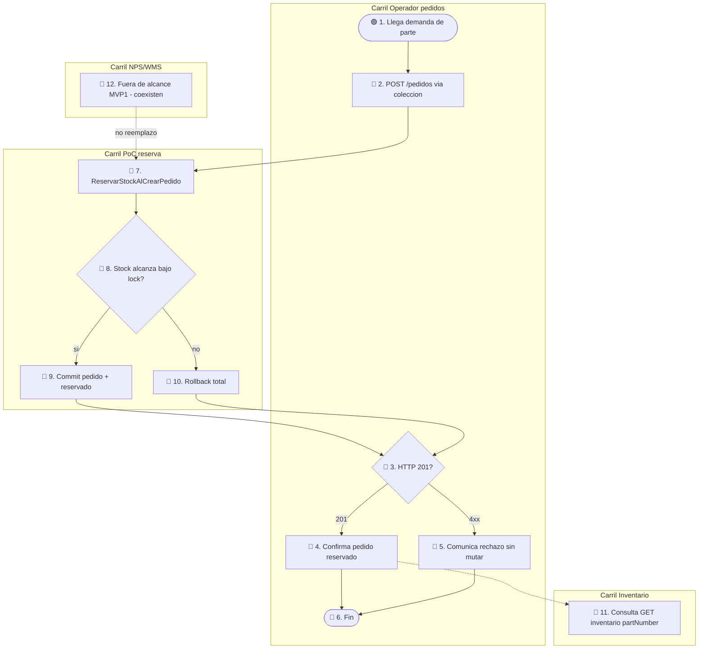

# AS-IS / TO-BE — MVP 1

Etiqueta global AS-IS: `hipótesis` / `pendiente_campo` (sin observación de campo en Komatsu).  
Confiabilidad TO-BE: **baja hasta Fase 0 / R1–R5**; el artefacto TO-BE materializa `ref: DT Prototype`.

## Leyenda

| Emoji | Significado |
|-------|-------------|
| 🟢 | Inicio |
| 🔵 | Actividad |
| 🔶 | Decisión |
| 🔴 | Fin |
| ⚠️ | Fricción |

## AS-IS (propuesta de trabajo)

Flujo crítico hipotético: demanda de parte → consulta de disponibilidad → promesa/pedido → riesgo de doble asignación. Artefactos posibles (no afirmados in-situ): NPS, WMS, Excel, correo, voz. `pendiente_campo`

```mermaid
flowchart TB
  subgraph laneOp ["Carril Operador pedidos"]
    direction TB
    a1(["🟢 1. Llega demanda de parte"])
    a2["🔵 2. Consulta disponibilidad"]
    a3{"🔶 3. Dato confiable ahora?"}
    a4["🔵 4. Promete / crea pedido"]
    a5(["🔴 5. Cliente/dealer notificado"])
  end
  subgraph laneInv ["Carril Inventario / centro partes"]
    direction TB
    b1["🔵 6. Revisa stock en sistema o soporte"]
    b2["⚠️ 7. Ajuste tardio o discrepancia"]
  end
  subgraph laneSis ["Carril Sistemas existentes"]
    direction TB
    c1["🔵 8. NPS y/o WMS u otro canal"]
  end
  a1 --> a2
  a2 --> c1
  c1 --> b1
  b1 --> a3
  a3 -->|"si"| a4
  a3 -->|"no / duda"| b2
  b2 -->|"⚠️ reconsulta"| a2
  a4 --> a5
```

**Paso a paso AS-IS**

1. **🟢 1. Llega demanda de parte** — Carril Operador pedidos. Arranca el flujo: llega una solicitud de part number.
2. **🔵 2. Consulta disponibilidad** — Sigue en Operador. Formula la pregunta “¿hay stock ahora?” sin invariante de reserva concurrente demostrado.  
   **Cambio de carril → Sistemas existentes.**
3. **🔵 8. NPS y/o WMS u otro canal** — Carril Sistemas. Puede abrir NPS/WMS u otro (`evidencia` de existencia pública; uso local `pendiente_campo`).  
   **Cambio de carril → Inventario / centro partes.**
4. **🔵 6. Revisa stock en sistema o soporte** — Carril Inventario. Interpreta el dato disponible.  
   **Cambio de carril → Operador pedidos.**
5. **🔶 3. Dato confiable ahora?** — Carril Operador. Decisión.  
   - Rama **sí** → nodo 4.  
   - Rama **no / duda** → nodo 7.
6. **⚠️ 7. Ajuste tardío o discrepancia** — Carril Inventario. Fricción: el dato no cuadra o llega tarde; flecha de reconsulta vuelve al nodo 2.
7. **🔵 4. Promete / crea pedido** — Carril Operador. Promesa **sin** prueba de 0 oversell bajo concurrencia (`hipótesis`).
8. **🔴 5. Cliente/dealer notificado** — Carril Operador. Fin del flujo AS-IS.

**Fricciones ⚠️:** ventanas entre consulta y promesa; dos operadores pueden “ganar” el mismo stock; sin prueba de 0 oversell. `hipótesis`

## TO-BE (solo MVP 1)

Mismos carriles + artefacto `ReservarStockAlCrearPedido` (`ref: DT Prototype`). Sin ERP, sin multi-almacén global, sin reemplazo NPS/WMS, sin sync productivo.

**Paso a paso TO-BE**

1. **🟢 1. Llega demanda de parte** — Carril Operador pedidos. Misma entrada que AS-IS.
2. **🔵 2. POST /pedidos via colección** — Carril Operador. Ejecuta el contrato del Prototype.  
   **Cambio de carril → PoC reserva.**
3. **🔵 7. ReservarStockAlCrearPedido** — Carril PoC. Abre transacción y prepara líneas.
4. **🔶 8. Stock alcanza bajo lock?** — Carril PoC. Decisión con control de concurrencia.  
   - Rama **sí** → nodo 9.  
   - Rama **no** → nodo 10.
5. **🔵 9. Commit pedido + reservado** — Carril PoC. Persistencia conjunta; camino feliz.  
   **Cambio de carril → Operador** (respuesta HTTP).
6. **🔵 10. Rollback total** — Carril PoC. Sin mutar pedido ni stock.  
   **Cambio de carril → Operador.**
7. **🔶 3. HTTP 201?** — Carril Operador.  
   - Rama **201** → nodo 4.  
   - Rama **4xx** → nodo 5.
8. **🔵 4. Confirma pedido reservado** — Carril Operador. Promesa con stock comprometido en perímetro PoC.
9. **🔵 5. Comunica rechazo sin mutar** — Carril Operador. Informa stock insuficiente limpio.
10. **🔴 6. Fin** — Carril Operador. Cierra el flujo.
11. **🔵 11. Consulta GET inventario partNumber** — Carril Inventario (opcional post-201). Audita `disponible`/`reservado`.
12. **🔵 12. Fuera de alcance MVP1 - coexisten** — Carril NPS/WMS. No se sustituyen; línea punteada de “no reemplazo” (`valida: R3`).

## Brecha AS-IS → TO-BE

| Brecha | Qué cambia en MVP 1 | Valida |
|--------|---------------------|--------|
| Promesa sin reserva atómica | `POST /pedidos` solo con reserva OK (seed) | `R2` |
| Dolor / prioridad no confirmados | Kickoff sponsor + tipificación | `R1` |
| Riesgo shadow IT vs NPS/WMS | Narrativa coexistencia + ADR | `R3` |
| Demo no usable sin explicación | Colección + demo muda | `R4` |
| Sin receptor empresarial | Sponsor nombrado + fecha | `R5` |

Fuera de esta brecha (MVP 2–3): Docker/k6 sistemático, ECS/AWS, extracción a microservicios.
