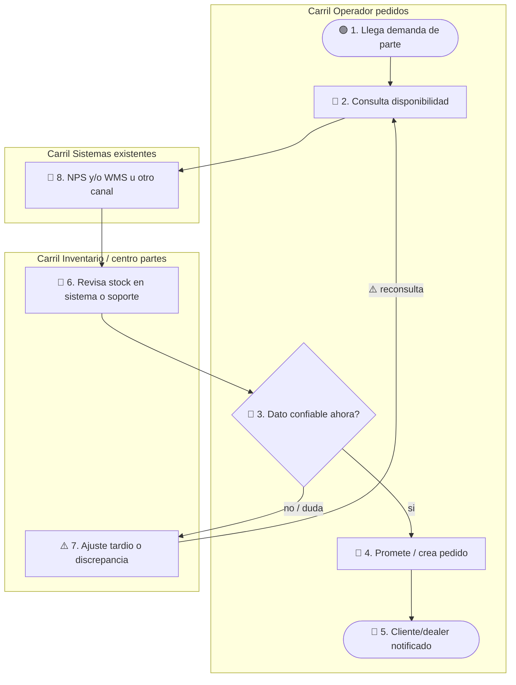
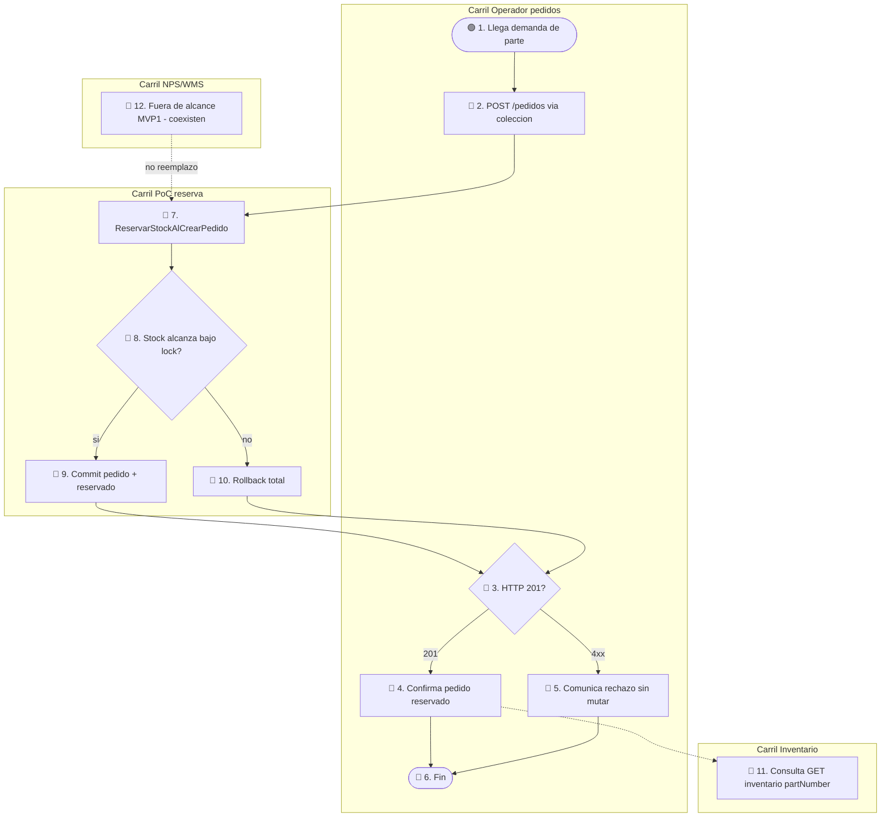

# AS-IS / TO-BE — MVP 1

Etiqueta global AS-IS: `hipótesis` / `pendiente_campo` (sin observación de campo en Komatsu).  
Confiabilidad TO-BE: **baja hasta Fase 0 / R1–R5**; el artefacto TO-BE materializa `ref: DT Prototype`.

## Leyenda

| Emoji | Significado |
|-------|-------------|
| 🟢 | Inicio |
| 🔵 | Actividad |
| 🔶 | Decisión |
| 🔴 | Fin |
| ⚠️ | Fricción |

## AS-IS (propuesta de trabajo)

Flujo crítico hipotético: demanda de parte → consulta de disponibilidad → promesa/pedido → riesgo de doble asignación. Artefactos posibles (no afirmados in-situ): NPS, WMS, Excel, correo, voz. `pendiente_campo`

**Paso a paso AS-IS**

1. **🟢 1.** Operador recibe demanda de parte.  
2. **🔵 2.** Busca disponibilidad (canal no observado).  
3. **🔵 8.** Puede abrir NPS/WMS u otro (`evidencia` de existencia pública; uso local `pendiente_campo`).  
4. **🔵 6.** Inventario interpreta stock.  
5. **🔶 3.** ¿Confía en el dato *ahora*?  
6. Si duda → **⚠️ 7** ajuste/discrepancia y vuelve a consultar.  
7. Si sí → **🔵 4** promete/crea pedido **sin invariante de reserva concurrente demostrado** (`hipótesis`).  
8. **🔴 5.** Notifica al solicitante.

**Fricciones ⚠️:** ventanas entre consulta y promesa; dos operadores pueden “ganar” el mismo stock; sin prueba de 0 oversell. `hipótesis`

## TO-BE (solo MVP 1)

Mismos carriles + artefacto `ReservarStockAlCrearPedido` (`ref: DT Prototype`). Sin ERP, sin multi-almacén global, sin reemplazo NPS/WMS.

**Paso a paso TO-BE**

1. **🟢 1.** Demanda llega al operador.  
2. **🔵 2.** Ejecuta `POST /pedidos` (colección).  
3. **🔵 7–8.** PoC reserva bajo control de concurrencia.  
4. Si alcanza → **🔵 9** commit; si no → **🔵 10** rollback.  
5. **🔶 3.** ¿201?  
6. **🔵 4** confirma promesa con stock reservado **o** **🔵 5** comunica rechazo sin mutar.  
7. **🔴 6.** Fin.  
8. **🔵 11.** Inventario puede auditar `disponible`/`reservado`.  
9. **🔵 12.** NPS/WMS **no** se sustituyen en MVP 1 (`valida: R3`).

## Brecha AS-IS → TO-BE

| Brecha | Qué cambia en MVP 1 | Valida |
|--------|---------------------|--------|
| Promesa sin reserva atómica | `POST /pedidos` solo con reserva OK | `R2` |
| Dolor / prioridad no confirmados | Kickoff sponsor + tipificación | `R1` |
| Riesgo shadow IT vs NPS/WMS | Narrativa coexistencia + ADR | `R3` |
| Demo no usable sin explicación | Colección + demo muda | `R4` |
| Sin receptor empresarial | Sponsor nombrado + fecha | `R5` |

Fuera de esta brecha (MVP 2–3): Docker/k6 sistemático, ECS/AWS, extracción a microservicios.
