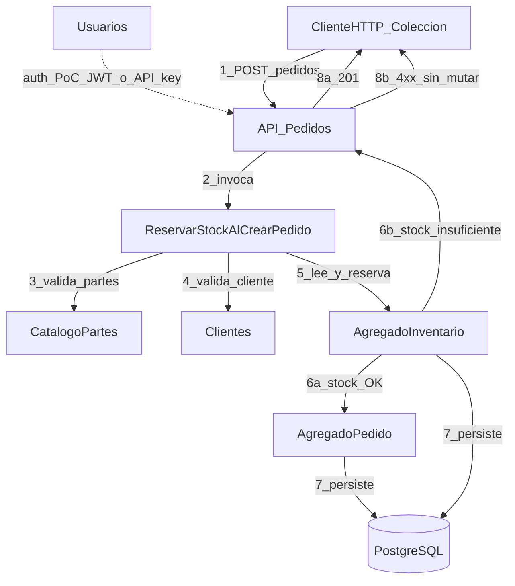

# Design Thinking — MVP 1 (Komatsu / pedidos↔inventario)

**Caso:** propuesta empresarial (PoC) a Komatsu — núcleo pedido↔stock con reserva.  
**Etiquetas:** `evidencia` | `hipótesis` | `pendiente_campo`

---

## Empatizar

### Roles (máx. 5)

| # | Rol | Qué vive en el MVP 1 | Etiqueta |
|---|-----|----------------------|----------|
| 1 | **Sponsor / evaluador de la propuesta (Komatsu IT u operaciones partes)** | Decide si el PoC es creíble frente a cuellos de integración/escala y coexistencia con plataformas ya desplegadas | `pendiente_campo` (identidad y canal de acceso no concedidos) |
| 2 | **Operador de pedidos / atención a demanda de partes** | Crea o dispara pedidos bajo presión de tiempo; necesita saber al instante si hay stock reservable | `hipótesis` (rutina interna no observada) |
| 3 | **Responsable de inventario / centro de partes** | Protege disponibilidad física/lógica; teme oversell y doble asignación ante picos | `hipótesis` |
| 4 | **Arquitecto / integración (lado Komatsu o partner)** | Evalúa si el PoC invade NPS/WMS o puede convivir como capa demostrable | `hipótesis` + ancla `evidencia` pública de existencia NPS/WMS |
| 5 | **Equipo entregable PoC (nosotros)** | Demuestra `ReservarStockAlCrearPedido`, 0 oversell y narrativa ejecutiva | `evidencia` (alcance profile / entregables MVP 1) |

### Plan observar / validar con Komatsu (Fase 0 — sin acceso asumido)

Todo lo siguiente es **`pendiente_campo`** hasta sponsor o visita acordada:

1. **Observar (no encuestar opiniones genéricas)**  
   - Shadow o grabación consentida de *la última vez* que se creó un pedido de partes con stock dudoso o pico de demanda.  
   - Capturar dónde se consulta disponibilidad, quién confirma, qué sistema se abre (pantalla NPS, WMS, Excel, correo, portal dealer).  
   - Contar rechazos / reintentos / “vendí y luego no había” en una ventana tipificada (p. ej. 1 turno).

2. **Preguntas abiertas en el momento**  
   - “Cuéntame la última vez que un pedido se trabó por stock — ¿qué pantalla tenías abierta y qué hiciste después?”  
   - “Cuando llegan varios pedidos del mismo part number a la vez, ¿quién gana y cómo se evita doble promesa?”  
   - “Si este PoC no reemplaza NPS ni WMS, ¿dónde encajaría en tu día a día para evaluarlo?”

3. **Validar con sponsor (checklist)**  
   - ¿El dolor priorizado es integración/escala/reserva, u otro (precio, EDI, multi-almacén)?  
   - ¿Hay métricas internas aportables (p95, tasa fallo, incidencias oversell) o solo umbrales del PoC?  
   - ¿Alcance de demo: datos sintéticos seed vs. subset anonimizado?

**Prohibido en esta fase:** afirmar KPIs internos de Komatsu no aportados; afirmar que “no tienen sistema”.

### Evidencia pública (contexto industria — no AS-IS del sitio local)

| Hecho | Fuente (pública) | Etiqueta | Uso en la propuesta |
|-------|------------------|----------|---------------------|
| Komatsu impulsó **NPS (New Parts System)** sobre plataforma cloud **Infor Nexus** para la cadena de suministro de partes de mantenimiento | DIGITAL X / Impress (caso NPS + Infor Nexus) | `evidencia` | Posicionar el PoC como **capa demostrable** de reserva pedido↔stock, no como reemplazo unilateral de NPS |
| **NPS** aparece como interfaz de partes Komatsu (precio, disponibilidad, ordering) en documentación de dealer systems | IntelliDealer Help (Komatsu NPS) | `evidencia` | Coexistencia / frontera: ordering/disponibilidad de red vs. invariante local del PoC |
| Komatsu adoptó **WMS ONEsLOGI (LOGISTEED)** en centros de partes (Japón y otros países documentados) para inbound/outbound y picking | Caso LOGISTEED Solutions / Komatsu | `evidencia` | El PoC **no** afirma sustituir WMS; la reserva del MVP 1 es lógica de dominio demostrable |

### Mapa de empatía (síntesis)

| | Dice | Piensa | Hace | Siente |
|---|------|--------|------|--------|
| **Operador pedidos** | “Necesito confirmar si puedo prometer esta parte ahora” `hipótesis` | “Si me equivoco, el cliente o el dealer se queja” `hipótesis` | Consulta disponibilidad en uno o más sistemas / canales; reintenta o escala `pendiente_campo` | Presión de tiempo en picos `hipótesis` |
| **Inventario** | “No vendan lo que ya está comprometido” `hipótesis` | “La concurrencia rompe la hoja o el stock ‘disponible’” `hipótesis` | Ajusta stock, investiga discrepancias, prioriza picking `pendiente_campo` | Desconfianza ante oversell `hipótesis` |
| **Sponsor / arquitectura** | “Muéstrenme que escala y no pelea con NPS/WMS” `hipótesis` | “¿Esto es PoC creíble o otro silo?” `hipótesis` | Pide ADR, métricas p95/error/0 oversell, roadmap AWS `evidencia` (criterio profile) | Riesgo de shadow IT vs. valor de prueba `hipótesis` |

**Insight de empatía (propuesta):** el valor percibido del MVP 1 no es “otro ERP”, sino **demostrar en vivo** que un pedido solo existe si el stock se reservó de forma concurrente-segura, con rechazo limpio si no alcanza — y narrar cómo eso convive con NPS/WMS existentes. `hipótesis` + ancla `evidencia` pública.

---

## Definir

### POV

**Operadores de pedidos e inventario de partes en Komatsu** necesitan **crear pedidos que reserven stock de forma atómica y concurrente-segura** (y rechazar sin mutar cuando no hay disponibilidad), porque la propuesta empresarial debe demostrar **0 oversell** y una narrativa creíble de integración/escala **sin afirmar el reemplazo de NPS/WMS**.  
(`hipótesis` de dolor interno + `evidencia` de plataformas públicas + `evidencia` de criterio MVP 1 en profile)

### HMW

1. **PRIMARIO —** ¿Cómo podríamos **reservar stock en el mismo acto de crear el pedido** para que el **operador de pedidos** obtenga **aceptación con stock comprometido o rechazo HTTP sin mutación**, con **0 oversell bajo concurrencia**?  
2. ¿Cómo podríamos **hacer visible en ≤1 demo** (API + seed de partes) para el **sponsor Komatsu** que el PoC **coexiste** con NPS/WMS y no los sustituye?  
3. ¿Cómo podríamos **fijar un contrato HTTP y un dominio mínimo** (catálogo, clientes, usuarios, pedidos, inventario) para que el **equipo PoC** entregue el núcleo en Spring Boot con colección reproducible?  
4. ¿Cómo podríamos **dejar trazado en un ADR** el camino a microservicios + AWS para que **arquitectura Komatsu** evalúe el roadmap sin bloquear el MVP 1 en EKS/SSO?

---

## Idear

| # | Idea | Encaje MVP 1 | Decisión |
|---|------|--------------|----------|
| A | **API monolito modular Spring Boot** con caso de uso `ReservarStockAlCrearPedido` (transacción + bloqueo/versión de fila), seed partes, colección HTTP, resumen ejecutivo | Alto / esfuerzo acotado | **Ganadora** |
| B | Front-office dealer portal completo integrado a NPS | Fuera de alcance (EDI/NPS replace) | Descartada |
| C | Multi-almacén global + IoT flota para stock en tiempo real | Fuera de secuencia | Descartada |
| D | Solo ADR + slides sin invariante ejecutable | No cumple 0 oversell demostrable | Descartada |
| E | Microservicios + EKS desde día 1 | Infla infra; EKS no bloqueante del PoC | Diferida (ADR / MVP 2–3) |

### Idea ganadora (núcleo)

**ReservarStockAlCrearPedido + demo HTTP:** al `POST /pedidos`, el sistema valida líneas, **reserva stock** de forma atómica; si alguna línea no alcanza → **rechazo sin mutar** pedido ni inventario; bajo carga concurrente tipificada → **0 oversell**. Catálogo/clientes/usuarios + seed de partes; ADR de arquitectura objetivo (microservicios + AWS); resumen 1–2 págs. para Komatsu.

---

## Prototipar

**Artefacto (≤1 día de diseño conceptual):** contrato API + flujo de reserva + seed demo + diagrama de dominio.  
**No es** despliegue AWS ni k6 (MVP 2–3). Auth PoC: JWT o API key (`evidencia` profile); Cognito/SSO fuera.

### Contrato API (mínimo)

| Método | Ruta | Comportamiento | Etiqueta |
|--------|------|----------------|----------|
| `POST` | `/pedidos` | Crea pedido **solo si** reserva OK en todas las líneas; respuesta 201 + cuerpo con líneas y cantidades reservadas | `hipótesis` de shape; SoT de comportamiento = criterio éxito |
| | | Stock insuficiente en cualquier línea → **4xx** (p. ej. 409/422) **sin** persistir pedido ni decrementar/reservar stock | `evidencia` (criterio profile) |
| `GET` | `/pedidos/{id}` | Lectura del pedido creado | `hipótesis` |
| `GET` | `/inventario/{partNumber}` | `disponible`, `reservado`, `onHand` (nombres ajustables) | `hipótesis` |
| `GET` | `/catalogo/partes` | Listado seed | `hipótesis` |
| `POST` | `/clientes`, `/usuarios` | Alta mínima para demo | `hipótesis` |

**Invariante:** `disponible = onHand - reservado` (o equivalente); nunca `reservado > onHand`. `hipótesis` de modelo; validación numérica en Test/RAT posteriores.

### Flujo conceptual `ReservarStockAlCrearPedido`

1. Recibe líneas `(partNumber, cantidad)`.  
2. Abre unidad de trabajo (transacción).  
3. Por cada línea: lee stock con control de concurrencia (bloqueo pesimista o versión optimista).  
4. Si alguna línea `cantidad > disponible` → rollback completo → respuesta de rechazo.  
5. Si todas OK → crea pedido en estado confirmado/reservado + incrementa `reservado` (o decrementa `disponible`) → commit → 201.  
6. Dos `POST` concurrentes sobre el mismo part con stock 1 → **exactamente uno** gana; el otro rechazo; **0 oversell**.

### Seed demo (partes)

Datos sintéticos orientados a partes/repuestos (no datos reales Komatsu sin acuerdo):

| partNumber (ej.) | onHand | reservado inicial | Nota |
|------------------|--------|-------------------|------|
| `KT-FILTER-001` | 10 | 0 | Caso feliz multi-línea |
| `KT-SEAL-014` | 1 | 0 | Carrencia / oversell |
| `KT-PUMP-220` | 0 | 0 | Rechazo inmediato |
| `KT-BOLT-M12` | 100 | 5 | Stock parcial ya comprometido |

`hipótesis` de códigos; `pendiente_campo` si Komatsu aporta subset anonimizado.

### Diagrama de dominio (lectura nodo a nodo)

**Lectura:**

1. `ClienteHTTP_Coleccion` envía `POST /pedidos` a `API_Pedidos`.  
2. `API_Pedidos` delega en `ReservarStockAlCrearPedido`.  
3–4. El caso de uso valida `CatalogoPartes` y `Clientes` (existencia / estado).  
5. Consulta/actualiza `AgregadoInventario` bajo control de concurrencia.  
6a. Si stock alcanza → crea `AgregadoPedido`.  
6b. Si no → vuelve a `API_Pedidos` sin escribir pedido ni stock.  
7. Persistencia conjunta en `PostgreSQL` solo en camino feliz.  
8a/8b. Respuesta 201 o 4xx al cliente.  
`Usuarios` autentica el PoC de forma mínima (línea punteada); no es Cognito.

### Límites del prototipo MVP 1

- Incluye: dominio + reserva + seed + ADR objetivo + colección HTTP + resumen ejecutivo Komatsu.  
- Excluye: ERP/MRP/EDI, multi-almacén global, IoT, reemplazo NPS/WMS, EKS bloqueante, SSO enterprise, KPIs internos no aportados.

---

## Test

Mapa `R# → actividad` (`ref: rat.md`). El usuario usa; el equipo calla. Si hay que explicar el prototipo para que funcione → hallazgo (R4).

| R# | Actividad de prueba | Umbral (SoT RAT) | Resultado provisional |
|----|---------------------|------------------|------------------------|
| R1 | Kickoff: incidente real o mandato escrito de tipificar con seed | Binario: incidente **o** mandato seed | `pendiente_campo` |
| R2 | Carrera ≥20 hilos / k6 sobre `KT-SEAL-014` (stock 1) | Exactamente 1×201; resto 4xx; 0 oversell | `hipótesis` hasta ejecutar |
| R3 | Sponsor marca por escrito coexistencia vs reemplazo NPS/WMS | Binario: acepta coexistencia en MVP 1 | `pendiente_campo` |
| R4 | Demo muda: feliz + rechazo en colección HTTP | &lt;3 intervenciones explicativas | `hipótesis` |
| R5 | Nombre + rol + fecha de revisión en acta/mail | Binario en ≤10 días hábiles | `pendiente_campo` |

**Protocolo mínimo (sin reabrir Empathize en este run):**

1. Preparar seed + colección (caminos 201 y 4xx).  
2. Ejecutar R2 en local; capturar salida y query de inventario para tercero.  
3. Sesión sponsor: R1 + R3 + agenda R5; no vender reemplazo WMS.  
4. Si R4 falla → `pendiente_campo` UX de colección (iteración futura), no inflar microservicios.

## Preguntas al equipo

1. **R1:** ¿Sponsor aporta incidente de doble promesa/stock o mandato escrito de tipificar solo con seed?  
2. **Narrativa:** ¿Coexistencia con NPS/WMS (recomendado) o “proceso aún manual en sitio X” tras visita?  
3. **R5:** ¿Sponsor nombrado y fecha de demo muda (`KT-SEAL-014`) sin explicar el prototipo?
