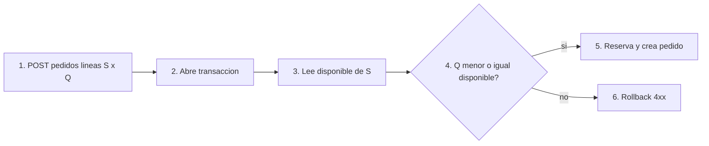

# Lean Canvas — MVP 1

## Lienzo

### Tabla 1 — fila superior (5 columnas)

| PROBLEMA | SOLUCIÓN | PROPUESTA DE VALOR ÚNICA | VENTAJA ESPECIAL | SEGMENTO DE CLIENTES |
|----------|----------|--------------------------|------------------|----------------------|
| 1. Pedidos de partes pueden prometerse sin reserva atómica → riesgo de oversell / doble asignación bajo concurrencia. `hipótesis` `ref: DT POV`   2. Dolor de integración/escala (cuellos, picos) aún no priorizado con sponsor ni medido in-situ. `pendiente_campo` `ref: profile`   3. Sin demo ejecutable, la propuesta cloud/microservicios no es evaluable frente a NPS/WMS ya existentes. `evidencia` plataformas públicas + `hipótesis` de gap de PoC   **Alternativas existentes:** NPS/Infor Nexus y WMS ONEsLOGI (`evidencia` pública); Syncron/planning aftermarket en unidades del grupo (`evidencia` proxy Komatsu Forest); Excel/manual en sitios no observados (`pendiente_campo`); ERP completo (`fuera de alcance`). | 1. `POST /pedidos` = `ReservarStockAlCrearPedido` (acepta con stock o 4xx sin mutar). `hipótesis` `ref: DT Prototype`   2. Demo concurrente seed (`KT-SEAL-014`) + colección HTTP + resumen ejecutivo 1–2 págs. `evidencia` entregables profile   3. ADR arquitectura objetivo (microservicios + AWS) sin bloquear MVP 1 en EKS. `hipótesis` `ref: DT HMW-4` | Para operadores de pedidos e inventario de partes en Komatsu que necesitan prometer stock sin oversell bajo demanda concurrente, el PoC Spring Boot con reserva atómica al crear pedido es una capa demostrable de consistencia pedido↔inventario que prueba 0 oversell y convive con NPS/WMS, a diferencia de slides sin invariante, de un ERP completo o de afirmar reemplazo de plataformas ya desplegadas. `hipótesis` `ref: DT Prototype` | ninguna aún `hipótesis` (el invariante es reproducible; la ventaja comercial frente a stack Komatsu no está demostrada) | **Específicos:** sponsor/evaluador Komatsu; operador de pedidos de partes; responsable de inventario/centro de partes; arquitecto de integración. `hipótesis` `ref: DT roles`   **Early adopters:** sponsor que agenda demo + operador que ejecuta `POST /pedidos` en la colección sin que se le explique el prototipo. `pendiente_campo` |

### Tabla 2 — fila media (bajo Solución y Ventaja)

| MÉTRICAS CLAVE | CANALES |
|----------------|---------|
| - Pedido reserva stock; insuficiente → 4xx sin mutar. `evidencia` criterio_éxito profile   - 0 oversell bajo concurrencia tipificada (p. ej. stock 1, N≥20 hilos / k6). `evidencia` profile + `hipótesis` protocolo   - Narrativa de propuesta clara (ADR + resumen ejecutivo aceptado por sponsor). `pendiente_campo` | Canal de evaluación: demo técnica + paquete de propuesta al sponsor Komatsu (no marketplace). `hipótesis` |

### Tabla 3 — base del lienzo

| ESTRUCTURA DE COSTOS | FLUJO DE INGRESOS |
|----------------------|-------------------|
| Tiempo de implementación Spring Boot + PostgreSQL; diseño ADR; sesiones con sponsor; infra local (Docker opcional MVP 2). Sin licencia ERP. `hipótesis` | N/A en el PoC (propuesta de valor; monetización/contrato fuera de MVP 1). `evidencia` alcance |

## Flujo del feature central

`ReservarStockAlCrearPedido` (`ref: DT Prototype`). **S** = partNumber. **Q** = cantidad solicitada.

**Paso a paso**

1. **1. POST pedidos** — Cliente HTTP envía líneas (**S**, **Q**).
2. **2. Abre transacción** — Unidad de trabajo; nada queda a medias.
3. **3. Lee disponible de S** — Inventario con control de concurrencia.
4. **4. ¿Q ≤ disponible?** — Decisión. **Cambio de camino.**
5. **5. Reserva y crea pedido** — Commit; 201.
6. **6. Rollback 4xx** — Sin mutar pedido ni stock.
