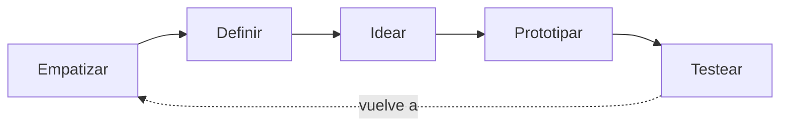
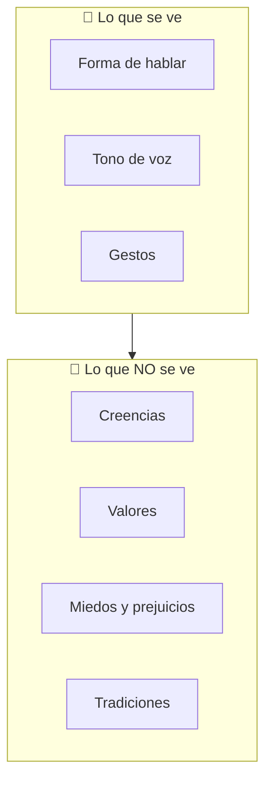
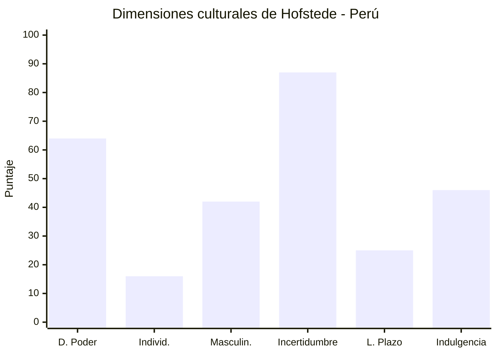
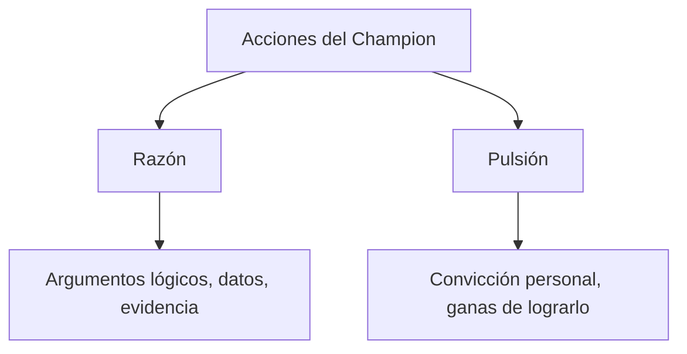

# Cómo pensar (y trabajar) como un innovador: Design Thinking, culturas y “champions”

Sesión: 01
Estado: Completado
Folder: ITD
Visibilidad: Privado

🗒️ Notas

### **Notas**

-

✂️ Bloc
		

---

## 1. Design Thinking: deja de pensar en la solución, piensa en la persona

Aquí está el error más común cuando alguien quiere “innovar”: empieza por la solución. *“Voy a hacer una app”*, *“voy a lanzar un producto nuevo”*. Y luego busca a quién vendérsela.

Design Thinking te invita a hacer exactamente lo contrario: **primero entiendes a la persona, después diseñas la solución**. Nació en Stanford y lo popularizó IDEO, una consultora de diseño que literalmente vive de resolver problemas así.

El proceso tiene 5 momentos:

**Cómo lo harías tú, en la práctica:**

- **Empatizar** → No preguntes “¿qué quieres?”. Obsérvalo trabajar, vive un día en sus zapatos. Ejemplo: si quieres mejorar el servicio de una cafetería, no le preguntes al dueño qué cree que falta — párate ahí una hora y mira cómo se mueve la fila, dónde se traban los pedidos, qué cara pone la gente al pagar.
- **Definir** → Convierte lo que viste en un reto concreto, usando esta fórmula: *“¿Cómo podríamos [problema] para que [persona] pueda [resultado]?”*. Ejemplo real: *¿Cómo podríamos reducir el tiempo de espera para que los clientes de la cafetería no se vayan frustrados?*
- **Idear** → Aquí no hay ideas malas, solo cantidad. Una técnica que puedes usar tú mismo con papel y lápiz se llama **Crazy 8’s**: te haces preguntas absurdas a propósito para salir del molde — *¿Qué haría Starbucks acá? ¿Y si no tuviera presupuesto? ¿Y si solo tuviera 1 dólar? ¿Cómo se vería esto dentro de 50 años?* Suena raro, pero funciona: te obliga a pensar distinto.
- **Prototipar** → No necesitas programar nada todavía. Un prototipo puede ser un dibujo, una maqueta de cartón, o incluso una actuación de “así funcionaría”. La idea es probar rápido y barato, no perfecto.
- **Testear** → Muéstraselo a usuarios reales y observa (no solo preguntes) qué pasa. Ellos te van a decir, sin decirlo, qué falla.

Algo importante: aunque el dibujo de arriba parece una línea recta, en la vida real **nunca va derecho**. Vas a volver a “Empatizar” cien veces mientras avanzas. Eso no es un error tuyo, es literalmente cómo funciona el proceso — ciclos, no una carretera.

---

## 2. Trabajar con gente de otra cultura: lo que no ves es lo que más importa

Imagina que negocias con alguien de otro país y llega 20 minutos tarde. ¿Es un desconsiderado o simplemente en su cultura el tiempo se vive distinto? Esa duda, multiplicada por mil detalles (cómo saludan, cómo dicen “no”, si negocian solos o en grupo), es justo lo que este tema te ayuda a leer.

La imagen mental que más te va a servir es la del **iceberg**: lo que ves de una cultura es solo la puntita.

**Cómo aplicarlo tú:** antes de reunirte con alguien de otro país (o incluso de otra región dentro del tuyo), no te quedes en “cómo habla”. Investiga qué valora esa cultura de fondo — eso te va a evitar el 90% de los malentendidos.

Un modelo que te ayuda a ordenar esto es el de **alto y bajo contexto**, de Edward Hall:

|  | Alto contexto | Bajo contexto |
| --- | --- | --- |
| Cómo se comunican | Indirecto, mucho lenguaje no verbal | Directo, dicen las cosas tal cual |
| Cómo deciden | En grupo, con consenso | La persona decide sola |
| En qué confían | Intuición y relación de confianza | Datos y contratos |
| Ejemplos | Japón, países árabes, Latinoamérica | Alemania, EE.UU., países nórdicos |

**Un ejemplo que lo hace clarísimo:** un jefe alemán te va a decir directo “esto está mal hecho”. Un jefe estadounidense probablemente empiece con dos halagos antes de la crítica. Ninguno es más grosero que el otro — simplemente su cultura los programó distinto para dar feedback. Si tú vienes de una cultura de “bajo contexto” y te toca liderar un equipo en un país de “alto contexto”, vas a tener que aprender a leer entre líneas, no solo a escuchar palabras.

También existe un modelo más numérico, el de **Hofstede**, que mide 6 rasgos de cada país. Así se ve Perú, por ejemplo:

**Cómo lo leerías:** el puntaje bajo en “Individualismo” (16) te dice que en Perú se valora mucho lo colectivo — decisiones en familia o en equipo, no en solitario. Y el 87 en “Incertidumbre” te avisa que la gente prefiere reglas claras antes que improvisar. Si vas a vender algo o liderar un equipo acá, eso te da pistas de cómo comunicarte: menos “confía en mí” y más “esto ya está probado, aquí están los datos”.

Antes de terminar este punto, dos conceptos que vale la pena distinguir bien porque se confunden fácil:

- **Etnocentrismo**: pensar que tu cultura es “la normal” y las demás son “raras”. Es la trampa en la que caemos todos sin darnos cuenta.
- **Competencia cultural**: la habilidad contraria — poder moverte bien en distintos contextos culturales sin imponer el tuyo. Esa es la que quieres desarrollar.

---

## 3. Ser un “champion”: defender una idea cuando nadie más cree en ella

Toda buena idea, en algún momento, se enfrenta a caras de duda. Alguien la mira y dice “eso no va a funcionar”. Ahí es donde entra el concepto de **Championing**: la acción de defender con fuerza y constancia un proyecto, una idea o a una persona con potencial, aunque el entorno la reciba con desconfianza.

No es casualidad — *The Economist* lo nombró una de las 100 ideas de negocio más influyentes. Y si lo piensas, casi todos los grandes innovadores tuvieron que “sostener” su idea contra la corriente: Edison insistiendo con la bombilla, Howard Schultz peleando por su visión de Starbucks cuando nadie creía en pagar tanto por un café.

¿De dónde saca fuerza un “champion” para seguir insistiendo?

**Cómo lo aplicarías tú:** si tienes una idea y sientes que nadie te apoya, no basta con “creer mucho” en ella (pulsión) ni solo con tener un power point lleno de datos (razón). Necesitas las dos cosas juntas: argumentos que convenzan a la mente, y convicción que sostenga tu energía cuando te digan que no. Esa combinación es la que hace que una idea sobreviva el tiempo suficiente para demostrar que funciona.

---

## En resumen, si solo te llevas tres frases de este post:

- **Design Thinking**: no diseñes para ti, diseña observando a la persona real, y prueba rápido y barato antes de invertir en grande.
- **Interculturalidad**: lo que ves de una cultura es la punta del iceberg — investiga los valores de fondo antes de asumir cómo va a reaccionar alguien.
- **Championing**: una buena idea no se defiende sola. Necesita a alguien que combine datos con terquedad sana para que llegue a puerto.