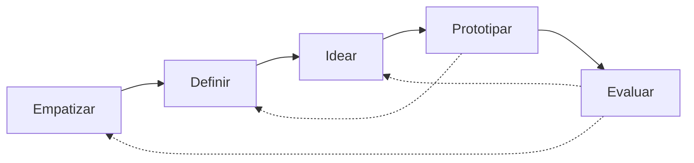
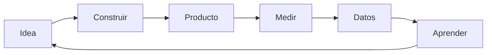
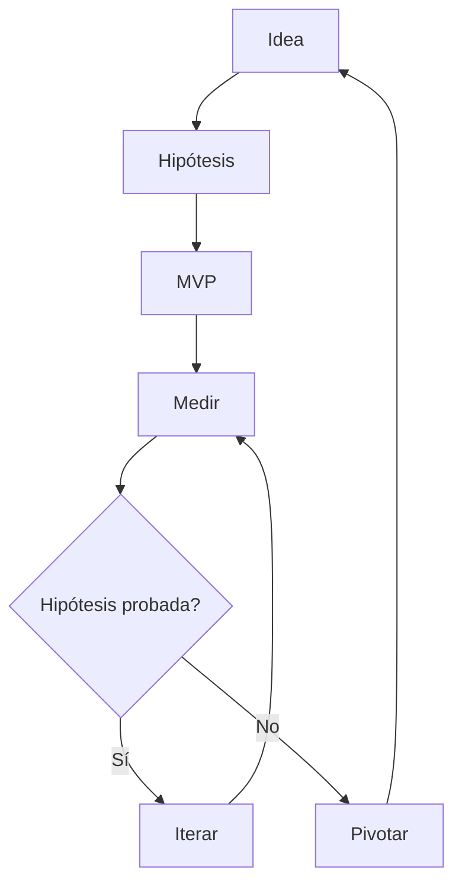
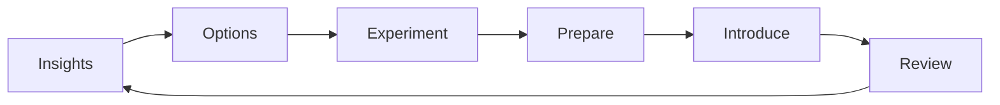

# Metodologías de Innovación: Design Thinking, Lean Startup y Lean Change Management

Sesión: 02
Estado: Completado
Folder: ITD
Visibilidad: Privado

🗒️ Notas

### **Notas**

-

✂️ Bloc
		

# Antes:

Cuando alguien dice “hay que innovar”, casi siempre se imagina un golpe de inspiración. En la práctica, las empresas que innovan de forma constante no dependen de la suerte: siguen un proceso repetible, con pasos concretos que cualquiera puede aprender. Vamos a ver tres de esos procesos, no solo qué son, sino **cómo se hacen paso a paso**, siguiendo un ejemplo real en cada uno para que puedas imaginarte aplicándolo tú mismo.

---

## 1. Design Thinking: entender antes de resolver

Design Thinking nació de observar cómo trabajan los diseñadores de producto, y se formalizó como metodología en la Universidad de Stanford, con la consultora IDEO como su principal impulsora. La idea de fondo es simple pero se olvida seguido: **antes de proponer una solución, hay que entender de verdad el problema desde la perspectiva de la persona que lo vive**. No es solo para diseñar objetos bonitos; sirve para rediseñar procesos, servicios, espacios o programas completos.

En teoría el proceso tiene 5 fases en fila. En la práctica es un ir y venir constante: pruebas algo, descubres que tu suposición estaba mal, y vuelves un paso atrás.

Para que esto no se quede en teoría, imaginemos a **Ana**, dueña de una cafetería, que lanzó una app de pedidos hace tres meses y casi nadie la usa.

### Empatizar: salir a observar, no a preguntar qué quieren

Empatizar no significa “ponte en los zapatos del cliente” como frase bonita — significa hacer algo muy concreto: **observar comportamiento real, no opiniones**. La gente dice una cosa y hace otra, así que la técnica es mirar qué pasa de verdad y hacer preguntas abiertas tipo *“cuéntame la última vez que intentaste pedir por la app”*, en vez de preguntas cerradas tipo *“¿te gustó la app?”*.

Ana se para detrás del mostrador dos tardes seguidas y mira. No pregunta “¿qué opinas de la app?” — eso solo le daría respuestas educadas. En vez de eso, ve a tres clientes abrir la app, dudar, y terminar cerrándola para pedir en el mostrador. Les pregunta, en el momento, qué pasó. Descubre algo que ninguna encuesta le habría dicho: la app pide crear una cuenta antes de mostrar el menú, y eso frena a la gente que solo quiere un café rápido.

### Definir: convertir lo observado en un reto accionable

Aquí no basta con decir “el problema es que la app es mala”. Definir significa **agrupar tus observaciones en patrones y convertirlas en una sola frase de reto**, usando una fórmula que obliga a ser específico: *“¿Cómo podríamos [acción] para que [usuario específico] pueda [resultado que busca]?”*

Ana junta sus notas, ve que el patrón se repite (el registro es la barrera) y escribe: *“¿Cómo podríamos rediseñar el pedido para que un cliente que ya está en la fila pueda pedir en menos de 3 toques, sin crear una cuenta?”* Esa frase, y no “mejorar la app” en general, es lo que guía todo lo que sigue.

### Idear: generar muchas opciones antes de elegir una

El error común es que, apenas alguien tiene una idea, el equipo empieza a construirla. Idear es lo contrario: **generar cantidad antes que calidad**, sin frenar a nadie con un “eso no serviría”. Una técnica muy usada es *Crazy 8’s*: cada persona dobla una hoja en 8 partes y dibuja 8 ideas distintas en 8 minutos, ayudándose de preguntas disparadoras como “¿cómo lo haría un negocio 100% digital?” o “¿cómo lo resolvería sin gastar nada?”.

Ana reúne a dos empleados 15 minutos. Usan esas preguntas disparadoras y salen con ideas que van desde “pedir por WhatsApp” hasta “un botón físico en la mesa que avisa al mesero”. Ninguna se descarta todavía.

### Prototipar: hacerlo tangible sin construirlo de verdad

Prototipar no es programar la versión final — es crear **la versión más barata y rápida posible que le permita a alguien más experimentarla**, aunque sea de papel o cartón. La regla es: si te tomó más de un día hacerlo, probablemente prototipaste de más.

Ana no le pide a nadie que reprograme la app. Imprime tres pantallas en papel con el nuevo flujo de “pedir sin registro” y las pega, una tras otra, sobre una tablet vieja, simulando cómo se vería.

### Evaluar: ponerlo frente a personas reales y quedarte callada

Evaluar significa **mostrar el prototipo a usuarios reales y observar dónde se traban**, sin explicarles cómo usarlo. Si tienes que explicar tu prototipo para que funcione, eso ya es información valiosa.

Ana le da la tablet con las pantallas de papel a cinco clientes en la fila y les dice “imagina que quieres pedir un café, muéstrame qué harías”. Dos de ellos igual buscan un botón de “iniciar sesión” por costumbre — eso le dice a Ana que necesita reforzar visualmente que ya no hace falta. Con eso vuelve a *definir* el reto, un poco más afinado, y el ciclo sigue.

---

## 2. Lean Startup: aprender rápido en vez de adivinar

Lean Startup lo creó **Steve Blank** en Silicon Valley, y su motor es una idea que cambia la forma de pensar en negocios: el éxito de una startup **no depende de estar en el lugar y momento correctos**, sino de seguir un proceso de **aprendizaje validado** que se puede enseñar y repetir. Se apoya en tres herramientas: el desarrollo de clientes (hablar con clientes reales desde el día uno), el Lean Canvas (un modelo de negocio resumido en una página, fácil de reescribir) y técnicas ágiles o Scrum para construir en ciclos cortos.

El corazón del método es este circuito, que se debe recorrer en el menor tiempo y con la menor inversión posible:

Sigamos a **Mateo**, que quiere lanzar un servicio de paseo de perros bajo demanda, tipo Uber, en su distrito.

### Plantear una hipótesis: escribirla de forma que se pueda equivocar

Una hipótesis en Lean Startup no es “creo que esto funcionaría” — es una afirmación **específica y comprobable**, con un número adentro, para que después puedas decir con claridad si se cumplió o no.

Mateo no escribe “a la gente le gustaría un paseador de perros”. Escribe: *“Creemos que los dueños de mascotas de mi zona pagarían S/20 por un paseo de 30 minutos reservado con solo 1 hora de anticipación.”* Esa frase, con el precio y el tiempo adentro, es lo que hace que después pueda medirla de verdad.

### Validar la hipótesis con el MVP: probar sin construir de más

Aquí entra el **Producto Mínimo Viable (MVP)**: la versión más simple posible del producto, suficiente para probar la hipótesis, y nada más. Mateo no contrata programadores ni diseña una app. Crea una página web de una sola pantalla con un botón “Reservar paseo” que en realidad solo abre WhatsApp, y él mismo pasea los perros manualmente los primeros días (esto se conoce como un “MVP concierge”: simular el servicio a mano antes de automatizarlo). Reparte el link en dos grupos de vecinos de Facebook.

### Medir la hipótesis: definir el número de éxito ANTES de mirar los resultados

Medir no es “ver cuántos likes tuvo el post”. Es fijar, antes de lanzar el experimento, cuál es el resultado que confirmaría o rechazaría tu hipótesis, y luego comparar la realidad contra ese número.

Antes de publicar, Mateo decide: *“Si al menos 8 personas reservan y pagan en las próximas dos semanas, la hipótesis queda validada.”* Pasan las dos semanas y le escriben 15 personas, pero solo 3 terminan pagando los S/20 — la mayoría dice que le parece caro para un paseo puntual.

### Generar un aprendizaje validado: una conclusión honesta, no una excusa

El aprendizaje validado es una frase corta que resume lo que los datos realmente te dijeron, aunque no sea lo que esperabas escuchar.

Mateo concluye: *“Sí existe interés real en el servicio, pero el precio por paseo suelto es una barrera; varios preguntaron si había un plan mensual.”* Eso no es un fracaso — es información que antes no tenía.

### Ciclo repetitivo: iterar o pivotar según la evidencia

Con ese aprendizaje, toca decidir: si la hipótesis se sostuvo, **iteras** (sigues por el mismo camino mejorando detalles); si no se sostuvo como esperabas, **pivotas** (cambias un elemento central del modelo) y vuelves a plantear una hipótesis nueva.

Mateo pivota: en vez de cobrar por paseo, prueba una **suscripción mensual** de 8 paseos por S/100. Vuelve a plantear una hipótesis nueva con ese modelo, y el circuito Construir–Medir–Aprender arranca de nuevo. Así, poco a poco, sin haber gastado en una app completa que quizás nadie hubiera usado como él la imaginó al inicio.

---

## 3. Lean Change Management: cambiar con la gente, no sobre la gente

Lean Change Management lo creó **Jason Little**, mezclando Agile, Lean Startup, gestión del cambio tradicional y Design Thinking. La diferencia frente a un plan de cambio clásico es de raíz: en vez de que la dirección diseñe todo el cambio de antemano y lo anuncie como un hecho, aquí el cambio se **co-crea con las personas afectadas**, avanzando en experimentos pequeños en vez de un plan gigante y rígido.

|  | Gestión del cambio tradicional | Lean Change Management |
| --- | --- | --- |
| ¿Quién diseña el cambio? | La dirección, de arriba hacia abajo | Se construye junto con quienes lo van a vivir |
| ¿Cómo se avanza? | Un plan cerrado desde el día uno | Experimentos cortos, ajustando sobre la marcha |
| ¿Qué se prioriza? | Cumplir el cronograma | Aprender rápido qué funciona de verdad |
| ¿Con qué se trabaja? | Documentos extensos | Herramientas simples y visuales |

Veamos a una empresa que quiere que su equipo de ventas adopte un **CRM nuevo**, algo que suele fracasar cuando se impone de golpe.

### Insights: entender la situación antes de mover una sola pieza

Este primer paso no es “avisar que viene un cambio” — es **recoger información real sobre cómo está la gente hoy frente a ese cambio**: quién lo apoyaría, quién es indiferente, quién se va a resistir y por qué. Una forma simple de hacerlo es con entrevistas cortas de 10 minutos a un puñado de personas, o un mapa visual sencillo con tres columnas: “a favor”, “neutral”, “en contra”, anotando el motivo de cada una.

El responsable del cambio entrevista a 6 vendedores. Descubre que no es que rechacen la tecnología: temen que llenar el CRM les quite tiempo de vender, que es de lo que viven.

### Options: generar más de un camino posible

En vez de saltar directo a “vamos a capacitar a todos con un manual”, esta fase obliga a **poner sobre la mesa al menos tres alternativas distintas** antes de elegir una, comparando qué tanto esfuerzo piden frente a qué tanto impacto tendrían.

El equipo genera tres opciones: (1) capacitación general para todos desde el inicio, (2) un “padrino” experto dentro de cada equipo que resuelve dudas en el momento, (3) probar primero con un solo equipo de ventas antes de expandir. Deciden que la opción 3, combinada con el “padrino”, es la que menos fricción genera y la más fácil de ajustar si algo sale mal.

### Experiment: probar en chico, con un ciclo dentro del ciclo

Aquí no se lanza el cambio a toda la empresa de una — se **diseña como un experimento real**, con tres momentos: preparar, introducir y revisar.

- **Prepare (preparar):** se define con qué equipo se hará la prueba, durante cuánto tiempo, y qué resultado concreto indicaría que va bien (por ejemplo: “el 80% del equipo registra sus llamadas en el CRM sin que se les recuerde”). Aquí se elige al equipo de 5 vendedores y a su “padrino” interno.
- **Introduce (introducir):** se lanza el piloto solo con ese equipo, por dos semanas, con el padrino disponible para resolver dudas al momento en vez de un manual que nadie lee.
- **Review (revisar):** al final de las dos semanas, se hace una reunión corta tipo retro: qué funcionó, qué no, qué se ajustaría antes de llevarlo al resto de la empresa. Si el resultado es positivo, ese aprendizaje regresa como nuevo *insight* para diseñar la siguiente ronda de opciones, ahora pensando en cómo escalarlo a los demás equipos.

---

## En resumen

Design Thinking te ayuda a **entender el problema correcto**, saliendo a observar comportamiento real y probando prototipos baratos antes de comprometerte con una solución. Lean Startup te ayuda a **construir el negocio o producto correcto**, escribiendo hipótesis medibles y probándolas con el mínimo esfuerzo antes de decidir si iterar o pivotar. Lean Change Management te ayuda a **implementar el cambio correcto** dentro de una organización, co-creándolo con la gente y probándolo en experimentos pequeños en vez de imponerlo de golpe. Los tres comparten la misma lógica de fondo: avanzar en ciclos cortos con evidencia real, en lugar de planear todo desde un escritorio y confiar en que funcione.