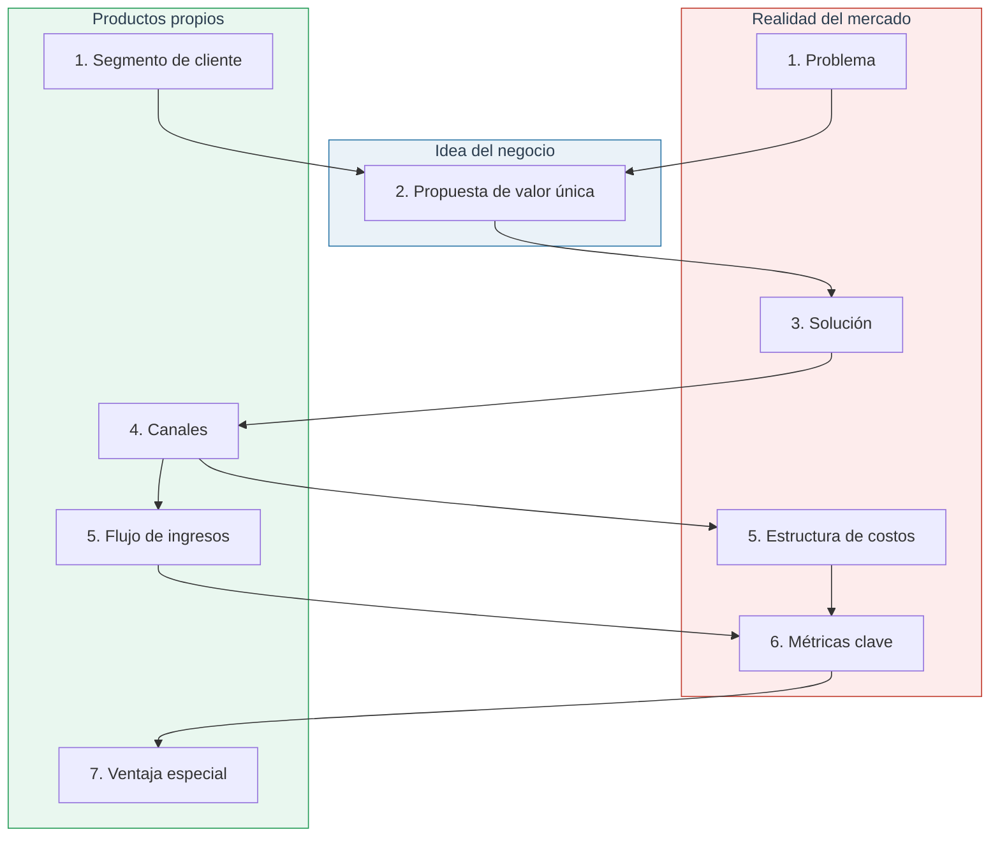
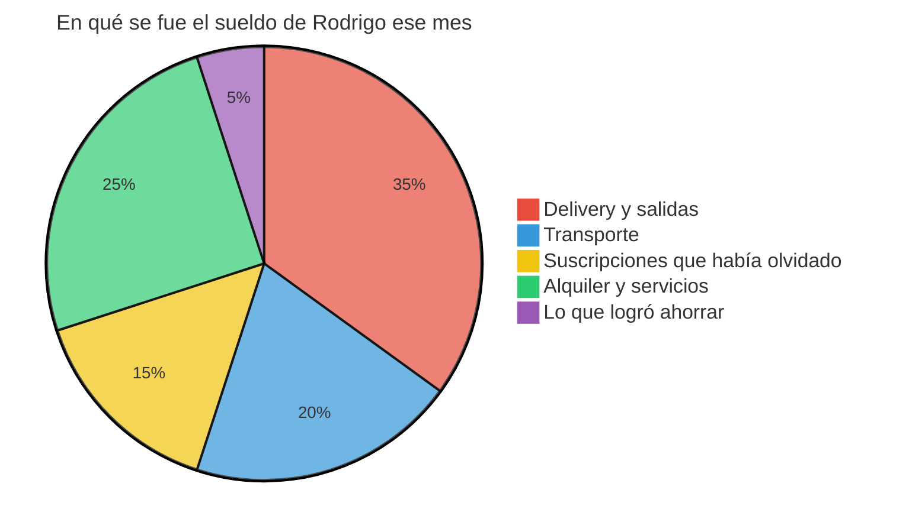
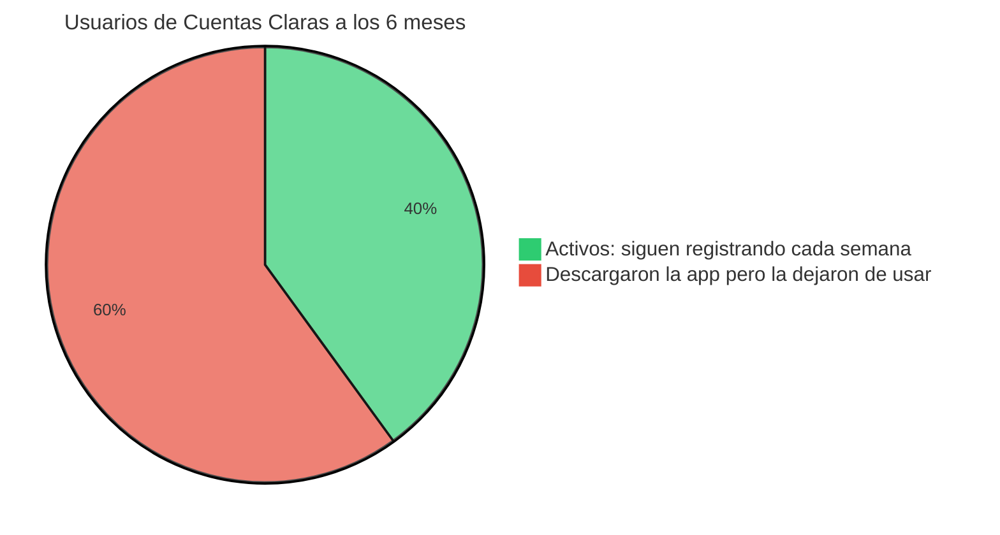

# Lean Canvas y FODA: dos mapas para pensar tu negocio con orden

Sesión: 03
Estado: Completado
Folder: ITD
Visibilidad: Privado

🗒️ Notas

### **Notas**

-

✂️ Bloc
		

# Antes:

Estas dos herramientas suelen aparecer juntas porque resuelven preguntas distintas pero complementarias. El **Lean Canvas** te ayuda a diseñar y poner a prueba un modelo de negocio nuevo, hipótesis por hipótesis. El **FODA** te ayuda a hacer una radiografía de dónde está parado un negocio (nuevo o ya en marcha) frente a su entorno, para decidir el siguiente movimiento.

Para verlo aplicado a algo concreto, vamos a seguir a **Rodrigo**, un chico de 24 años que acaba de empezar su primer trabajo formal y, como le pasa a la mayoría de jóvenes que recién reciben un sueldo fijo, se quedó sin plata cinco días antes de que le pagaran de nuevo, sin entender bien en qué se le fue el dinero. A partir de esa experiencia decide construir **"Cuentas Claras"**, un servicio para ayudar a jóvenes sin experiencia financiera a entender sus ingresos vs. sus gastos, y a proyectar si les alcanzará para lo que quieren.

---

## 1. Lean Canvas

El Lean Canvas lo creó **Ash Maurya**, adaptando el Business Model Canvas de Alexander Osterwalder y Yves Pigneur. Osterwalder pensó su lienzo para negocios ya bastante definidos, con bloques como "socios clave" o "relación con el cliente". Maurya cambió esos bloques por otros pensados para el momento en que **casi todo sobre tu idea es una suposición sin comprobar**: Problema, Solución, Métricas clave y Ventaja especial. La regla de oro es que debe caber en una sola hoja y reescribirse muchas veces — no es un plan de negocio de 40 páginas, es un mapa de hipótesis vivo.

### Cómo se ve el lienzo completo, y en qué orden se llena

El lienzo se organiza en 9 bloques agrupados en 3 zonas, y no se llena de arriba hacia abajo ni de izquierda a derecha: se llena **en el orden que reduce más riesgo primero**. Primero defines a quién le hablas y qué problema tiene (sin eso, todo lo demás es adivinar), y recién al final defines tu ventaja especial, porque esa solo se ve clara una vez que ya conoces bien el negocio.



- **Realidad del mercado:** lo que existe hoy afuera, independiente de ti (el problema, cómo lo vas a resolver, cómo lo vas a medir y cuánto cuesta hacerlo).
- **Idea del negocio:** el corazón de tu propuesta, la frase que conecta el problema con la solución.
- **Productos propios:** lo que es tuyo y de nadie más: a quién le vendes, cómo llegas a esa persona, cómo cobras y qué hace que no te puedan copiar fácilmente.

Antes de entrar bloque por bloque, así se veía el mes en que Rodrigo se quedó sin darse cuenta de en qué se le fue el sueldo — exactamente el tipo de desorden que "Cuentas Claras" busca resolver:



Con esa experiencia como punto de partida, así llenó Rodrigo cada bloque de su Lean Canvas:

- **1. Problema.** No basta con "los jóvenes no saben de finanzas". Van los **3 problemas más importantes**, ordenados por urgencia, más las "alternativas existentes": qué hace la gente hoy en su lugar. Para llenarlo bien no te sientas a imaginar problemas — sales a conversar con clientes potenciales preguntando por su rutina real, no si usarían tu producto.
    
    > Rodrigo entrevista a 15 amigos y excompañeros de universidad que, como él, recién empezaron a trabajar. Los 3 problemas que se repiten: no llevan ningún registro de en qué gastan y solo se enteran cuando ya se quedaron sin plata; las apps de finanzas que conocen (la del banco, un Excel) usan palabras como "flujo de caja" que no entienden y los aburren; y no tienen forma sencilla de saber si les alcanzará para algo a futuro, como un viaje o la mudanza. Alternativas actuales: anotar gastos sueltos en las notas del celular, o simplemente calcular "a ojo" y fallar seguido.
    > 
- **1. Segmento de cliente.** No es "todos los que quieren ahorrar" — mientras más específico, más útil. Aquí también defines a tus **early adopters**: quiénes lo usarían primero porque su necesidad es más urgente que la del resto.
    
    > Rodrigo define su segmento como jóvenes de 20 a 28 años en su primer o segundo trabajo formal, sin educación financiera previa. Sus early adopters: quienes ya se quedaron sin dinero antes de fin de mes al menos una vez en los últimos tres meses y lo comentan abiertamente — esa queja espontánea es una señal de dolor real, no hipotético.
    > 
- **2. Propuesta de valor única.** Una sola frase que explica por qué alguien te elegiría a ti y no a la alternativa que ya usa — no un eslogan bonito. Fórmula útil: *"Para [segmento] que [problema], [producto] es [categoría] que [beneficio clave], a diferencia de [alternativa]."*
    
    > La de Rodrigo: *"Para jóvenes que recién empiezan a trabajar y no saben en qué se les va la plata, Cuentas Claras es una app que te muestra tus ingresos vs. gastos en lenguaje simple y te avisa si no te alcanzará para lo que quieres, a diferencia de las apps bancarias que solo muestran movimientos sin explicarte nada."*
    > 
- **3. Solución.** Van únicamente **las 3 características que resuelven los 3 problemas del bloque anterior**, ni una más — es fácil querer meter todo lo que el producto "podría" hacer, y eso diluye el foco. Por cada problema, una función que lo ataca directamente.
    
    > Para "no llevo registro", un bot de WhatsApp donde escribes "gasté 15 soles en almuerzo" y él lo clasifica solo. Para "el lenguaje me asusta", un resumen semanal en frases simples como *"esta semana gastaste 30% más en delivery que la anterior"*, sin gráficos técnicos. Para "no puedo proyectar", una alerta simple: *"a este ritmo, el 25 te quedas sin plata, 5 días antes de tu próximo sueldo."*
    > 
    > 
    > ```mermaid
    > flowchart LR
    >     A["Escribes por WhatsApp: 'Gasté 15 soles en almuerzo'"] --> B["El bot lo clasifica solo"]
    >     B --> C["Se guarda en tu registro de la semana"]
    >     C --> D["Cada domingo recibes tu resumen simple"]
    > 
    >     style A fill:#EAF2F8,stroke:#2874A6,color:#2C3E50
    >     style B fill:#E9F7EF,stroke:#239B56,color:#2C3E50
    >     style C fill:#FCF3CF,stroke:#B7950B,color:#2C3E50
    >     style D fill:#F5EEF8,stroke:#884EA0,color:#2C3E50
    > ```
    > 
- **4. Canales.** Cómo vas a llegar de verdad a esos clientes, no una lista de todos los canales que existen. Se eligen los 2 o 3 más realistas según tus recursos actuales.
    
    > Rodrigo arranca compartiendo la app en grupos de WhatsApp de recién egresados, y busca alianzas con áreas de Recursos Humanos de empresas que contratan practicantes, para que se la ofrezcan como un beneficio de bienvenida a los nuevos ingresantes.
    > 
- **5. Estructura de costos.** Los costos principales para entregar la solución, separando lo fijo (servidores, mantenimiento del bot) de lo variable (soporte, mensajería).
    
    > Esto le permite a Rodrigo calcular cuánto necesita cobrar para que el negocio no pierda plata mientras crece.
    > 
- **5. Flujo de ingresos.** Cómo y cuándo entra el dinero — se llena junto al bloque anterior porque ambos definen si el modelo es sostenible.
    
    > Rodrigo elige un modelo freemium: el registro básico y el resumen semanal son gratis, y por S/9 al mes se desbloquean las proyecciones personalizadas y las alertas.
    > 
- **6. Métricas clave.** No cualquier número — el que de verdad dice si el negocio funciona, evitando "métricas de vanidad" como descargas totales.
    
    > Rodrigo elige el **porcentaje de usuarios que sigue registrando gastos después de 4 semanas**. Eso le dice mucho más sobre si el producto engancha que cuánta gente lo bajó una vez y lo abandonó.
    > 
- **7. Ventaja especial.** Algo que a un competidor le costaría copiar rápido — "buen servicio" no cuenta, porque cualquiera puede decir lo mismo.
    
    > Rodrigo ya tenía, antes de lanzar el producto, una comunidad de 3,000 seguidores en redes hablando de finanzas para jóvenes en un lenguaje cercano. Un banco grande podría copiar la función en meses, pero no puede replicar esa confianza y cercanía de la noche a la mañana.
    > 

Con los 9 bloques llenos en una sola hoja, Rodrigo tiene un mapa de hipótesis para probar — exactamente lo que Lean Startup usa como punto de partida antes de salir a validar cada bloque con clientes reales.

---

## 2. FODA (Fortalezas, Oportunidades, Debilidades, Amenazas)

El FODA es una de las herramientas más usadas en planeamiento estratégico. Su lógica es cruzar dos ejes: **qué tanto controlas el factor** (interno vs. externo) y **si juega a tu favor o en tu contra** (positivo vs. negativo).

|  | Factores positivos | Factores negativos |
| --- | --- | --- |
| **Internos** (dependen de ti) | Fortalezas | Debilidades |
| **Externos** (no dependen de ti) | Oportunidades | Amenazas |

A diferencia del Lean Canvas, que se llena al inicio para diseñar algo nuevo, el FODA se usa en cualquier momento como una **foto del presente**, y suele repetirse cada cierto tiempo para ver cómo cambió el panorama.

Seis meses después del lanzamiento, así le fue a Rodrigo con "Cuentas Claras":



- **Fortalezas** — pregúntate "¿qué hago mejor que otros, con lo que ya tengo?"
    
    > Rodrigo tiene su comunidad de 3,000 seguidores ya validada como canal propio, una tasa de retención de 40% a las 4 semanas (buena para este tipo de app), y un soporte por WhatsApp cercano que genera mucha confianza entre sus usuarios.
    > 
- **Debilidades** — la más incómoda de ver, porque cuesta reconocerla en uno mismo; ayuda preguntarle a alguien cercano o a tus propios clientes.
    
    > El equipo es solo Rodrigo y un desarrollador freelance, así que el soporte se satura cuando crecen los usuarios; además, la app todavía no se conecta directo al banco, así que todo el registro es manual y algunos usuarios se cansan de escribir cada gasto.
    > 
- **Oportunidades** — mira cambios del entorno que podrías aprovechar si actúas a tiempo: tendencias, tecnología nueva, cambios de hábito o de política pública.
    
    > Cada vez más empresas quieren ofrecer "bienestar financiero" como beneficio a sus practicantes y trainees, y hay programas públicos y privados de educación financiera para jóvenes buscando aliados con quién ejecutarlos.
    > 
- **Amenazas** — cambios del entorno que te podrían perjudicar si no reaccionas: competencia, regulación, economía.
    
    > Un banco grande podría lanzar dentro de su propia app (que ya está instalada en millones de celulares) una función simple de "resumen de gastos", sin costo adicional para el usuario.
    > 

### El cruce de variables: de la lista a la estrategia

Aquí es donde la mayoría se queda corta: llenan los cuatro cuadros y ahí se detienen, sin sacar ningún plan de acción. El verdadero valor del FODA aparece cuando **cruzas cada factor interno con cada factor externo** para generar una estrategia concreta — esto se conoce como matriz FODA cruzado (o TOWS).

|  | Oportunidades | Amenazas |
| --- | --- | --- |
| **Fortalezas** | Estrategias FO: usa tus fortalezas para aprovechar la oportunidad | Estrategias FA: usa tus fortalezas para defenderte de la amenaza |
| **Debilidades** | Estrategias DO: corrige la debilidad apoyándote en la oportunidad | Estrategias DA: protege el negocio de la amenaza mientras superas la debilidad |

Aplicado al caso de Rodrigo:

- **FO (fortaleza + oportunidad):** usa su comunidad y su credibilidad para crear **"Cuentas Claras for Business"**, un paquete de bienestar financiero que las empresas pagan como beneficio para sus nuevos practicantes.
- **FA (fortaleza + amenaza):** en vez de competir en funciones contra el banco grande, se apoya en su cercanía y su comunidad para **diferenciarse por acompañamiento humano**, algo que un banco no puede replicar aunque copie la función.
- **DO (debilidad + oportunidad):** usa los programas públicos o alianzas de educación financiera para **financiar la conexión automática con los bancos**, resolviendo el problema del registro manual sin gastar de su propio bolsillo.
- **DA (debilidad + amenaza):** antes de que el banco grande lance su función gratis, prioriza **cerrar alianzas corporativas exclusivas** que amarren usuarios desde su primer día de trabajo, cuando todavía no tienen ninguna alternativa instalada.

Con esto, el FODA deja de ser una lista de cuatro columnas y se convierte en cuatro decisiones concretas que Rodrigo puede empezar a ejecutar la semana siguiente.

---

## Lean Canvas vs. FODA: ¿cuándo usar cada uno?

|  | Lean Canvas | FODA |
| --- | --- | --- |
| ¿Para qué sirve? | Diseñar y validar un modelo de negocio nuevo | Diagnosticar la posición estratégica actual, de un negocio nuevo o ya en marcha |
| ¿Cuándo se usa? | Al inicio, y se reescribe cada vez que una hipótesis falla | En cualquier momento, típicamente en revisiones periódicas |
| ¿Hacia dónde mira? | Hacia adentro de tu propio modelo de negocio | Hacia adentro (fortalezas/debilidades) y hacia afuera (oportunidades/amenazas) a la vez |
| ¿Qué te entrega al final? | Un mapa de 9 hipótesis listas para salir a probar | Un cruce de factores que se traduce en estrategias concretas |

---

## En resumen

El Lean Canvas se usa **al arrancar**, para poner en una sola hoja todas las suposiciones de tu negocio y salir a probarlas antes de invertir en construir de más. El FODA se usa **para tomar el pulso** del negocio en cualquier momento de su vida, cruzando lo que controlas con lo que no controlas para decidir el siguiente movimiento estratégico. No compiten entre sí: Rodrigo arrancó "Cuentas Claras" con un Lean Canvas armado en una tarde, y seis meses después usó un FODA cruzado para decidir que su siguiente paso no sería pelear contra un banco grande, sino cerrar alianzas corporativas antes de que ese banco reaccionara.