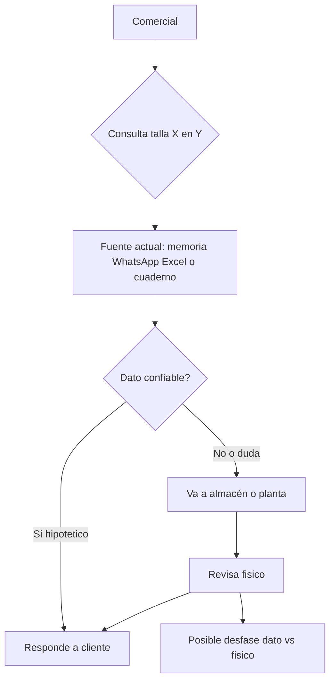
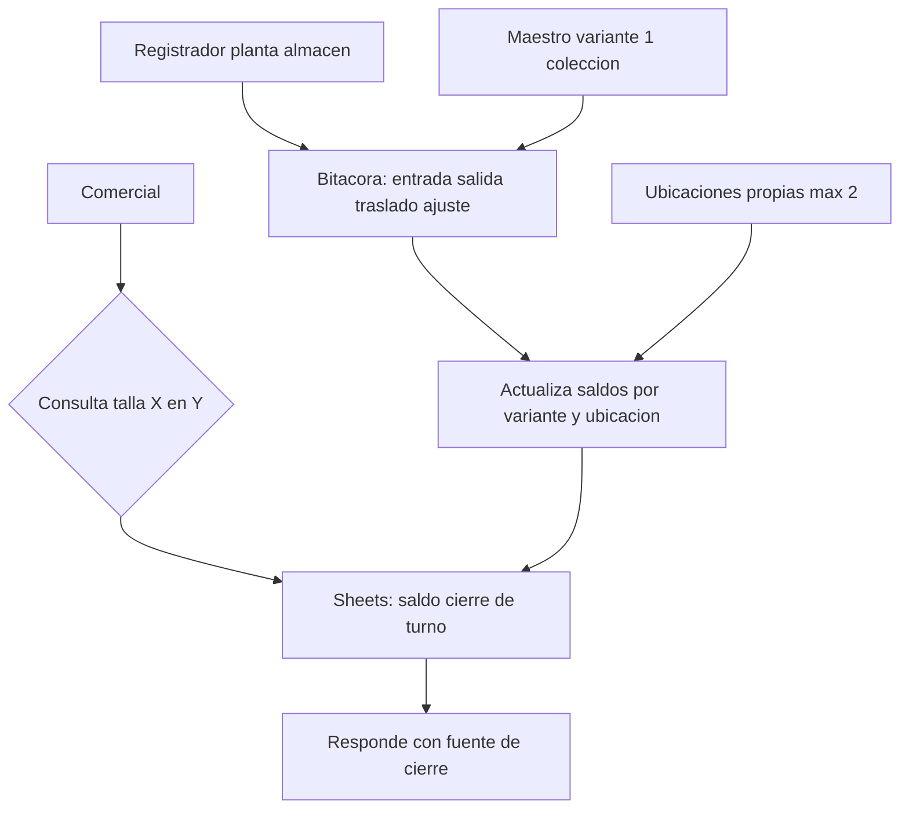

# MVP ready — MVP 1 — PASS

## Contexto del MVP (desde profile)

- **Tema:** Diagnóstico y diseño de MVP de confiabilidad de inventario PT por variante — Calzados Romantex S.A.C.
- **Objetivo MVP1:** Confiabilidad de stock PT por variante en ubicaciones propias.
- **Entregables:** Mapa AS-IS (Fase 0); maestro variante; bitácora sin POS; piloto Sheets (1 colección, ≤2 ubic. propias); métricas de exactitud / registro en turno.
- **Criterio de éxito:** Usuario planta/almacén responde “¿hay talla X en Y?” con fuente de cierre de turno; % descuadre medido en muestra.
- **Fuera:** tiempo real, POS, SUNAT, BOM, e-commerce, ATP tercerizados, fichas tallaje (MVP2).

## Tools usadas

- design-thinking ← `common/design-thinking/model1.md`
- lean-canvas ← `common/lean-canvas/model1.md`
- foda ← `common/foda/model1.md`
- rat ← `common/rat/model1.md`
- as-is-to-be ← `common/as-is-to-be/model1.md`

Búsquedas: **3/3** (2 Empathize/contexto sectorial + 1 reserva RAT). Sin degradación de tools.

---

## 1. Design Thinking

### Empathize

**Roles** (`hipótesis` salvo criterio de éxito del profile = `evidencia`):

| Rol | Qué hace hoy | Dolor | Necesidad vs MVP1 |
|-----|--------------|-------|-------------------|
| Usuario planta/almacén (registrador) | Opera stock físico en ubicaciones propias | Fuente de saldos poco clara o desfasada | Responder “¿hay talla X en Y?” con cierre de turno |
| Comercial / canal | Confirma disponibilidad | Puede no coincidir con físico (`evidencia` profile; magnitud `pendiente_campo`) | Confiar en saldo por variante×ubicación propia |
| Dueño / decisor | Prioriza piloto | Doble carga / paperware | Ver % descuadre y adopción de registro |
| Responsable de ubicación (si distinto) | Ownership de zona | Sin dueño claro de movimientos | Reglas entrada/salida/traslado/ajuste |

**Mapa de empatía (registrador + comercial)** — `hipótesis` / `pendiente_campo`:

- **Dice:** “voy a mirar / pregunto al almacén”
- **Piensa:** el dato debería estar; si falla, se pierde la venta
- **Hace:** consulta informal (cuaderno, WhatsApp, memoria, Excel) — `pendiente_campo` Fase 0
- **Siente:** fricción al confirmar talla×ubicación

**Contexto sectorial** (no atribuible a Romantex): en calzado el control útil es por variante modelo×color×talla; exactitud ítem-ubicación &lt;95% suele señalar brecha de proceso (`evidencia` industria).

### Define

- **POV:** El usuario de planta/almacén necesita una **fuente de cierre de turno** por variante en ubicaciones propias porque comercial no puede tratar como fiable la disponibilidad sin contraste físico (`hipótesis` + problema `evidencia` profile).
- **HMW primario:** ¿Cómo podríamos hacer consultable el saldo PT por variante en ≤2 ubicaciones propias con bitácora sin POS y latencia de turno?
- Otros HMW: medir % descuadre sin POS; maestro de 1 colección sin fichas MVP2; ownership de registro por turno.

### Ideate

1. **Priorizada:** Piloto Sheets (maestro + bitácora + saldos).
2. Cuaderno estandarizado + foto/cierre (más frágil para métricas).
3. Formulario móvil → hoja (riesgo de “tiempo real”).
4. Solo conteo sin bitácora — **descartada**.
5. ERP/POS — **descartada** (fuera de alcance).

### Prototype (`ref: DT Prototype` — SoT)

**Artefacto:** libro Sheets del piloto MVP1.

- **Hojas:** Maestro variante; Ubicaciones (≤2 propias); Bitácora (fecha/turno, tipo entrada|salida|traslado|ajuste, variante, ubicación, cantidad, responsable); Vista saldos/consulta; Métricas (exactitud; % registro en turno).
- **Alcance:** 1 colección; sin POS; latencia = cierre de turno.
- **Roles:** registrador escribe; comercial lee cierre; dueño ve métricas.
- **Dato maestro mínimo:** id_variante, modelo, color, talla, ubicación_id, saldo_cierre.

### Test (post-RAT)

| Actividad | R# | Quién | Umbral | Cuándo |
|-----------|-----|-------|--------|--------|
| Conteo ciego muestra vs declarado | R1 | Estudiante + almacén; tutor audita | Exactitud ≥ 95% en n≥20 → R1 falsado | Fase 0 |
| Ownership por ubicación | R2 | Entrevista dueño/ubicación | 0/2 con dueño → R2 falsado; se exige 2/2 | Fase 0 |
| Bitácora vs movimientos conocidos | R3 | Planta; tutor revisa export | &lt;80% en ≥5 turnos → R3 falsado | Piloto 2–4 sem. |
| Cobertura maestro 1 colección | R4 | Comercial + almacén | &lt;90% en muestra ≥15 → R4 falsado | Semana 1 piloto |
| Consulta con fuente = cierre | R5 | Comercial + testigo | &lt;4/5 citan hoja → R5 falsado | Tras ≥5 turnos |

**`pendiente_campo`:** mapa AS-IS real; fuentes actuales; magnitud descuadre; ownership; carga de registro; acceso a conteo.

---

## 2. Lean Canvas

| Bloque | Contenido | Etiqueta / ref |
|--------|-----------|----------------|
| Problema | Disponibilidad comercial puede no coincidir con físico; sin cierre de turno la confirmación es informal; alternativas típicas cuaderno/WhatsApp/Excel/memoria (`pendiente_campo` cuáles usa Romantex) | `evidencia` profile + `hipótesis`; `ref: DT Empathize` |
| Segmentos | Día a día: registrador planta/almacén, comercial. Decisor: dueño. Tutor = contraparte académica | `hipótesis`; `ref: DT roles` |
| UVP | “¿Hay talla X en Y?” con fuente de cierre de turno + % descuadre medido, sin POS/ERP | `hipótesis` + criterio `evidencia` |
| Solución | = Prototype (AS-IS Fase 0, maestro, bitácora, Sheets, métricas) | `evidencia`; `ref: DT Prototype` |
| Canales | N/A interno (ver Segmentos) | `hipótesis` |
| Flujos de ingreso | N/A operativo | — |
| Estructura de costos | Tiempo estudiante + contraparte; Sheets; visitas; capacitación mínima | `hipótesis` |
| Métricas clave | Exactitud ítem-ubicación; % registro en turno; consultas con fuente = cierre | `evidencia` profile |
| Ventaja especial | ninguna aún | `pendiente_campo` |

---

## 3. FODA del MVP

| | Ayuda | Perjudica |
|--|-------|-----------|
| Interno | **F:** Alcance acotado; criterio observable; separación MVP1 vs fichas MVP2 (`evidencia` profile) | **D:** Sin evidencia de campo (`pendiente_campo`); disciplina de registro desconocida; maestro posiblemente incompleto; doble carga cuaderno+Sheets (`hipótesis`) |
| Externo | **O:** Ventana Fase 0 + piloto antes de ERP; sector refuerza stock por variante (`evidencia` sectorial) | **A:** Expectativa tiempo real/POS; acceso denegado a conteo; reabrir tallaje prematuro (`hipótesis` / `pendiente_campo`) |

**Implicación:** Solo defender el piloto si Fase 0 demuestra descuadre material y ownership de registro; si no, no escalar Sheets ni fichas → **R1**, **R2**.

### Amarre candidatos → R#

| Candidato FODA | R# |
|----------------|-----|
| Descuadre / problema no demostrado | R1 |
| Ownership / roles de registro | R2 |
| Disciplina bitácora / doble carga | R3 |
| Maestro incompleto | R4 |
| Expectativa tiempo real vs cierre | R5 |
| Acceso a conteo denegado | condiciona R1 |
| Confusión inventario vs tallaje | cola no RAT |

---

## 4. Mapa de supuestos (RAT)

### R1
- **Supuesto:** Existe descuadre material entre stock usado para confirmar y físico por variante en ≥1 ubicación propia piloto.
- **Etiqueta:** `pendiente_campo` | Impacto alto × incertidumbre alta
- **Falsación:** conteo n≥20; exactitud ≥95% → R1 falsado; contraparte almacén; tutor audita; Fase 0
- **Dueño_entregable:** estudiante | **Contraparte:** almacén/planta | **Origen:** profile + FODA

### R2
- **Supuesto:** Hay ownership explícito de registro en las ≤2 ubicaciones propias.
- **Etiqueta:** `pendiente_campo` | alto × alta
- **Falsación:** 2/2 ubicaciones con dueño nombrado; si 0/2 → falsado; Fase 0
- **Dueño_entregable:** estudiante | **Contraparte:** dueño/jefatura | **Origen:** FODA + DT

### R3
- **Supuesto:** El registrador adopta la bitácora sin POS (≥80% movimientos del turno registrados).
- **Etiqueta:** `hipótesis` | alto × alta
- **Falsación:** &lt;80% en ≥5 turnos → falsado; tutor revisa export; piloto 2–4 sem.
- **Dueño_entregable:** estudiante | **Contraparte:** registrador | **Origen:** FODA + Lean

### R4
- **Supuesto:** Maestro variante usable para 1 colección sin fichas MVP2.
- **Etiqueta:** `hipótesis` | alto × media
- **Falsación:** cobertura &lt;90% en muestra ≥15 → falsado; semana 1 piloto
- **Dueño_entregable:** estudiante | **Contraparte:** comercial | **Origen:** FODA + profile

### R5
- **Supuesto:** Quien confirma usa el saldo de cierre de turno (acepta latencia ≠ tiempo real).
- **Etiqueta:** `hipótesis` | medio × alta
- **Falsación:** &lt;4/5 consultas citan hoja → falsado; tras ≥5 turnos
- **Dueño_entregable:** estudiante | **Contraparte:** comercial | **Origen:** FODA + criterio_exito

**Cola no RAT:** cuello tallaje vs inventario; presión a POS; talleres tercerizados.

---

## 5. Flujos AS-IS / TO-BE

**AS-IS** — `pendiente_campo` / supuesto de trabajo. **Confiabilidad: baja hasta Fase 0.**

**TO-BE** — `ref: DT Prototype`; confiabilidad baja hasta validar R1–R3.

**Brecha**
- Cambia: fuente = cierre de turno; registrador + bitácora; métricas.
- Igual: sin POS/tiempo real; ≤2 ubic. propias; sin fichas operativas.
- Valida: `R1`, `R2`, `R3`, `R4`, `R5`.

---

## Preguntas al equipo

1. **(R1)** ¿Autorizan en Fase 0 un conteo n≥20 variante×ubicación en ≥1 ubicación propia, con planilla auditable por tutor? Si no hay acceso: ¿qué evidencia externa mínima aceptan?
2. **(R2/R3)** ¿Quién será el registrador nombrado por cada ubicación y en qué turnos es obligatoria la bitácora?
3. **(R5)** ¿Comercial acepta latencia de turno (no tiempo real) durante el piloto?

## Listo para

Trabajo de campo / Fase 0 (R1–R2) y prototipo Sheets; opcional `graphify-project` si se indexa este md bajo `mvp/`.
