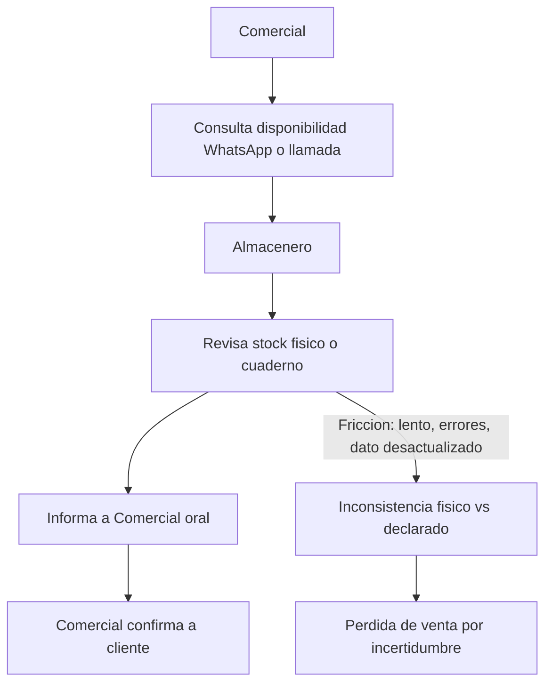
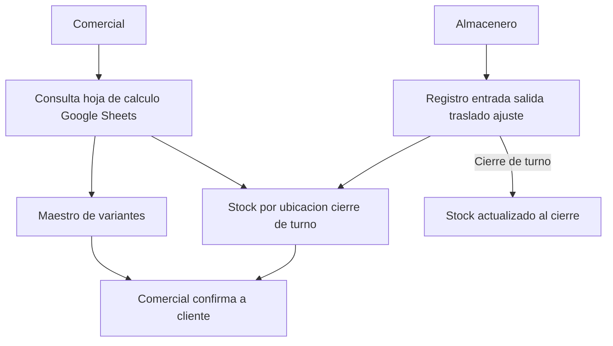

# Flujos AS-IS / TO-BE - Confiabilidad de Inventario PT

## AS-IS

Etiqueta global: `hipótesis` (supuesto de trabajo hasta Fase 0)

## TO-BE (MVP 1)

`ref: DT Prototype` · `confiabilidad: baja hasta Fase 0`

## Brecha AS-IS → TO-BE

- Qué cambia: fuente única en Sheets (maestro + saldos + bitácora) y registro de movimientos al cierre de turno por almacenero.
- Qué se deja igual: roles comercial/almacenero; consulta sigue siendo humana (sin POS ni tiempo real).
- Qué valida el salto: `valida: R1, R2, R3`
