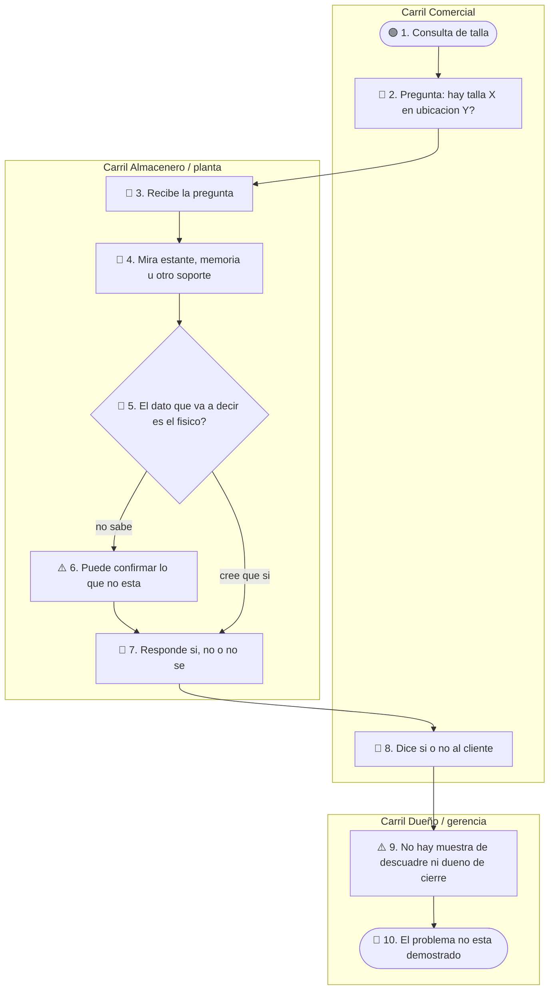
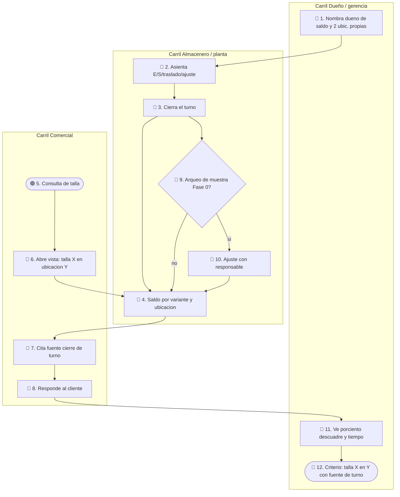

# AS-IS / TO-BE — MVP 1

Etiqueta global AS-IS: `hipótesis` / `pendiente_campo` (no hay observación de campo aún). TO-BE: `ref: DT Prototype`; `confiabilidad: baja hasta Fase 0`.

**X e Y (valen para ambos flujos).** **X** = talla (número de calzado de esa variante: un modelo × un color, p. ej. talla 38 del botín negro). **Y** = ubicación **propia** donde se busca el producto terminado (p. ej. almacén de planta; no un taller tercerizado).

## AS-IS

### Cómo se lee el flujo

**Carriles**

- **Comercial:** habla con el cliente y formula la pregunta de disponibilidad; no es dueño del stock físico.
- **Almacenero / planta:** busca el par y arma la respuesta; hoy no hay evidencia de bitácora ni de cierre de turno.
- **Dueño / gerencia:** no recibe todavía una métrica de descuadre ni un dueño de cierre.

**Leyenda en este dibujo:** 🟢 inicio · 🔵 actividad · 🔶 decisión · ⚠️ fricción · 🔴 fin.

**Paso a paso** (sigue las flechas; un ítem = un nodo o un cambio de carril)

1. **🟢 1. Consulta de talla** — Carril Comercial. Aquí arranca todo. Llega un cliente (o un pedido interno) que quiere un par concreto. Todavía nadie ha mirado el almacén.

2. **🔵 2. Pregunta: hay talla X en ubicación Y?** — Sigue en Comercial. Comercial no cuenta pares: arma la pregunta. **X** = la talla pedida (p. ej. 38). **Y** = el sitio propio donde debería estar el PT (p. ej. almacén de planta). Ejemplo: «¿hay botín negro talla 38 en el almacén de planta?»

3. **Cambio de carril → Almacenero / planta.** La flecha sale de Comercial y entra a planta: le pasa esa pregunta de palabra (llamada, grito al almacén, WhatsApp: `pendiente_campo`, no afirmado). El cliente todavía no tiene el sí/no.

4. **🔵 3. Recibe la pregunta** — Carril Almacenero / planta. Planta ya entendió qué talla y qué ubicación le piden. Aún no responde; solo tiene el encargo.

5. **🔵 4. Mira estante, memoria u otro soporte** — Mismo carril. Planta busca el par: estante, lo que recuerda, cuaderno u otro soporte. Qué soporte usan en Romantex es `pendiente_campo`. Todavía no hay decisión de qué decir.

6. **🔶 5. El dato que va a decir es el físico?** — Decisión, mismo carril. Planta se pregunta si lo que va a afirmar coincide con lo que hay en el piso. Dos salidas (no se salta a 8 desde aquí):
   - Rama **no sabe** → va al **⚠️ 6**.
   - Rama **cree que sí** → salta el 6 y va directo al **🔵 7**.

7. **⚠️ 6. Puede confirmar lo que no está** — Solo si salió «no sabe». Fricción: planta igual tiene que decir algo, pero no tiene una fuente compartida (cierre de turno, kárdex visto por comercial). Riesgo: afirmar que hay talla X en Y cuando el par no está. Esta rama **no** habla aún con el cliente; sigue a 7.

8. **🔵 7. Responde sí, no o no sé** — Mismo carril. Aquí se reúnen las dos ramas (pasó por 6 o vino de 5 «cree que sí»). Planta le devuelve a Comercial una de tres: sí hay, no hay, o no sabe. Aún no se lo dice al cliente: se lo dice a Comercial.

9. **Cambio de carril → Comercial.** La flecha cruza de planta a Comercial: vuelve la respuesta oral.

10. **🔵 8. Dice sí o no al cliente** — Carril Comercial. Recién ahora Comercial habla con el cliente. No abre una hoja ni cita un cierre de turno: transmite lo que planta le acaba de decir.

11. **Cambio de carril → Dueño / gerencia.** Lo que acaba de pasar (una confirmación sin medir) no deja rastro para gerencia. La flecha baja al carril de dueño porque el diagnóstico del MVP necesita esa foto y hoy no existe.

12. **⚠️ 9. No hay muestra de descuadre ni dueño de cierre** — Carril Dueño / gerencia. Nadie midió cuántas veces el sí/no de Comercial coincidió con el físico, ni quién cierra un turno. Fricción de gobierno, no de atención al cliente.

13. **🔴 10. El problema no está demostrado** — Mismo carril. El flujo **termina** aquí: se atendió al cliente, pero Fase 0 no está hecha. No se puede afirmar magnitud de descuadre ni construir el Sheets como si el problema ya estuviera probado.

## TO-BE

Dos tiempos en **una** cadena: primero se deja lista la fuente (turno), después la misma pregunta 🟢 que el AS-IS lee esa fuente. Se juntan en el **🔵 4. Saldo**.

### Cómo se lee el flujo

**Carriles** (los mismos que el AS-IS)

- **Dueño / gerencia:** nombra dueño de saldo, fija ≤2 ubicaciones propias y al final mira las métricas del gate.
- **Almacenero / planta:** escribe la bitácora, cierra el turno (dueño operativo del saldo) y, si toca, arquea la muestra.
- **Comercial:** solo lectura. Misma pregunta que en el AS-IS, pero contra el Sheets (`ref: DT Prototype`).

**Leyenda en este dibujo:** 🟢 inicio de la consulta · 🔵 actividad · 🔶 decisión de arqueo · 🔴 fin con criterio de éxito.

#### Pista A — Dejar lista la fuente (antes o durante el turno)

1. **🔵 1. Nombra dueño de saldo y 2 ubic. propias** — Carril Dueño / gerencia. Arranque de gobierno, no de atención al cliente. Elige quién cierra el turno y en qué puntos propios corre el piloto (`valida: R3`). Sin este paso no hay Y válido.

2. **Cambio de carril → Almacenero / planta.** Gerencia le encarga a planta operar esas ubicaciones.

3. **🔵 2. Asienta E/S/traslado/ajuste** — Carril Almacenero / planta. Cada vez que entra, sale, se traslada o se ajusta un par, planta escribe una fila en `Movimientos` **en el mismo turno**. Todavía no es lo que ve Comercial (`valida: R2`).

4. **🔵 3. Cierra el turno** — Mismo carril. Planta marca el turno cerrado. A partir de aquí el número publicable deja de ser «lo que hay en el estante ahora» y pasa a ser «lo que quedó al cierre». No es tiempo real.

5. **🔵 4. Saldo por variante y ubicación** — Mismo carril. Nodo **de reunión**. El Sheets suma movimientos hasta ese cierre: una cantidad por cada (variante = modelo × color × **talla X**) y cada **ubicación Y**. Aquí se engancha la Pista B (consulta). El arqueo (Pista C) **no** sale de este nodo: sale del **🔵 3** (cierre), para no mezclarlo con cada venta.

#### Pista B — La misma pregunta que el AS-IS (se junta en el 4)

6. **🟢 5. Consulta de talla** — Carril Comercial. Mismo inicio que el AS-IS: un cliente pide un par. La diferencia es qué va a mirar Comercial.

7. **🔵 6. Abre vista: talla X en ubicación Y** — Sigue en Comercial. **X** y **Y** = los mismos que en el AS-IS (talla del par y ubicación propia). Abre la vista `Consulta` del Sheets; no le grita a planta. Si no hay un **🔵 3** previo, la vista no debe usarse para confirmar (`valida: R4`).

8. **Cambio de carril → Almacenero / planta (solo a leer el 4).** La flecha `6 → 4` cruza: Comercial no edita; **lee** el saldo que planta dejó al cierre.

9. **🔵 4. Saldo…** (ya descrito). La vista muestra cantidad + que la fuente es ese cierre. Siguiente de la consulta: **🔵 7** (si no estamos en arqueo).

10. **Cambio de carril → Comercial.** El número vuelve a quien atiende al cliente.

11. **🔵 7. Cita fuente cierre de turno** — Carril Comercial. Antes de hablarle al cliente, Comercial formula la respuesta con fuente explícita: «según cierre del turno T del día D, en Y hay N pares de talla X». Si la vista no tiene cierre, no confirma.

12. **🔵 8. Responde al cliente** — Mismo carril. Recién ahora el cliente oye el sí/no. Comercial transmite el dato del 7, no una impresión.

13. **Cambio de carril → Dueño / gerencia.** La atención ya cerró; gerencia recibe el rastro de esa consulta y de las métricas.

14. **🔵 11. Ve % descuadre y tiempo** — Carril Dueño / gerencia. Mira si Fase 0 midió descuadre y cuánto tardó la confirmación (`valida: R1`).

15. **🔴 12. Criterio: talla X en Y con fuente de turno** — Mismo carril. El flujo **termina** cuando un usuario de planta/almacén (y Comercial leyendo esa fuente) puede responder «¿hay talla X en Y?» citando el cierre — criterio de éxito del profile. No termina en un POS ni en tiempo real.

#### Pista C — Arqueo Fase 0 (rama del 3; no es cada venta)

16. **🔶 9. Arqueo de muestra Fase 0?** — Carril Almacenero / planta. La flecha sale del **🔵 3. Cierra el turno**, no del 6 ni del 8. Es el gate diagnóstico (muestra), no un paso de cada cliente. Dos salidas:
    - Rama **sí** → **🔵 10**.
    - Rama **no** → **🔵 4** (el saldo del cierre se publica tal cual y la Pista B puede leerlo).

17. **🔵 10. Ajuste con responsable** — Solo rama «sí». Planta cuenta la muestra, compara con el saldo y, si hay diferencia, asienta un **ajuste** con responsable. Luego la flecha **vuelve al 🔵 4** (el saldo queda corregido). Ahí se clasifica si el descuadre era de cantidad o de talla mal anotada (`valida: R5`).

## Brecha AS-IS → TO-BE

- **Cambia:** después del 🔵 2 del AS-IS (pregunta oral) ya no se salta a planta a ciegas: Comercial abre la vista (TO-BE 🔵 6) y cita el cierre (🔵 7). `valida: R4`
- **Cambia:** aparecen dueño de saldo (TO-BE 🔵 1), bitácora + cierre (🔵 2–3) y métrica para gerencia (🔵 11). `valida: R2` `valida: R3` `valida: R1`
- **Se deja igual:** ≤2 ubicaciones **propias**, 1 colección, sin POS, sin tiempo real, sin ATP de tercerizados; X sigue siendo talla y Y ubicación propia. `evidencia` profile
- **Se deja igual hasta ver R5:** si el arqueo (🔶 9 → 🔵 10) atribuye el descuadre al código de talla, no se visten fichas en este MVP. `valida: R5`
