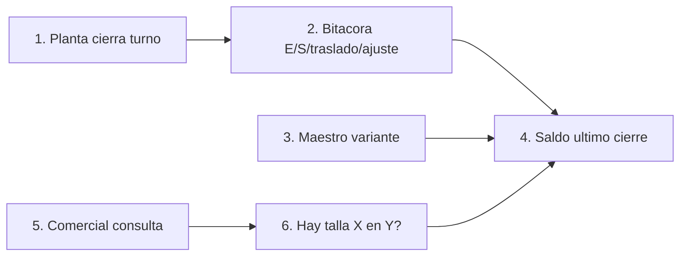

# Design Thinking — MVP 1

## Empatizar

**conflicto:** el nombre comercial público ROMANTEX S.A.C. (RUC 20293975036, Lima, telas/decoración, romantex.com.pe) no coincide con el caso académico «Calzados Romantex S.A.C.» (calzado, Trujillo). Se anota y se sigue el perfil; no se «corrige» la empresa ni se mezclan hechos. `evidencia` (identidad pública) vs `hipótesis` (atributos del perfil).

**Hechos vs perfil.** `evidencia`: existe esa sociedad textil limeña; no es fabricante de calzado en Trujillo. `hipótesis` / dato de perfil (no campo): PYME familiar de calzado de cuero en Trujillo, +20 años, talleres propios y tercerizados en El Porvenir. `pendiente_campo`: confirmar razón social, RUC y sedes del caso académico en Fase 0. Sector proxy (PYME calzado Perú/Trujillo: kárdex/Excel talla-color; ofertas POS tipo INVY descartadas por el perfil) = solo rutina hipotética, no práctica de Romantex.

**Roles del MVP1** (piloto; no usuario: talleres tercerizados).

| Rol | Qué vive en el piloto | Etiqueta |
|-----|------------------------|----------|
| Comercial / ventas | Pregunta «¿hay talla X en Y?» al cliente; no es dueño del saldo | `hipótesis` |
| Almacenero / planta | Stock físico en ubicaciones propias; entrada/salida/traslado/ajuste; cierre de turno = fuente de consulta | `hipótesis` |
| Dueño / gerencia | Gate Fase 0; ownership de ubicaciones y de la muestra de descuadre | `hipótesis` |
| Operario taller **propio** (opcional) | Entrega PT a ubicación propia; no ATP ni piloto en tercerizados | `hipótesis` |

**Plan Fase 0 — observar rutina (no opiniones).** Sombra un día/turno en planta-almacén y un ciclo de consulta comercial. Preguntar en el momento: «cuéntame la última vez que un cliente pidió una talla y no sabías si estaba»; «muéstrame dónde miraste»; «qué hiciste cuando el físico no coincidió». Observar, no preguntar si «les gusta» un sistema.

1. Dónde vive el PT: anotar soporte (estante, caja, cuaderno, Excel, otro) y ≤2 candidatas **propias** al piloto. `pendiente_campo`
2. Cadena de la última confirmación talla×color×modelo: quién preguntó, a quién, con qué objeto, cuánto tardó (reloj, no encuesta). `pendiente_campo`
3. Muestra de descuadre: conteo físico vs lo que comercial habría confirmado, **por variante**, en esas ubicaciones; no afirmar magnitud hasta medirlo. `pendiente_campo`
4. Cierre de turno: ¿existe? ¿quién firma/ajusta? ¿queda rastro? `pendiente_campo`
5. Tallaje (soporte, sin implantar): cómo se anota la talla en ficha, caja, kárdex o pedido; si el descuadre nace de inventario o de maestro. `pendiente_campo`
6. Ownership talleres: propio vs tercerizado; el piloto no usa ATP de tercerizados. `pendiente_campo`

**Mapa de empatía** (todo `hipótesis`; sin citas).

| | Comercial | Almacenero / planta | Dueño / gerencia |
|---|-----------|---------------------|------------------|
| Dice | «Te confirmo si hay tu talla» — sin fuente compartida demostrada | Responde talla a talla según lo que ve o anota | Quiere saber si el problema es real antes de gastar |
| Piensa | Que el dato que usa es el físico; puede no serlo | Que mover pares sin asiento «se regulariza después» | Que sin muestra el problema no está demostrado |
| Hace | Consulta persona/lugar; no hay evidencia de WhatsApp/Excel en esta empresa | Recibe/despacha/traslada; registro hipotético: cuaderno, Excel o nada (proxy de sector, no hecho) | Aún no ha mediado descuadre ni tiempo de confirmación |
| Siente | Riesgo de confirmar lo que no está; no medido | Carga extra si cada movimiento pide sistema; POS descartado | Tensión diagnóstico vs paperware |

Prohibido: métricas de descuadre, «ya usan WhatsApp», tiempo real, analítica de ventas.

## Definir

**POV.** Comercial de Calzados Romantex necesita confirmar disponibilidad de PT por variante (modelo × color × talla) en una ubicación **propia** con la misma fuente que planta cierra al turno; hoy esa coincidencia es `hipótesis` no medida, y Fase 0 debe separar descuadre de inventario vs maestro de tallaje.

**HMW**

1. **PRIMARIO.** ¿Cómo podríamos dejar un saldo PT por variante al cierre de turno para que almacenero/planta pueda responder «¿hay talla X en Y?» con una fuente única que comercial consulte sin POS ni tiempo real?
2. ¿Cómo podríamos medir descuadre y tiempo de confirmación en una muestra por variante para que gerencia pueda decidir si el cuello es inventario o anotación de talla?
3. ¿Cómo podríamos asentar entrada/salida/traslado/ajuste en el mismo turno para que planta no dependa de memoria ni de un POS?
4. ¿Cómo podríamos relevar cómo se anotan las tallas hoy para que el equipo sepa si el maestro de tallaje contamina el saldo, sin estandarizar fichas en MVP1?

## Idear

Fuera de alcance (descartadas): ERP/POS, SUNAT, BOM/MRP, e-commerce, tiempo real, ATP talleres tercerizados, ISO 19407 como ajuste, fichas como núcleo (MVP2).

| # | Idea | Encaje | Esfuerzo / datos |
|---|------|--------|------------------|
| 1 | Kárdex papel por variante + foto del cierre | 100% manual, $0; cumple fuente de turno si hay disciplina | Bajo; no agrega consulta compartida comercial–planta |
| 2 | Pizarra por ubicación (columnas talla) + recuento de turno | Sin presupuesto ni POS | Bajo; no bitácora ni maestro; no escala a 2 ubicaciones |
| 3 | **Ganadora.** Sheets: maestro variante + bitácora + saldo derivado; consulta «¿hay talla X en Y?»; 1 colección, ≤2 ubic. propias | Alineada a criterio de éxito y entregables del perfil | 1 día de diseño; datos = movimientos del turno + conteo Fase 0 |
| 4 | Grupo de mensajería con foto de estante (proxy de sector, **no** hecho de la empresa) | Sin POS | No deja maestro ni % descuadre; no adoptar como «lo que ya hacen» |
| 5 | POS / kárdex comercial (p. ej. INVY u otro) | Perfil lo descartó; no es el piloto | Fuera |

**Prioridad:** idea 3 — máximo valor al criterio «¿hay talla X en Y?» con fuente de cierre de turno + % descuadre en muestra; esfuerzo de prototipo ≤1 día; no exige datos que Fase 0 aún no tiene.

## Prototipar

**Artefacto (≤1 día).** Google Sheets — piloto 1 colección, ≤2 ubicaciones **propias**. Frecuencia: **cierre de turno**, no tiempo real. Sin POS. `ref: profile` entregables.

**Roles en la hoja**

- Almacenero/planta: escribe movimientos y cierra turno (dueño del saldo).
- Comercial: solo consulta saldo de último cierre (lectura).
- Gerencia: define las 2 ubicaciones y la muestra de arqueo.
- Taller propio: solo si entrega PT a una ubicación del piloto (una línea de entrada); tercerizados fuera.

**Maestro mínimo — `Variantes`.** Clave = modelo × color × talla. Campos: `id_variante`, `modelo`, `color`, `talla`, `colección` (una), `activo`. Sin ficha ISO; sin BOM.

**Ubicaciones.** Hoja `Ubicaciones`: `id_ubic`, `nombre`, `propia=sí` (máx. 2).

**Bitácora — `Movimientos`.** Una fila = un evento del turno: `fecha`, `turno`, `id_variante`, `id_ubic` (origen y/o destino), `tipo` ∈ {entrada, salida, traslado, ajuste}, `cantidad` (+/−), `responsable`, `nota`. Traslado = salida en A + entrada en B. Ajuste solo con responsable de planta.

**Saldo y consulta.** `Saldos` (tabla o consulta): suma de movimientos por `id_variante` × `id_ubic` **hasta el último cierre de turno**. Vista `Consulta`: filtros talla + ubicación → cantidad y `fuente = cierre turno [fecha/turno]`. Si no hay cierre, no se confirma a cliente (`pendiente_campo`: regla exacta a validar).

**Métricas del piloto (medir en campo, no inventar baseline).** Exactitud: % descuadre = pares variante-ubicación con \|saldo − conteo físico\| > 0, sobre la muestra. Registro en turno: % de movimientos del turno con fila en bitácora (observado vs declarado).

**Paso a paso del prototipo**

1. **1. Planta cierra turno** — Carril planta. Dueño del saldo: sin este cierre no hay fuente para Comercial.
2. **2. Bitácora E/S/traslado/ajuste** — Mismo rol. Cada movimiento del turno es una fila; de ahí sale el número.
3. **3. Maestro variante** — Catálogo mínimo: modelo × color × talla. Sin ficha ISO. Alimenta qué significa cada fila de saldo.
4. **4. Saldo último cierre** — Nodo de reunión: cantidad por variante × ubicación, cortada al cierre (no tiempo real).
5. **5. Comercial consulta** — **Cambio de rol → Comercial.** No edita; solo pregunta.
6. **6. Hay talla X en Y?** — **X** = talla del par (p. ej. 38). **Y** = ubicación propia (p. ej. almacén planta). La vista lee el **4** y muestra cantidad + fuente = ese cierre. Si no hay cierre, no se confirma al cliente (`pendiente_campo`: regla exacta a validar).

No MVP+1: ni POS, ni tercera ubicación, ni tercerizados, ni fichas operativas, ni tiempo real.

## Evaluar

Tras RAT. El usuario usa el artefacto; el equipo no explica el prototipo. Umbrales = `rat.md` (no se cambian). Si hay que tutoriar la hoja para que «funcione», eso es hallazgo de adopción (`R2` / `R4`).

| R# | Actividad de prueba | Quién usa (tú callas) | Umbral (idéntico a RAT) |
|----|---------------------|------------------------|-------------------------|
| R1 | Fase 0: comercial dice qué confirmaría; planta cuenta la misma variante-ubicación; se anota match/no | Comercial + almacenero; estudiante solo cronometra y registra | Muestra ≥20 pares variante-ubicación en ≤2 ubic. propias; si % con discrepancia **> 10%** → R1 falsado (el soporte actual no es fuente confiable) |
| R2 | Un turno con prototipo: almacenero llena bitácora mientras ocurren E/S/traslado/ajuste | Almacenero/planta; no dictar cada fila | En ≥3 turnos, si **< 70%** de movimientos físicos observados tienen fila el mismo turno → R2 falsado |
| R3 | Preguntar en planta quién cierra el turno y pedir el rastro (papel, Excel o celda de cierre) | Dueño/gerencia nombra; almacenero muestra el acto | Binario: si nadie acepta cerrar ni se nombra dueño del saldo → R3 falsado |
| R4 | Consultas reales «¿hay talla X en Y?» con la vista `Consulta` abierta | Comercial consulta solo; si pide que le expliquen la hoja, anotar hallazgo | En ≥5 consultas post-prototipo, si **< 3** usan la vista de último cierre → R4 falsado |
| R5 | Sobre cada discrepancia de R1: contraparte planta clasifica causa (cantidad en estante vs talla mal anotada) | Almacenero/planta clasifica; no el estudiante solo | Si **≥ 50%** de discrepancias se atribuyen a código/talla y no a cantidad → R5 falsado (cuello de maestro, no de inventario) |

Si Test pide reabrir Empathize (p. ej. el cuello es tallaje, no saldo): `pendiente_campo` para otra iteración — no se re-ejecuta el pipeline aquí.

**Preguntas al equipo**

1. En la última vez que comercial confirmó una talla: ¿dónde miró, a quién preguntó y cuántos minutos tardó hasta decir sí/no?
2. `conflicto:` ¿el equipo trata «Calzados Romantex S.A.C.» como razón social de campo o como nombre de caso académico, dado que ROMANTEX S.A.C. público es textil en Lima?
3. ¿Cuáles son las dos ubicaciones **propias** candidatas al piloto y quién es dueño del stock ahí (planta vs taller propio vs tercerizado)?
4. ¿Existe hoy un cierre de turno con rastro (papel, Excel u otro), o el saldo vive solo en la cabeza/estante?
5. En una muestra de variantes de **una** colección: ¿el comercial habría confirmado lo mismo que el conteo físico? Registrar descuadre por modelo × color × talla (sin estimar % a priori).
6. ¿Cómo se escribe la talla hoy en caja, pedido o kárdex, y hay casos en que el par «no calza» el código más que el estante?
