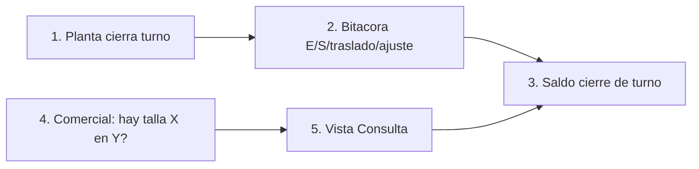

# Lean Canvas — MVP 1

## Lienzo

### Tabla 1 — fila superior (5 columnas)

| PROBLEMA | SOLUCIÓN | PROPUESTA DE VALOR ÚNICA | VENTAJA ESPECIAL | SEGMENTO DE CLIENTES |
|----------|----------|--------------------------|------------------|----------------------|
| 1. Comercial no puede confirmar «¿hay talla X en Y?» con una fuente compartida de cierre de turno. `hipótesis` `ref: DT POV`   2. El descuadre físico vs lo confirmable y el tiempo de respuesta no están medidos; el problema no está demostrado. `pendiente_campo` `ref: profile Fase 0`   3. Los movimientos PT (E/S/traslado/ajuste) pueden no asentarse en el mismo turno. `hipótesis` `ref: DT HMW-3`   **Alternativas existentes:** memoria/estante; kárdex papel o Excel de sector (`hipótesis` proxy, no hecho de Romantex); POS/ERP (INVY u otro) **fuera de alcance**. `evidencia` profile | 1. Vista `Consulta` de saldo por variante × ubicación = último cierre de turno. `hipótesis` `ref: DT Prototype`   2. Protocolo Fase 0: muestra de match físico vs lo que comercial confirmaría + reloj de confirmación. `pendiente_campo` `ref: DT HMW-2`   3. Bitácora Sheets entrada/salida/traslado/ajuste con responsable de planta. `hipótesis` `ref: DT Prototype` | Para comercial y planta de Calzados Romantex que no pueden afirmar talla X en ubicación Y con una fuente de cierre de turno, el piloto Sheets de saldo PT por variante es un kárdex ligero sin POS que responde con el último cierre y deja medir descuadre en muestra, a diferencia de confirmar de memoria, del estante sin bitácora o de un POS/ERP. `hipótesis` `ref: DT Prototype` | ninguna aún `hipótesis` | **Específicos:** almacenero/planta (dueño del saldo) y comercial/ventas (consulta) en ≤2 ubicaciones **propias**. `hipótesis` `ref: DT roles`   **Early adopters:** el almacenero de la ubicación piloto + el comercial que hace la pregunta de talla en ese punto; gerencia solo como gate de Fase 0. `hipótesis`   Fuera: talleres tercerizados. `evidencia` profile |

### Tabla 2 — fila media (bajo Solución y Ventaja)

| MÉTRICAS CLAVE | CANALES |
|----------------|---------|
| - Usuario planta/almacén responde «¿hay talla X en Y?» citando fuente de cierre de turno. `evidencia` criterio_éxito profile   - % descuadre en muestra (pares variante-ubicación con saldo ≠ físico). `pendiente_campo`   - % de movimientos del turno con fila en bitácora el mismo turno. `hipótesis` | N/A (uso interno planta–comercial; canal del curso = visitas de observación). `evidencia` |

### Tabla 3 — base del lienzo

| ESTRUCTURA DE COSTOS | FLUJO DE INGRESOS |
|----------------------|-------------------|
| Tiempo de visitas Fase 0 (sombra + conteo); 1 día de diseño del Sheets; tutoría académica. Sin licencia POS. `hipótesis` | N/A (sin cobro; entregable académico). `evidencia` |

## Flujo del feature central

Consulta de disponibilidad PT por variante con fuente = último cierre (`ref: DT Prototype`). **X** = talla del par (número). **Y** = ubicación propia.

**Paso a paso**

1. **1. Planta cierra turno** — Rol planta. Primero deja de mover el saldo «en caliente»: marca el turno cerrado.
2. **2. Bitácora E/S/traslado/ajuste** — Sigue en planta. Los movimientos de ese turno ya están (o se asientan) en filas; alimentan el saldo.
3. **3. Saldo cierre de turno** — Nodo de reunión. Cantidad por variante × **Y**. Aquí se engancha la consulta.
4. **4. Comercial: hay talla X en Y?** — **Cambio de rol → Comercial.** Misma pregunta del criterio de éxito. **X** = talla (p. ej. 38). **Y** = ubicación propia (p. ej. almacén planta).
5. **5. Vista Consulta** — Comercial abre la hoja (solo lectura). **Siguiente:** lee el **3** (saldo de ese cierre). Si no hubo cierre, no confirma al cliente.
