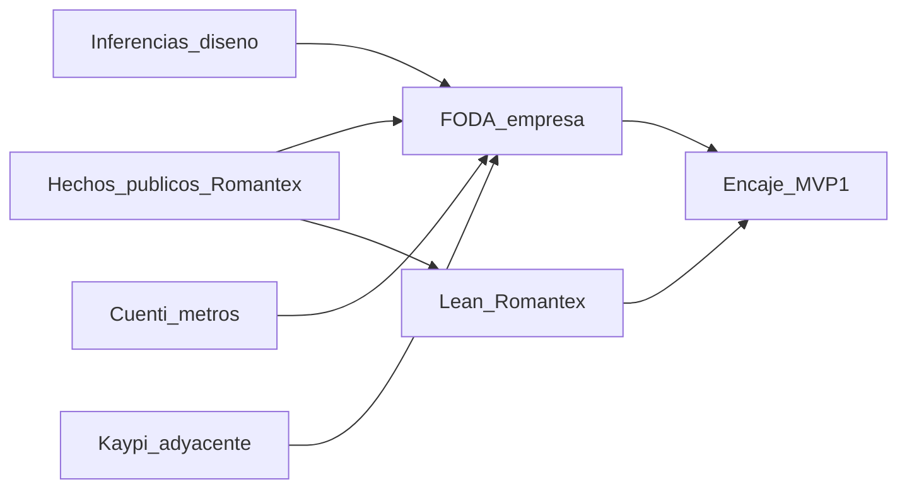

# Debate de informe — ROMANTEX — v2-capitulo-1

## Puntuación
| Eje | Critico | Defensa | Impacto | Viabilidad | Inversor | Gramática | Revisor | Notas |
|-----|---------|---------|---------|------------|----------|-----------|---------|-------|
| Cap.1 | GO_con_cambios | 4/5/3 | — | 5/5/5 | GO_con_cambios | listo | apto_con_cambios | Sujeto FODA/Lean OK; densificar sin genérico |

## Ataques fuertes del crítico (resumen)
1. Debilidades aún justifican el MVP (inferencias sin AS-IS).
2. Reseña delgada (1995–1996 + marketing); techo de fuentes abiertas.
3. Kaypi mal anclado como metraje/rollo (es apparel/talla).
4. Métricas Lean de empresa inventadas.
5. M/V/V con molde repetido (menor).

## Tesis de valor (inversor)
El PoC protege el margen reputacional de la promesa de disponibilidad midiendo metros residuales consultables; no monetiza SaaS.

## Preguntas y respuestas (cronológico; ≥3)
1. **Q (crítico):** ¿Qué evidencia no marketing demuestra consulta fragmentada de residual?  
   **A (defensor):** Ninguna primaria; se acepta solo como inferencia de diseño desde el discurso de “miles de metros” + multi-sede, etiquetada como tal.  
2. **Q (crítico):** ¿Por qué Kaypi cuenta como ancla de metraje/rollo?  
   **A (cruce R2):** No debe. En el reporte Kaypi queda como saturación **adyacente** (ERP textil apparel); Cuenti sostiene el ancla de metros/rollos.  
3. **Q (defensor → crítico):** ¿Exigís fuente primaria para validar debilidades de inventario?  
   **A (consenso):** Sí para afirmar hallazgo de campo; no para hipótesis de diseño explícitas. El polish etiqueta inferencias.  
4. **Q (inversor):** ¿Hay camino a ROI SaaS?  
   **A:** No en fase curso. Valor = riesgo evitado / exactitud de consulta en muestra.

## Cruce R2 / propuestas de valor
- Viabilidad: MVP 1 (1 sede, 1 familia, rollo→metros) no re-inflado — mantener.  
- Inversor: métricas proxy solo en “Encaje del proyecto”; hipótesis falsable explícita.  
- Defensor + crítico: separar hecho público vs inferencia en FODA.

## Gate anti-genérico
- anclas_conservadas: sí — RUC, 1995/1996, Paz Soldán, El Polo, Cuenti, Kaypi, PolyPM, Datatex, Oeko-Tex, Contract  
- foda_sujeto_empresa: sí (puente MVP separado; amenazas de curso fuera del FODA)  
- lean_sujeto_empresa: sí (métricas PoC solo en contraste)  
- kaypi_corregido: sí (adyacente apparel, no metraje)  
- genéricos_sin_nombre: no

## Calidad R3
- [gramatica-continuidad] Voz uniforme; M/V/V menos plantilla que v1; sin labels de pipeline.  
- [revisor-cientifico] Draft vs reporte: sustancia conservada y corregida (Kaypi, Lean, etiquetas FODA). sentido_interno 4/5; densidad_hechos 3/5; veredicto apto_con_cambios (techo histórico público).

## Diagrama

## Fuentes consultadas
- Draft v2; company.md; theme-audit; Cuenti; Kaypi; PolyPM; Datatex; romantex.com.pe; Universidad Peru
- Agentes: [crítico](34c7fe34-085e-4ee3-8ade-2fdd6d1c5c52), [defensor](d89b507b-d827-4ae1-981d-c9b5a5e72e77), [viabilidad](337fd1cf-3669-4238-99b0-7d24779d1cc1), [inversor](29385c87-eefd-4866-9808-df6924992235)
