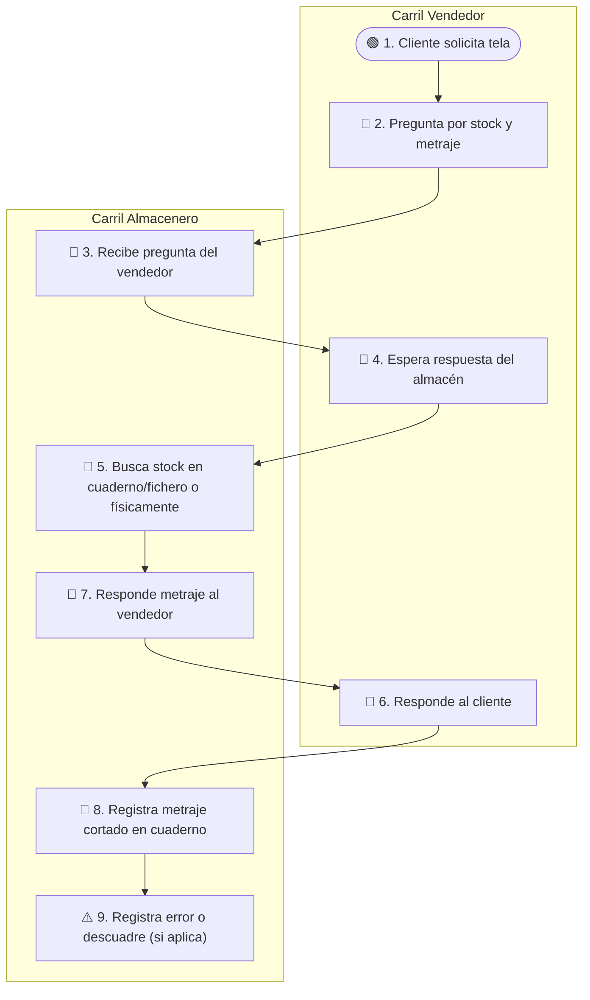
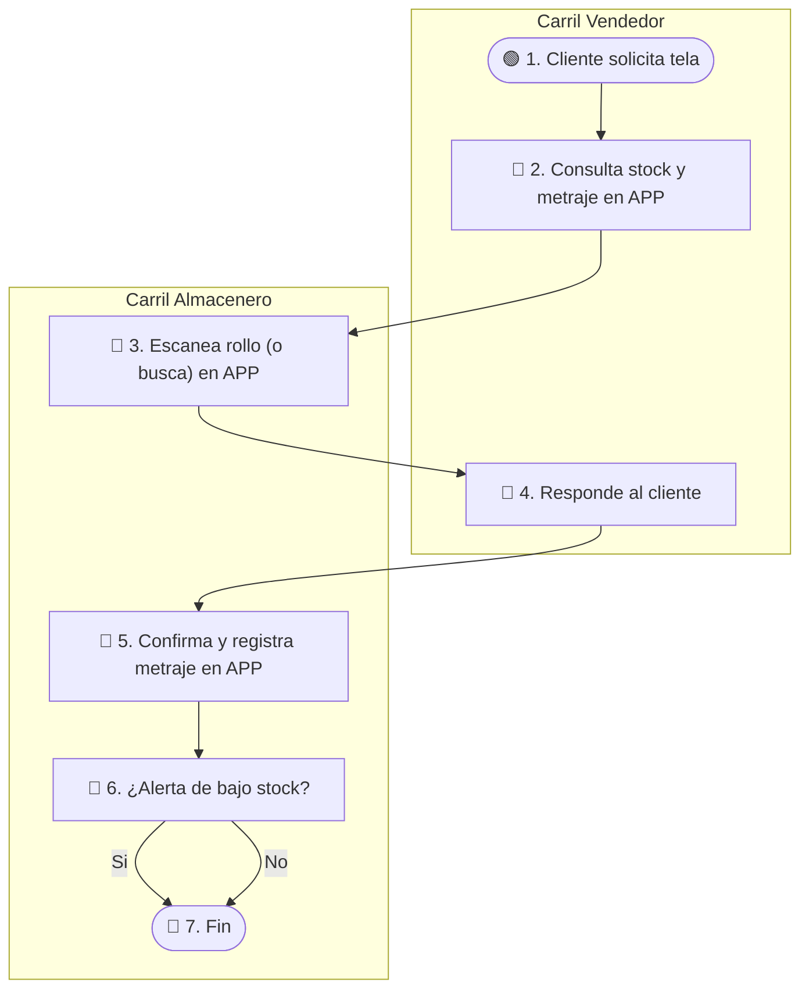

# Flujos AS-IS / TO-BE — MVP 1

## Leyenda de formas / emojis

| Emoji | Significado | Forma Mermaid sugerida |
|-------|-------------|------------------------|
| 🟢 | Inicio | `(["🟢 …"])` |
| 🔵 | Actividad / proceso | `["🔵 …"]` |
| 🔶 | Decisión (rombo) | `{"🔶 …?"}` |
| 🔴 | Fin / terminación | `(["🔴 …"])` |
| ⚠️ | Fricción / problema | nodo o arista con label `"⚠️ …"` |

## AS-IS

### Lectura del flujo AS-IS

1.  **🟢 1. Cliente solicita tela** — Carril Vendedor. El proceso inicia cuando un cliente en showroom o por otro canal requiere información sobre una tela.
2.  **🔵 2. Pregunta por stock y metraje** — Carril Vendedor. El vendedor consulta la disponibilidad y cantidad de metraje residual de la tela.
3.  **Cambio de carril → Almacenero.** La pregunta pasa del vendedor al almacenero.
4.  **🔵 3. Recibe pregunta del vendedor** — Carril Almacenero. El almacenero es notificado de la consulta.
5.  **🔵 4. Espera respuesta del almacén** — Carril Vendedor. El vendedor queda a la espera de la información.
6.  **🔵 5. Busca stock en cuaderno/fichero o físicamente** — Carril Almacenero. El almacenero invierte tiempo buscando manualmente en registros o en el almacén.
7.  **🔵 6. Responde al cliente** — Carril Vendedor. Una vez obtenida la información (después de paso 7), el vendedor comunica la disponibilidad al cliente.
8.  **🔵 7. Responde metraje al vendedor** — Carril Almacenero. El almacenero comunica la información al vendedor.
9.  **🔵 8. Registra metraje cortado en cuaderno** — Carril Almacenero. Después de una venta o corte, el almacenero anota el nuevo metraje residual a mano.
10. **⚠️ 9. Registra error o descuadre (si aplica)** — Carril Almacenero. Se registran discrepancias o errores que surgen del proceso manual.

## TO-BE (ref: DT Prototype)

### Lectura del flujo TO-BE

1.  **🟢 1. Cliente solicita tela** — Carril Vendedor. El proceso inicia cuando un cliente requiere información sobre una tela.
2.  **🔵 2. Consulta stock y metraje en APP** — Carril Vendedor. El vendedor utiliza la aplicación para obtener información precisa y en tiempo real del stock y metraje.
3.  **Cambio de carril → Almacenero.** La consulta es procesada por la app, que accede a la información gestionada por el almacenero.
4.  **🔵 3. Escanea rollo (o busca) en APP** — Carril Almacenero. El almacenero, o el sistema automáticamente, escanea el rollo para actualizar o verificar la información en la aplicación.
5.  **🔵 4. Responde al cliente** — Carril Vendedor. Con la información actualizada, el vendedor responde al cliente de forma ágil y precisa.
6.  **🔵 5. Confirma y registra metraje en APP** — Carril Almacenero. Después de una transacción, el almacenero registra el metraje cortado directamente en la aplicación.
7.  **🔶 6. ¿Alerta de bajo stock?** — Carril Almacenero. La aplicación verifica si el metraje residual ha caído por debajo de un umbral establecido.
8.  **Si** — La flecha va a 🔴 7. Fin. Si se genera una alerta, el sistema la gestiona internamente.
9.  **No** — La flecha va a 🔴 7. Fin. Si no hay alerta, el proceso termina sin necesidad de intervención.
10. **🔴 7. Fin** — Carril Almacenero. El proceso de actualización y gestión del metraje finaliza.

## Brecha AS-IS → TO-BE

*   El proceso de búsqueda manual y registro en cuadernos es reemplazado por la consulta y registro en una aplicación móvil, reduciendo errores y tiempos. `valida: R1`
*   La información de stock pasa de ser fragmentada y desactualizada a estar centralizada y en tiempo real, lo que permite al vendedor dar respuestas precisas. `valida: R2`
*   Se eliminan las fricciones asociadas a la dependencia del personal y la comunicación asíncrona entre vendedor y almacenero. `valida: R3`
