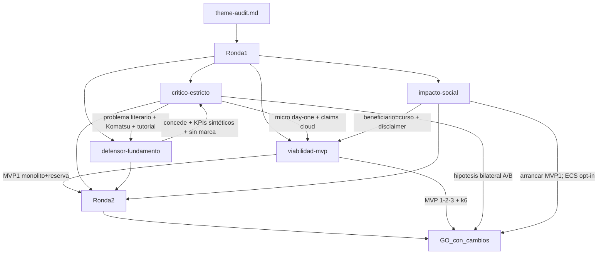

# Debate de auditoría — DS

## Puntuación (dimensiones)

Scores R2 (post-mitigación). R1 del crítico fue 2/2/2/2 → `NO_GO`; tras reformulación (sin gap Komatsu, KPIs sintéticos, MVP1 monolito + reserva, contrato k6) → `GO_con_cambios`.

| Dimensión / eje | Critico | Defensa | Impacto | Viabilidad | Notas |
|-----------------|---------|---------|---------|------------|-------|
| problema | 4 | 4 | 5* | 4 | Hipótesis falsable del prototipo; no diagnóstico Komatsu (*claridad beneficiarios) |
| alcance | 4 | 4 | 4 | 4 | Monolito modular → Compose+k6 → ECS; ≤3 servicios; K8s solo madurez |
| evidencia_aporte | 3 | 3 | 4 | 4 | Stack saturado; aporte = experimento A/B + reserva stock |
| manejabilidad / MVP | 4 | 5 | 4 | 4 | MVP1 dominio primero; cloud después |
| Total / veredicto | GO_con_cambios | GO_con_cambios | media (social) | GO condicionado | **pasa con cambios** |

\* Impacto puntúa ejes sociales (honestidad de marca ~4 si disclaimer fijo); no es score 1:1 de “problema técnico”.

## Preguntas y respuestas (cronológico)

- [critico-estricto] Problema literario: “fragmentación / cuellos de botella / desabastecimiento” sin KPI, baseline ni población.
  - [defensor-fundamento] **Concede.** Reformula a hipótesis del **prototipo** con KPIs sintéticos: `p95_POST_/pedidos`, tasa error, `tasa_inconsistencia_stock` (oversell → 0).
- [critico-estricto] Branding Komatsu sin acceso; NPS/Infor Nexus y WMS LOGISTEED ya modernizan partes → no hay gap que un CRUD “resuelva”.
  - [defensor-fundamento] **Concede.** Komatsu = inspiración OEM; **eliminar marca del título** como víctima/cliente; disclaimer explícito.
- [critico-estricto] Patrón Spring order/inventory + ECS saturado (tutoriales/demos); aporte = etiqueta OEM.
  - [defensor-fundamento] **Concede novelty.** Aporte defendible solo como **experimento didáctico medible** (baseline monolito vs extracción + carga), no como producto.
- [critico-estricto] Claims de disponibilidad/escalabilidad/latencia sin umbrales ni plan de carga = paperware.
  - [defensor-fundamento] **Concede.** Contrato k6/Locust + umbrales; si no hay experimento, quitar promesas cloud del abstracto.
- [critico-estricto] Microservicios para CRUD sin justificación anti-monolito; DB compartida = monolito disfrazado; pedido↔stock sin reserva.
  - [defensor-fundamento] **Concede riesgo.** Preferir monolito modular + 1 servicio crítico; o exactamente 3 con DB-per-service/schemas aislados; **reserva de stock** obligatoria.
- [critico-estricto] “Evidencia suficiente” del audit sobrepromete aporte.
  - [defensor-fundamento] **Concede parcialmente.** Benchmark de dominio OK; aporte condicional al experimento.
- [impacto-social] Beneficiario real = curso, no Komatsu/operarios. Riesgo de halo de marca y sobrepromesa industrial.
  - Exigencia: título sin “sistema para Komatsu”; disclaimer sprint 0; datos sintéticos; éxito por rúbrica académica.
- [viabilidad-mvp] Scope creep: 5 MS, K8s día 1, doble monitoreo, frontend completo, auth enterprise.
  - Recorte: ≤3 contenedores app; ECS-first; un monitoreo (CloudWatch en AWS); UI opcional; Compose local primero.

## Cruce global

El crítico abrió en **NO_GO** (promedio 2; problema no medible; Komatsu contradice el framing de carencia; stack tutorial). Defensa e impacto coincidieron: el tema solo sobrevive como **lab académico medible**, no como solución OEM. Viabilidad propuso secuencia dominio → k6 local → ECS. En R2 el crítico aceptó salida a **GO_con_cambios** si la hipótesis es **bilateral** (el monolito puede ganar el A/B), la métrica de stock se atribuye a la **reserva** (no a “microservicios”), y no se reintroduce microservicios-first ni Komatsu-problema.

### Debate MVP entregables

- [viabilidad-mvp] propuesta de secuencia / arranque: **MVP 1** — monolito modular + `ReservarStockAlCrearPedido` + disclaimer + test concurrencia 0 oversell. **MVP 2** — Compose + k6 (p95&lt;500 ms local, failed&lt;1%, 0 oversell). **MVP 3** — ECS/Fargate + RDS + k6 cloud (p95&lt;1200 ms, failed&lt;2%) + CloudWatch. K8s = madurez documental.
- [critico-estricto] Núcleo correcto = MVP1 (evaluación, no cosplay Netflix). Residual: no sesgar la hipótesis para que “gane” MS; split = rama experimental. Veredicto: **GO_con_cambios**.
- [defensor-fundamento] Acepta 1→2→3. Microservicios = acto 3 del relato (extracción tras baseline), no commit 0. Si no hay extracción en fase 3, declarar “contenedores + cloud del monolito”.
- [impacto-social] Arrancar **MVP 1**; MVP 2 obligatorio por inclusión (sin AWS); MVP 3 opt-in/rúbrica cloud. Apoya GO_con_cambios si título+disclaimer fijos.
- Orquestador — MVP de arranque: **1** — dominio pedido↔stock con reserva en monolito modular; microservicios/cloud como madurez medible, no day-one.

## Diagrama del debate

## Fuentes consultadas

- Komatsu NPS / Infor Nexus — https://dcross.impress.co.jp/docs/usecase/001098.html
- Komatsu + LOGISTEED ONEsLOGI — https://sol.logisteed.com/en/case/voice/komatsu.html
- AWS Guidance order & inventory — https://aws.amazon.com/solutions/guidance/implementing-order-and-inventory-management-for-quick-service-restaurants-on-aws/
- AWS Field Notes ECS + API Gateway — https://aws.amazon.com/blogs/architecture/field-notes-serverless-container-based-apis-with-amazon-ecs-and-amazon-api-gateway/
- Sparity spare parts microservices — https://www.sparity.com/case-studies/microservices-platform-for-service-supply-chain-transformation/
- Supply Chain Digital / Komatsu DX (contexto) — https://supplychaindigital.com/digital-supply-chain/komatsu-increasing-supply-chain-efficiency-through-digital-transformation
- Benchmarks monolito vs MS (latencia) — https://doi.org/10.5381/jot.2021.20.2.a3 · https://doi.org/10.21275/sr26104211700
- k6 API load testing — https://grafana.com/docs/k6/latest/testing-guides/api-load-testing/
- Entrada: `docs/topics/DS/theme-audit.md`

## Addendum — corrección de framing (usuario)

El usuario aclaró post-R2 que **no es un proyecto solo estudiantil**: es una **propuesta para Komatsu**. El acta R1/R2 anterior asumió “beneficiario = curso”; esa premisa queda **anulada para el tema final**.

Se actualizaron `theme-audit.md` y `theme-audit-polish.md` para destinatario empresarial (Komatsu). Se conservan del debate: PoC medible, reserva de stock, secuencia de madurez técnica y no inventar KPIs internos. El veredicto se mantiene **GO_con_cambios** bajo el framing corregido.

