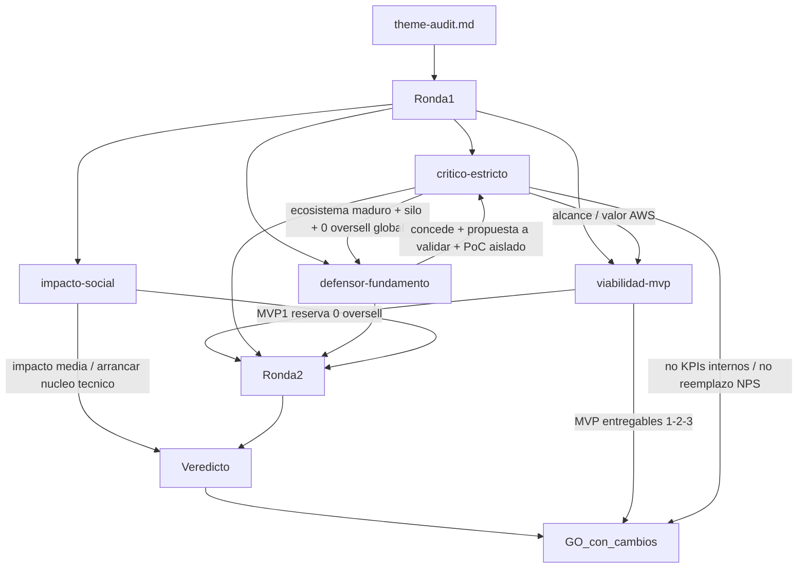

# Debate de auditoría — DS

## Puntuación (dimensiones)

Scores R2 (post-mitigación). R1 del crítico fue 2/2/2 → `NO_GO`; tras reformulación (propuesta a validar, PoC aislado, 0 oversell en perímetro del PoC) + MVP recortado → crítico R2 `GO_con_cambios` (3/4/2/3).

| Dimensión / eje | Critico | Defensa | Impacto | Viabilidad | Notas |
|-----------------|---------|---------|---------|------------|-------|
| problema | 2→3 | 4 | 3 | 4 | Propuesta a validar; residual: hipótesis de negocio aún genérica vs stack maduro |
| alcance | 2→4 | 4 | 3 | 4 | PoC aislado aceptable; sin integración productiva ERP/WMS/NPS |
| evidencia_aporte | 2→2 | 4 | 3 | 4 | Aporte técnico demo OK; valor estratégico inmediato para Komatsu aún débil |
| manejabilidad / MVP | 3 | 5 | 4 | 4–5 | MVP1 = núcleo pedido↔stock; Docker/k6 y AWS en secuencia |
| Total / veredicto | GO_con_cambios | GO_con_cambios | relevancia media | GO_con_cambios | **pasa con cambios** |

## Preguntas y respuestas (cronológico)

- [critico-estricto] Problema genérico: Komatsu ya tiene Global Supplier Portal, KOM-MICS, webMethods, ONEsLOGI, Swisslog SynQ, Joget; no se demuestra fallo específico.
  - [defensor-fundamento] **Concede** la madurez del ecosistema. El PoC **no audita** esos sistemas; reformula el problema como **propuesta a validar/priorizar con Komatsu** sobre cuellos en pedidos/repuestos y oversell, sin afirmar magnitud in-company no aportada.
- [critico-estricto] “Convivencia fuera de alcance” contradice “falta de integración”; riesgo de nuevo silo.
  - [defensor-fundamento] **Concede** el riesgo. Mitigación: PoC **demostrable y autónomo** (seed); integración productiva fuera de fase; no vender como reemplazo de NPS/WMS.
- [critico-estricto] “0 oversell” sin fuente única de verdad WMS es quimera.
  - [defensor-fundamento] **Concede** verdad global. Mitigación: invariante **0 oversell dentro del perímetro del PoC** (reserva atómica bajo concurrencia sobre datos del demo), no sincronización productiva con WMS.
- [critico-estricto] Microservicios/AWS sin valor diferencial vs optimizar stack existente.
  - [defensor-fundamento] Valor del PoC = métricas demostrables (p95 `POST /pedidos`, tasa error, 0 oversell) + ADR de arquitectura objetivo; no TCO enterprise inventado.
- [impacto-social] Beneficiarios internos (logística/atención) y clientes vía disponibilidad de repuestos; impacto PoC limitado; proyección ESG/ODS si escala. Riesgos: exclusión digital de socios menos tecnificados, dependencia AWS, datos.
  - Exigencia: no imponer integración a PYMES proveedoras en esta fase; métricas operativas antes que relato social.
- [viabilidad-mvp] Riesgo técnico alto en 0 oversell + cloud; secuenciar por riesgo. R1 pedía AWS ya en MVP1; R2 mantiene foco en reserva demostrable y autonomía del PoC.

## Cruce global

El crítico abrió en **NO_GO** (promedio 2; problema no contextualizado frente al stack real de Komatsu; integración ciega; 0 oversell global). Defensa y viabilidad coincidieron: el tema **solo sobrevive** si (1) el framing es propuesta/PoC a validar, (2) el 0 oversell es invariante del demo, (3) no se pretende reemplazar NPS/WMS. Impacto respalda arrancar por el núcleo técnico (reserva) por menor exclusión. Tras R2, veredicto orquestador: **GO_con_cambios**. Condiciones vigiladas: no afirmar KPIs internos de Komatsu; no reintroducir sync WMS como gate de MVP1; no vender el PoC como sustituto ya decidido del ecosistema actual.

### Debate MVP entregables

- [viabilidad-mvp] propuesta de secuencia / arranque: **MVP 1** — núcleo reserva stock / 0 oversell demostrable (perímetro PoC). Luego empaquetado + carga; luego cloud AWS con métricas. Arquitectura objetivo microservicios en ADR.
- [critico-estricto] R2: alcance técnico mitigado → `GO_con_cambios`; residual vigilado: hipótesis de negocio cuantificable + ruta PoC→adopción + no vender 0 oversell seed como verdad global. Núcleo aceptable = **pedido↔stock correcto + métricas PoC**.
- [defensor-fundamento] Acepta secuencia dominio → contenedores/carga → AWS; interfaces de integración solo documentadas (ADR), no implementadas en MVP1.
- [impacto-social] Arrancar **MVP 1** (reserva aislada); relevancia social media; vigilado: dependencia AWS y exclusión digital en fases posteriores.
- Orquestador — MVP de arranque: **1** — Núcleo de propuesta: pedidos e inventario correctos con reserva (0 oversell) como base creíble para Komatsu.

## Diagrama del debate

## Fuentes consultadas

- Komatsu company info — https://www.komatsu.jp/en/aboutus/profile
- Komatsu Strategic Growth Plan / IR — https://www.komatsu.jp/en/-/media/home/ir/library/annual/2025/en/kr25e_strategy.pdf
- Komatsu Global Supplier Portal — https://komatsu.disclosure.site/en/themes/185
- KOM-MICS (estrategia) — https://www.komatsu.jp/en/-/media/home/ir/library/annual/2025/en/kr25e_strategy_05.pdf
- IBM webMethods / Komatsu Australia — https://www.ibm.com/case-studies/komatsu-australia
- Hitachi ONEsLOGI / Komatsu — https://sol.logisteed.com/en/case/voice/komatsu.html
- Swisslog SynQ / Komatsu — https://www.swisslog.com/en-us/about-swisslog/newsroom/news-press-releases-blog-posts/2024/09/komatsu-omni-channel-distribution-automated-with-autostore
- Joget / Komatsu Indonesia — https://joget.com/customer-stories/komatsu-digital-inventory-management/
- Entrada: `docs/topics/DS/theme-audit.md`
