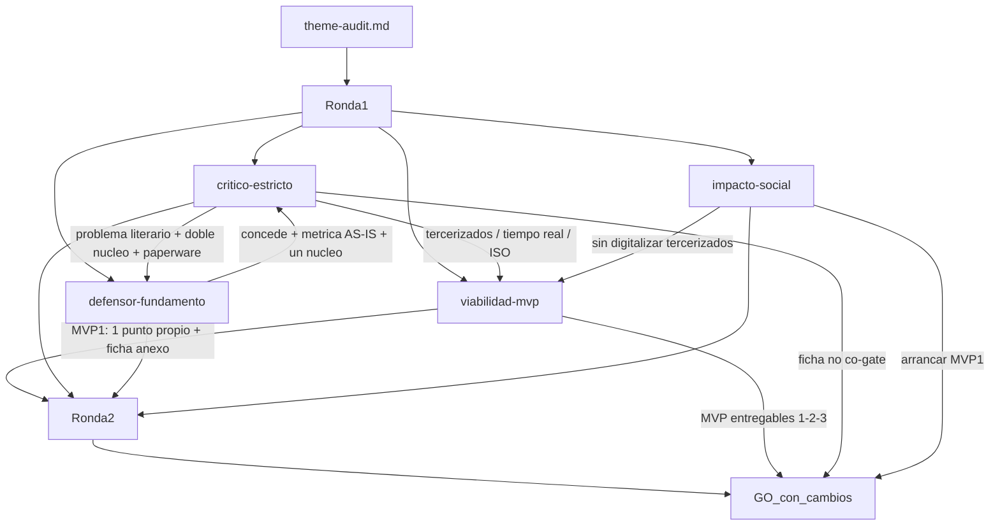

# Debate de auditoría — ITD

## Puntuación (dimensiones)

Scores R2 (post-mitigación). R1 del crítico fue 2/2/2/2 → `NO_GO`; tras reformulación + MVP recortado → `GO_con_cambios`.

| Dimensión / eje | Critico | Defensa | Impacto | Viabilidad | Notas |
|-----------------|---------|---------|---------|------------|-------|
| problema | 4 | 3 | 4 | 4 | Hipótesis medible (AS-IS); no afirmar magnitud in-company |
| alcance | 4 | 4 | 4 | 4 | Un núcleo; ≤1–2 ubicaciones propias; ficha no co-gate |
| evidencia_aporte | 3 | 3 | 3 | 4 | Dominio commodity (INVY/iSiore); aporte = diagnóstico de registro + ownership |
| manejabilidad / MVP | 4 | 4 | 4 | 5 | MVP1 acotado; tercerizados fuera |
| Total / veredicto | GO_con_cambios | pasa (condicional) | media (social) | viable_con_recortes | **pasa con cambios** |

## Preguntas y respuestas (cronológico)

- [critico-estricto] El problema afirma stock poco confiable, respuestas lentas y datos de ventas sin métrica ni AS-IS; “tiempo real” es buzzword.
  - [defensor-fundamento] **Concede.** Solo hipótesis de perfil + dolor de rubro. Reformula a hipótesis con métricas (match físico vs registro; tiempo de consulta; ownership/latencia). Elimina “tiempo real” y analytics de ventas del núcleo.
- [critico-estricto] Alcance hinchado: doble núcleo (inventario multipunto incl. tercerizado + fichas/equivalencias/ajuste) no es fase diagnóstico.
  - [defensor-fundamento] **Concede.** Un solo núcleo esta fase: inventario PT en ≤2 ubicaciones **propias**. Fichas/ISO/tercerizados a cola o fase 2.
- [critico-estricto] Diferenciador paperware vs INVY/iSiore: la matriz variante es commodity; “sin ERP” es restricción, no aporte.
  - [defensor-fundamento] **Concede** commodity. Aporte defendible = AS-IS + mapa rol–dato–latencia (ownership), no SaaS sustituto. Fase diagnóstico antes de comprar.
- [critico-estricto] ¿Evidencia de campo que justifique “desalineación” sin inventar magnitud?
  - [defensor-fundamento] Ninguna cuantitativa en el bloque; solo perfil + proxies de rubro. Justifica hipótesis de diagnóstico, no hecho verificado.
- [critico-estricto] Si INVY resuelve la matriz, ¿qué no es configurable en 30 días?
  - [defensor-fundamento] La matriz sí lo es. Gap posible (catálogo limpio, ownership fábrica, criterios horma) solo si el AS-IS lo demuestra; no afirmar superioridad casera.
- [impacto-social] Beneficio local (comercial/almacén); tercerizados en riesgo de exclusión/sobrecarga si se les impone registro.
  - Exigencia: arrancar sin digitalizar El Porvenir; lenguaje de oficio; roles lectura/escritura; modo degradado imprimible; anti doble registro.
- [viabilidad-mvp] Scope creep: multipunto, tiempo real, ISO plena, analytics. Dependencias: acceso empresa, muestra de datos, dueño de proceso.
  - Recorte: 1 ubicación piloto; frecuencia turno/día; ISO solo equivalencias acotadas.

## Cruce global

El crítico abrió en **NO_GO** (promedio 2; problema no medible; doble núcleo; saturación INVY/iSiore). Defensa y viabilidad coincidieron en que el tema **solo sobrevive con recortes**. Tras R2, defensa aceptó las cuatro condiciones del crítico; viabilidad propuso MVP1 = consulta en 1 punto propio + ficha anexo; impacto respaldó ese arranque por mínima exclusión. El crítico cerró en **GO_con_cambios**: ataques fuertes R1 mitigados; queda vigilado el anexo de fichas (no puede ser gate de éxito de MVP1) y no vender el proyecto como alternativa a INVY/iSiore.

### Debate MVP entregables

- [viabilidad-mvp] propuesta de secuencia / arranque: **MVP 1** — consulta disponibilidad por variante en UN punto propio + ficha tallaje como anexo delgado (N≤10). Luego MVP 2 gobierno/frecuencia (turno). MVP 3 opcional ≤2 ubicaciones propias. Tercerizados, tiempo real, analytics e ISO plena fuera.
- [critico-estricto] Núcleo correcto = diagnóstico de **registro** + métricas AS-IS + modelo de datos. Anexo ficha **aceptable solo no bloqueante**; si es criterio de éxito co-núcleo → re-hincha. Wireframes no son gate. Veredicto: **GO_con_cambios**.
- [defensor-fundamento] Acepta secuencia 1→2→3. Ficha en MVP1 = anexo muestral (≤5 campos, cero ISO); estandarización de tallaje queda en cola. Sin candado, CAE.
- [impacto-social] Arrancar **MVP 1**; MVP 2 en paralelo ligero (sin RACI el 1 se pudre); MVP 3 después. Riesgos residuales: doble registro, sobrecarga en turno, dependencia post-curso.
- Orquestador — MVP de arranque: **1** — consulta de disponibilidad PT por variante en un punto propio, con métricas AS-IS como criterio de éxito; ficha tallaje solo anexo no bloqueante (o diferida a fase 2).

## Diagrama del debate

## Fuentes consultadas

- INVY (Perú) — https://www.invyperu.com/tienda-de-calzado-punto-de-venta
- iSiore GO (Perú) — https://www.isiorego.com/blog/erp/erp-para-fabricas-de-calzado-en-peru/
- Uphance — https://www.uphance.com/footwear-inventory-system/
- ISO 19407:2023 — https://www.iso.org/standard/83106.html · https://standards.iteh.ai/catalog/standards/iso/ac8767eb-dc46-4cec-bd13-a041c0268a09/iso-19407-2023
- Perfil del proyecto: `docs/content/ITD/profile.md` (contexto empresarial; no evidencia cuantitativa de desalineación)
- Entrada: `docs/topics/ITD/theme-audit.md`
