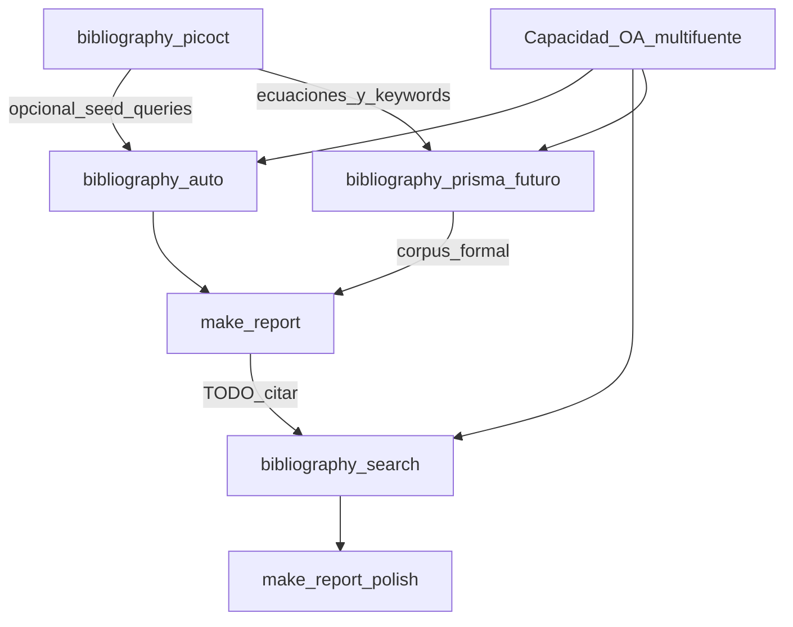

# Draft — siguientes pasos (bibliografía)

Estado: borrador de roadmap. No implementa skills aún; sirve para validar diseño antes de cerrar el tramo bib manual (PICOCT → PRISMA).

Fecha: 2026-09-06

---

## 1. Checklist PRISMA / PRISMA-S (anclar a estándar público)

**Qué:** al armar la skill de screening / flujo manual (hoy marcada como pendiente tipo `prepare-bibliography-manual` o futura `bibliography-prisma`), **no inventar** el checklist: anclarlo a PRISMA 2020 y/o PRISMA-S (reporting de búsquedas).

**Por qué:** trazabilidad académica, comparabilidad con RSL “de verdad”, menos riesgo de olvidar ítems (bases, fechas, dedupe, screening, exclusiones).

**Dónde cae en el flujo:**

```text
bibliography-picoct  →  [búsqueda + screening PRISMA]  →  corpus manual
                              ↑
                     NUEVA skill (pendiente validar)
```

- **Después** de `bibliography-picoct` (ya hay P/I/C/O/C/T + keywords + ecuaciones).
- **En paralelo o en vez de** depender solo de `bibliography-auto` cuando el curso pide RSL/manual formal.
- **Antes** de alimentar el informe con un corpus “cerrado” (no solo 5 OA rápidos).

**Referencias a anclar (no clonar pipelines ajenos enteros):** checklist PRISMA 2020 + PRISMA-S; opcionalmente mirar skills públicas solo como guía de ítems.

**Validación previa requerida:** definir entregables (`prisma-flow.md`, log de búsqueda, exclusiones), límites de volumen, y si Graphify indexa el log o solo los MD/PDF incluidos.

---

## 2. PICO/SPIDER query planning (mejorar `bibliography-picoct`)

**Qué:** enriquecer el playbook/skill **`bibliography-picoct`** con planificación de queries tipo PICO **y**, cuando el tema no sea intervención clásica, variante **SPIDER** (Sample, Phenomenon of Interest, Design, Evaluation, Research type) u otras (PEO) documentadas.

**Por qué:** hoy picoct ya llena marco + keywords EN/ES + ecuaciones Scopus; SPIDER/mejor query planning sube **recall** y evita keywords solo “buzzword”.

**Dónde cae:** **dentro de `bibliography-picoct`** (misma carpeta `bibliography/PICOCT|…/`), no skill nueva.

Posibles adiciones al playbook:

- Elegir marco: PICOCT (default) | PICOC | PICO | SPIDER (si el profile es fenomenológico / cualitativo).
- Bloque “query plan”: sinónimos controlados, exclusiones, filtros PUBYEAR/DOCTYPE.
- Tabla EN|ES ya existente + ecuaciones por bloque OR interno / AND entre bloques (ya parcialmente SoT).

**No mezclar aquí:** descarga de PDFs (sigue en auto/search/PRISMA).

---

## 3. Análisis — Búsqueda OA multi-fuente (OpenAlex, S2, PubMed, arXiv)

**Estado (2026-09-06): HECHO para auto + search.**

- Playbook: `common/bibliography-oa-sources/model1.md`
- Skill capacidad: `.cursor/skills/bibliography-oa-sources/SKILL.md`
- Cableado en `bibliography-auto` y `bibliography-search` (Paso 2 obligatorio)

PRISMA / mejoras SPIDER en picoct: **siguen en draft** (secciones 1–2); no implementadas.

Pregunta: ¿en qué skill unificar o en qué parte del flujo entra?

### Conclusión corta

**No una sola skill “search-oa” suelta.** Es una **capacidad compartida** (playbook/helper) consumida por tres puntos distintos del flujo, cada uno con contrato de salida distinto.



### Por skill / etapa

| Etapa | Skill | Rol de la búsqueda multi-fuente | Contrato (no cambiar) |
|-------|--------|----------------------------------|------------------------|
| Corpus base rápido | **`bibliography-auto`** | **Uso principal #1.** Candidatos OA desde profile (sin exigir PICOCT). OpenAlex + S2 + arXiv (+ PubMed si salud). Tope ≤5 tras debate. | `bibliography/auto/` + `docs/<slug>.md` |
| Huecos del draft | **`bibliography-search`** | **Uso principal #2.** Misma capacidad, queries = `TODO: citar`. PubMed/S2 útiles para claims puntuales. | `bibliography/search/` + `docs/search/` |
| RSL / manual formal | **`bibliography-prisma` (futuro)** | **Uso principal #3 (volumen + log).** Multi-fuente + dedupe + screening; PRISMA-S reporta *cómo* se buscó. | Log + incluidos; no mezclar catálogos auto/search |
| Solo marco | **`bibliography-picoct`** | **No descarga.** Como mucho: “fuentes sugeridas de prueba” sin PDF (opcional). Query planning ≠ retrieval. | `PICOCT/*.md` keywords/ecuaciones |
| Redacción | **`make-report`** | No busca; **invoca** `bibliography-search` si hay TODOs. | `draft.md` + trace |
| Cierre prosa | **`make-report-polish`** | No busca papers nuevos (salvo verificación puntual del revisor). | `reporte.md` |

### Cómo unificar sin romper el flujo

1. Extraer un playbook compartido, p. ej. `common/bibliography-oa-sources/model1.md` (rutas API, priorización OA, dedupe DOI, ranking).
2. **`bibliography-auto`** y **`bibliography-search`** lo invocan en su “Paso 2 — candidatos” (hoy genérico).
3. El futuro **PRISMA** reutiliza el mismo helper con parámetros de volumen/log distintos.
4. **Prohibido:** unificar carpetas `auto/` y `search/`; unificar solo la *técnica* de búsqueda.

### Qué no hacer

- Meter OpenAlex “dentro de picoct” como descarga masiva.
- Sustituir el debate critico/defensor por el scoring de una skill pública.
- Instalar un lit-review end-to-end que ignore `docs/content/<FOLDER>/`.

### Prioridad sugerida

1. Validar y cerrar mejoras de **query planning** en `bibliography-picoct` (PICO/SPIDER).
2. Diseñar **PRISMA** anclado a estándar + misma capacidad OA (cierra bib manual).
   *(OA multi-fuente en auto/search: ya implementado — no es pendiente.)*

---

## Orden de implementación (cuando se valide)

```text
1. bibliography-picoct  (+ SPIDER / query plan)     [mejora in-place]
2. bibliography-prisma / prepare-bibliography-manual [skill nueva; checklist PRISMA]
3. README: insertar paso formal entre picoct y auto (o ramal “vía RSL”)
```

## Referencias externas (solo consulta)

- PRISMA 2020 / PRISMA-S (checklist oficial).
- Skills públicas de lit-review / paper-search: **extraer ideas**, no clonar pipeline.
